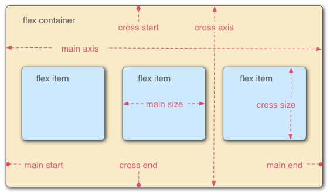

# flex

- why
    - 解决 float 和 position 的局限性
        - 在父内容里面垂直居中一个块内容。
        - 使容器的所有子项占用等量的可用宽度/高度，而不管有多少宽度/高度可用。
        - 使多列布局中的所有列采用相同的高度，即使它们包含的内容量不同。
- what
    - 
- how
    1. 容器属性
        1. flex-direction: row | row-reverse | column | column-reverse;
        2. flex-wrap: nowrap | wrap | wrap-reverse;
        3. flex-flow: `<flex-direction> || <flex-wrap>`;
           - flex-direction 和 flex-wrap的缩写
        4. justify-content: flex-start | flex-end | center | space-between | space-around;
           - 控制 flex 项在主轴上的位置
        5. align-items: flex-start | flex-end | center | baseline | stretch;
           - 控制 flex 项在交叉轴上的位置
        6. align-content: flex-start | flex-end | center | space-between | space-around | stretch;
    2. 项目属性
        1. order: `<integer>`;
           - 排序
        2. flex-grow: `<number>`; /*default 0*/
        3. flex-shrink: `<number>`; /*default 1*/
        4. flex-basis: `<length> | auto`; /*default auto*/
        5. flex: none | [ <'flex-grow'> <'flex-shrink'>? || <'flex-basis'> ]
        6. align-self: auto | flex-start | flex-end | center | baseline | stretch;
