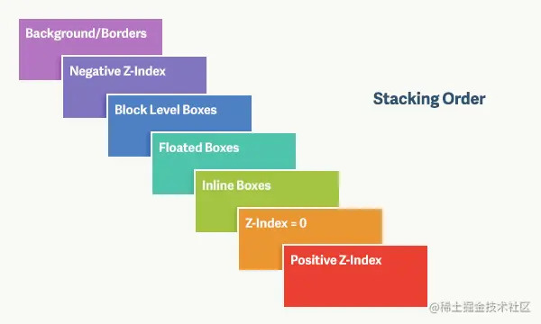

# z-index

- what
    - 设定了一个定位元素及其后代元素或 flex 项目的 z-order
    - 前提是元素的 position 属性不是 static
- z-index 失效
    - 父元素position为relative时，子元素的z-index失效。
        - 解决：父元素position改为absolute或static；
    - 元素没有设置position属性为非static属性。
        - 解决：设置该元素的position属性为relative，absolute或是fixed中的一种；
    - 元素在设置z-index的同时还设置了float浮动。
        - 解决：float去除，改为display：inline-block；

- 元素的层叠顺序
    - 
    - 背景和边框：建立当前层叠上下文元素的背景和边框。
    - 负的z-index：当前层叠上下文中，z-index属性值为负的元素。
    - 块级盒：文档流内非行内级非定位后代元素。
    - 浮动盒：非定位浮动元素。
    - 行内盒：文档流内行内级非定位后代元素。
    - z-index:0：层叠级数为0的定位元素。
    - 正z-index：z-index属性值为正的定位元素。
    注意: 当定位元素z-index:auto，生成盒在当前层叠上下文中的层级为 0，不会建立新的层叠上下文，除非是根元素。
