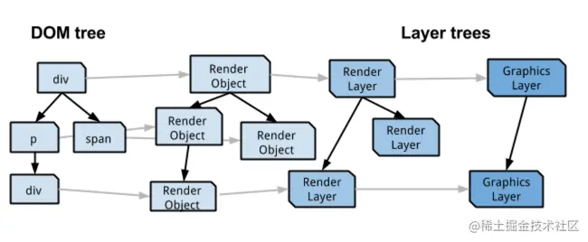

# 动画性能优化

- 如何优化动画性能
- 解题：
    - 初阶：
        - html：
            - 精简dom 结构
        - CSS：
            - 尽量避免回流重绘，限制回流范围，举一些示例
            - 使用
            - 尽量使用GPU，顺带说出GPU的问题
        - JS：
            - 提升代码性能，单任务计算周期控制在 xx ms内
            - 使用 web worker
    - 中阶：
        - 怎么衡量 —— 性能指标 —— 主要是FPS，怎么采集？raf函数
            - 目标 —— 60fps
        - 如果有 canvas 动画相关经验
            - 离屏 canvas
            - 使用 webGL
            - 减少 canvas api 调用 ——
                - 少用圆
                - 少改变context状态
                - 分层canvas —— 例如 Echarts 就是这么做的
                - 局部刷新
    - 高阶：
        - 有实打实的优化经验，聊聊自己的故事
        - 某个单点能聊的特别深

- 资料：
    - <https://caelumtian.github.io/2019/10/22/%E5%89%8D%E7%AB%AF%E6%80%A7%E8%83%BD%E7%9B%91%E6%8E%A71/>
    - <https://juejin.cn/post/6844903796817002504>

- 原因
    - 一般设备刷新频率为 60 次每帧，每帧渲染时间需要小于 16 ms，否则页面会卡顿
- 渲染流程
    - 
        - js：实现动画效果，操作 dom
        - style 样式计算：确定样式规则
        - layout 布局：计算元素大小和位置
        - paint 绘制：绘制文字、颜色、图像、边框、阴影
        - composite 合并：合并图层并显示到屏幕上
- 渲染映射
    - 
    - node -> RenderObject(一对一)
    - RenderObject -> RenderLayer(层级关系)（多对一）
        - 会专门创建一个新的渲染层
            - 页面根元素
            - 有 CSS 定位属性（relative, absolute, fixed, sticky）
            - transparent ≠ 1
            - overflow ≠ visible
            - 有 CSS mask 属性
            - 有 CSS box-reflect 属性
            - 有 CSS filter 属性
            - 3D 或硬件加速的 2D canvas
            - video 元素
    - RenderLayer -> GraphicsLayer（图形层）（多对一）
    - 提升到 CompositingLayer(合成层)
        - 有 3D transform 属性
        - 有 perspective 属性
        - 3D canvas 或硬件加速的 2D canvas
        - 硬件加速的 iframe 元素
        - 使用了硬件加速的插件，如 flash
        - opacity / transform 为 animation / transition
        - 子元素是一个合成层
        - 兄弟元素是一个合成层，且在 z 轴上有重叠
        - 有 will-change 属性
- 优化方法
    - js：优化 js 执行效率
        - 使用 requestAnimationFrame 代替 setTimeout 和 setInterval
            - requestAnimationFrame 屏幕的每一次刷新间隔中只执行一次，setTimeOut 和 setInterval 可能会在一帧之内执行多次
            -
        - 可并行的 DOM 元素更新，划分为多个任务
        - DOM 无关的耗时操作，使用 web worker
    - style：降低样式计算复杂度和范围
        - 降低样式选择器的复杂度
            - 减少伪类选择器和过长的选择器的使用
            - OOCSS、BEM等命名规范来组织CSS
        - 减少需要执行样式计算的元素个数
    - layout：避免大规模、复杂的布局
        - 避免频繁改变布局
            - 尽量使用 transform 和 opacity 作为动画属性，或采用 JavaScript 实现动画
        - 用 flexbox 替代传统布局
        - 避免使用强制同步布局事件
    - paint/composite
        - 将移动或渐变元素提升到合成层
            - 只重绘需要重绘的部分
            - GPU加速：合成层的位图直接由GPU合成，比CPU处理速度更快
        - 避免提升合成层的陷阱
- 监控指标
    - 合成监控
        - chrome://tracing
        - chrome://gpu
    - 真实用户监控：采集用户数据
        - API
            - performance API
            - Timing API
        - 指标
            - 起始时间
                - navigationStart - 准备加载页面的起始时间
                - fetchStart - DNS查询开始
                - requestStart - 开始请求
            - FCP - 首次内容绘制
                - first-contentful-paint
            - FMP - 首次有意义绘制
                - first-meaningful-paint
            - FST - 首屏绘制事件
                - first-screen-timestamp
            - TTI - 可交互时间
                - time-to-interactive
            - FPS - 每秒帧数
                - frames-per-second
        - 上报数据
            - url
            - status：业务状态码
            - responseTime：响应时间
            - content： 额外信息，如请求错误原因
            - networkCode: 网络状态码
