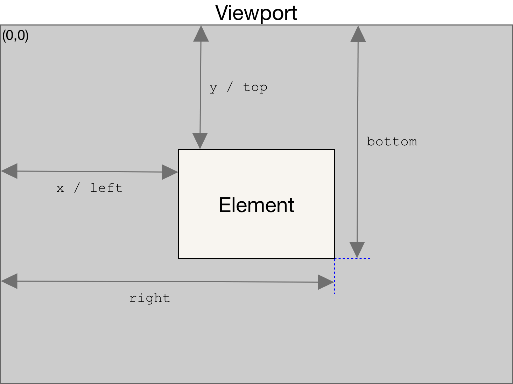
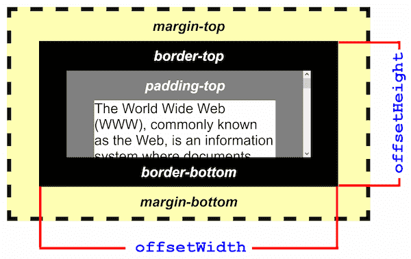
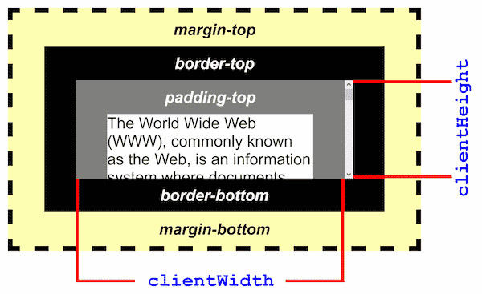
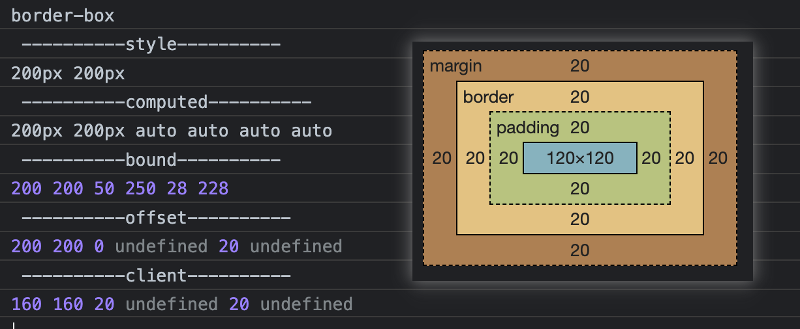
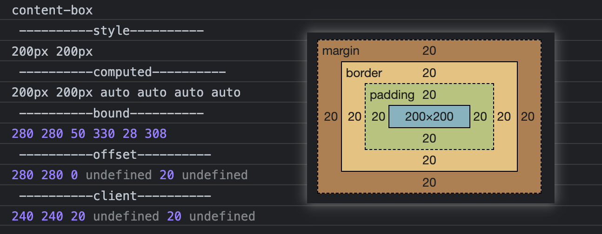

# 盒模型

1. 标准盒模型：
   1. box-sizing: content-box;
   2. width: content
2. IE 盒模型：
   1. box-sizing: border-box;
   2. width: content + padding + border

- 获取盒模型的宽和高
  1. dom.style.width/height
     - 只能取到行内样式的宽和高，取不到定位
  2. dom.currentStyle.width/height （仅 IE）
     - 只适用于 IE 浏览器
  3. window.getComputedStyle(dom).width/height
     - 只读的，可以用于检查元素的样式（包括由一个`<style>`元素或一个外部样式表设置的那些样式）
     - 读取到的是书写的值，不是最终渲染后的值
  4. （常用）dom.getBoundingClientRect().width/height
     - 
     - 取到的是最终渲染后的宽和高，大多浏览器支持。
     - width = content + padding + border
     - 还可以取到相对于视窗的上下左右的距离。
  5. dom.offsetWidth/offsetHeight
     - 
     - 取到的是最终渲染后的宽和高，大多浏览器支持。
     - width = content + padding + border + scrollbar
     - 还可以取到相对于上一级定位元素的上左的距离。
  6. dom.clientWidth/clientHeight
     - 
     - width = content + padding - 滚动条宽度 (如果存在)
     - 通过 top, left, 获取上、左边框的宽度。

