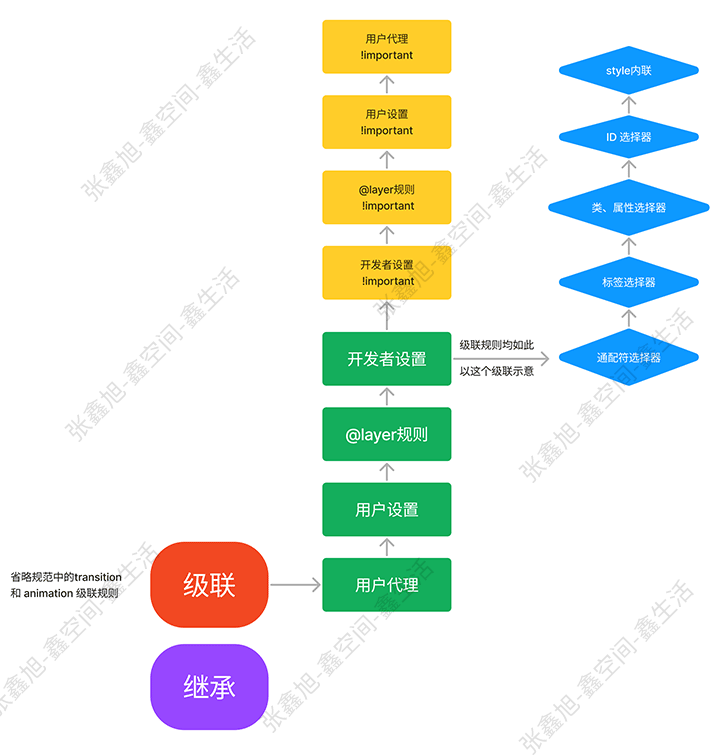

# css 选择器

- 解题：
    - 初阶：
        - 优先级概念、作用，不同选择器会有不同权重，浏览器根据选择器权重确定应用哪一些样式，能很好地解决样式冲突问题
        - 它由 匹配的选择器中的 每一种选择器类型的 数值 决定。而当优先级与多个 CSS 声明中任意一个声明的优先级相等的时候，CSS 中最后的那个声明将会被应用到元素上。
        - ID、class、important、行内样式 等场景的权重

    - 高阶：问题：性能问题 + 优先级管理混乱，容易出现冲突
        - css @layer 规范 —— 块级的优先级管理机制
        - BEM 命名
        - vue SFC scope style => .xxx => .xxx[data-xxxx]
        - React 生态有不少 css-in-js 实践，例如：styled-components：写法像内联 CSS，效果是生成随机 class 选择器

- 解答
    - 初阶：能大概说出选择器的类型
        - 属性选择器、ID/Class 选择器、关系选择器、属性选择器、伪类选择器(hover/active 等)、伪元素选择器(:after/selection 等)
    - 中阶：
        - 性能：从右到左匹配，例如：#app section p:nth-child(2n)，所以最右边的选择器应该尽量具体
            - 尽量避免使用通用选择器 *
            - 复杂选择器用 class 替换（多层选择器、单个属性选择器、基于正则的选择器：*=， |=， ^=， $=，  ~= ）
            - 多用样式继承
        - 优先级：优先级就是分配给指定的 CSS 声明的一个权重，它由 匹配的选择器中的 每一种选择器类型的 数值 决定。而当优先级与多个 CSS 声明中任意一个声明的优先级相等的时候，CSS 中最后的那个声明将会被应用到元素上。
            - div#app section.article a => 1+100+1+10+1
            - 优先用优先级解决冲突问题，尽量避免 !important
        - 兼容性：不同浏览器对 CSS 选择器支持不同
    - 高阶：结合问题，扩展开来，聊聊选择器的一些实践
        - BEM 命名
        - vue SFC scope style => .xxx => .xxx[data-xxxx]
        - React 生态有不少 css-in-js 实践，例如：styled-components：写法像内联 CSS，效果是生成随机 class 选择器

- 知识点：
    - 不同选择器会有不同权重，浏览器根据选择器权重确定应用哪一些样式，能很好地解决样式冲突问题
    - 内联样式、行内样式
    - 注意 !important 会破坏权重机制，后续会特别难维护

- 选择器分类
    - 简单选择器（Simple selectors）：
        - 元素
        - class
        - id
        - 通用选择器

    - 组合器
        - A,B 匹配满足A（和/或）B的任意元素.
        - A B 匹配任意元素，满足条件：B是A的后代结点（B是A的子节点，或者A的子节点的子节点）
        - A > B 匹配任意元素，满足条件：B是A的直接子节点
        - A + B 匹配任意元素，满足条件：B是A的下一个兄弟节点（AB有相同的父结点，并且B紧跟在A的后面）
        - A ~ B 匹配任意元素，满足条件：B是A之后的兄弟节点中的任意一个（AB有相同的父节点，B在A之后，但不一定是紧挨着A）

    - 属性选择器（Attribute selectors）：
        - 存在和值（Presence and value）属性选择器
            - [attr]：该选择器选择包含 attr 属性的所有元素，不论 attr 的值为何。
            - [attr=val]：该选择器仅选择 attr 属性被赋值为 val 的所有元素。
            - [attr~=val]：该选择器仅选择 attr 属性的值（以空格间隔出多个值）中有包含 val 值的所有元素，比如位于被空格分隔的多个类（class）中的一个类。
        - 子串值（Substring value）属性选择器
            - [attr|=val] : 选择attr属性的值以val（包括val）或val-开头的元素（-用来处理语言编码）。
            - [attr^=val] : 选择attr属性的值以val开头（包括val）的元素。
            - [attr$=val] : 选择attr属性的值以val结尾（包括val）的元素。
            - [attr*=val] : 选择attr属性的值中包含字符串val的元素。

    - 伪类（Pseudo-classes）：
        - :active
        - :any
        - :checked
        - :default
        - :dir()
        - :disabled
        - :empty
        - :enabled
        - :first
        - :first-child
        - :first-of-type
        - :fullscreen
        - :focus
        - :hover
        - :indeterminate
        - :in-range
        - :invalid
        - :lang()
        - :last-child
        - :last-of-type
        - :left
        - :link
        - :not()
        - :nth-child()
        - :nth-last-child()
        - :nth-last-of-type()
        - :nth-of-type()
        - :only-child
        - :only-of-type
        - :optional
        - :out-of-range
        - :read-only
        - :read-write
        - :required
        - :right
        - :root
        - :scope
        - :target
        - :valid
        - :visited

    - 伪元素（Pseudo-elements）:
        - ::after
        - ::before
        - ::first-letter
        - ::first-line
        - ::selection
        - ::backdrop

- 选择器优先级
    1. ！important
    2. 内联
    3. ID
    4. 类、伪类、属性
    5. 元素、伪元素
    6. 通配符、关系
    7. 继承
    >(1,1,1) (ID,类,元素)
    - 其他
        - 如果两条样式都使用!important，则权重值高的优先级更高
        - 在css样式表中，同一个CSS样式你写了两次，后面的会覆盖前面的
        - 样式指向同一元素，权重规则生效，权重大的被应用
        - 样式指向同一元素，权重规则生效，权重相同时，就近原则生效，后面定义的被应用
        - 样式不指向同一元素时，权重规则失效，就近原则生效，离目标元素最近的样式被应用

- 性能问题

- BEM 命名
    - [block]__[element]–[modifier]
        1. Block 块:组件的最外层父元素被定义为块。
            - 一个功能独立的页面组件，可重复使用，也支持嵌套。
            - 每个块的块名必须是唯一的，用于明确指出它所描述的是哪个块。 
        2. Element 元素:组件内部可能有一个或多个子元素。
            - 块的组成部分，是依赖上下文的。 
            - 用于描述它是什么，而不是它的状态。
            - 元素之间可以彼此嵌套，一个元素总是一个模块的一部分，而不是另一个元素的一部分
        3. Modifier 修饰符:块或元素都可以有修饰符表示的变化。
            - 通常是外观或行为有些许改变，这时可以使用修饰符来处理。 
    - 好处
        - 仅从名字就能知道一个 CSS 选择器具体做什么
        - 从名字能大致清楚一个选择器可以在哪里使用
        - 从 CSS 类的名称可以看出它们之间的联系
- [css-in-js](./css-in-js.md)
- 
    - 