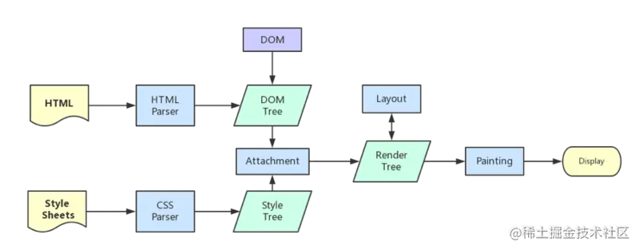

# 重排和重绘

- 关键字
    #浏览器渲染流程
    #浏览器原理

1. 重排reflow: 需要重新计算元素的几何信息(元素的的位置和尺寸大小)
   1. 引发原因
       - 页面初始渲染，这是开销最大的一次重排
       - 添加/删除可见的DOM元素
       - 改变元素位置
       - 改变元素尺寸，比如边距、填充、边框、宽度和高度等
       - 改变元素内容，比如文字数量，图片大小等
       - 改变元素字体大小
       - 改变浏览器窗口尺寸，比如resize事件发生时
       - 激活CSS伪类（例如：:hover）
       - 设置 style 属性的值，因为通过设置style属性改变结点样式的话，每一次设置都会触发一次reflow
       - 查询某些属性或调用某些计算方法：offsetWidth、offsetHeight等
       - 除此之外，当我们调用 getComputedStyle 方法，或者IE里的 currentStyle 时，也会触发重排，原理是一样的，都为求一个“即时性”和“准确性”。
       - 
   2. 影响范围：
      1. 全局范围：从根节点html开始对整个渲染树进行重新布局。
      2. 局部范围：对渲染树的某部分或某一个渲染对象进行重新布局
           1. 把一个dom的宽高之类的几何信息定死，然后在dom内部触发重排，就只会重新渲染该dom内部的元素，而不会影响到外界。

2. 重绘repaint: 需要重新绘制元素的外观，但没有改变布局
   1. 引发原因
       - 颜色变化
       - visibility
       - opacity
       - border-radius
       - 

- 重排优化
    1. 减少重排范围
        - 不适用 table 布局，可能很小的一个小改动会造成整个 table 的重新布局。
            - 不得已使用时，设置 `table-layout:auto/fixed;`，让 table 一行一行的渲染，限制重排范围。
        - 尽可能在低层级的 DOM 节点上，改变 class，而不是高层级的节点。

    2. 减少重排次数
        - 样式集中改变
            - 更改类名而不是修改样式
            - 合并多次对 DOM 和样式的修改，然后一次处理掉
        - 分离 DOM 读写操作
            - DOM 的多个读操作（或多个写操作），应该放在一起。
                - 浏览器重排或重绘时，可以批量执行
        - 将 DOM 脱离文档流再修改后，放回去
            - `display:none` 隐藏后操作，再显式，只触发两次重排重绘
                - `visibility: hidden` 只影响重绘，不影响重排
            - 通过 document.fragment 创建一个离线的 DOM，修改后再放回去，只触发一次重排。
            - 复制节点，在副本上操作，最后替换原始节点，只触发一次重排。
        - 使用 absolute 或 fixed
            - 脱离了文档流，重排开销小。
            - 在这个节点上操作时，一些其它在这个区域内的节点可能需要重绘，但是不需要重排。
        - 优化动画
            - 将动画效果应用到 position 为 absolute 或 fixed 的元素上。
            - 开启 GPU 加速: 使用css3硬件加速
                - Canvas2D
                - 布局合成
                - 3D转换（transitions）
                - 3D变换（transforms）
                - WebGL和视频(video)

- 在浏览器上查看页面渲染时间
    1. 打开开发者工具：点击 Performance 左侧有个小圆点，点击刷新页面会录制整个页面加载出来时间的分配情况。
       1. 
    2. 点击 Event Log：单独勾选 Loading 项会显示 html 和 css 加载时间。
       1. 

- 拓展：
    - 页面生成的过程
        1. 
        2. HTML 被 HTML 解析器解析成 DOM 树；
        3. CSS  被 CSS 解析器解析成 CSSOM 树；
        4. 结合 DOM 树和 CSSOM 树，生成一棵渲染树(Render Tree)，这一过程称为 Attachment；
        5. 生成布局(flow)，浏览器在屏幕上“画”出渲染树中的所有节点；
        6. 将布局绘制(paint)在屏幕上，显示出整个页面。
        - 第四步和第五步是最耗时的部分，这两步合起来，就是我们通常所说的渲染。

    - 渲染
        - 在页面的生命周期中，网页生成的时候，至少会渲染一次。
        - 在用户访问的过程中，还会不断触发重排(reflow)和重绘(repaint)，不管页面发生了重绘还是重排，都会影响性能。
        - 重绘不一定导致重排，但重排一定会导致重绘。
    - [30FPS](./30FPS.md)
    - 使用 Transform 实现位移跟使用 top/left 实现，有什么区别
        - 使用 transform 实现位移，只会触发重绘，不会触发重排。
        - 使用 top/left 实现位移，会触发重排和重绘。
    - `display:none` 的元素是否会触发重排
        - 不会触发重排和重绘。
    - 下面两段代码，那种性能更高？为什么？（第二段，只触发一次重排）

        ```js
        // 第一段
        div.style.left = div.offsetLeft + 1 + 'px';
        div.style.top = div.offsetTop + 1 + 'px';
        div.style.right = div.offsetRight + 1 + 'px';
        div.style.bottom = div.offsetBottom + 1 + 'px';

        // 第二段
        var curLeft = div.offsetLeft;
        var curTop = div.offsetTop;
        var curRight = div.offsetRight;
        var curBottom = div.offsetBottom;

        div.style.left = curLeft + 1 + 'px';
        div.style.top = curTop + 1 + 'px';
        div.style.right = curRight + 1 + 'px';
        div.style.bottom = curBottom + 1 + 'px';
        ```
