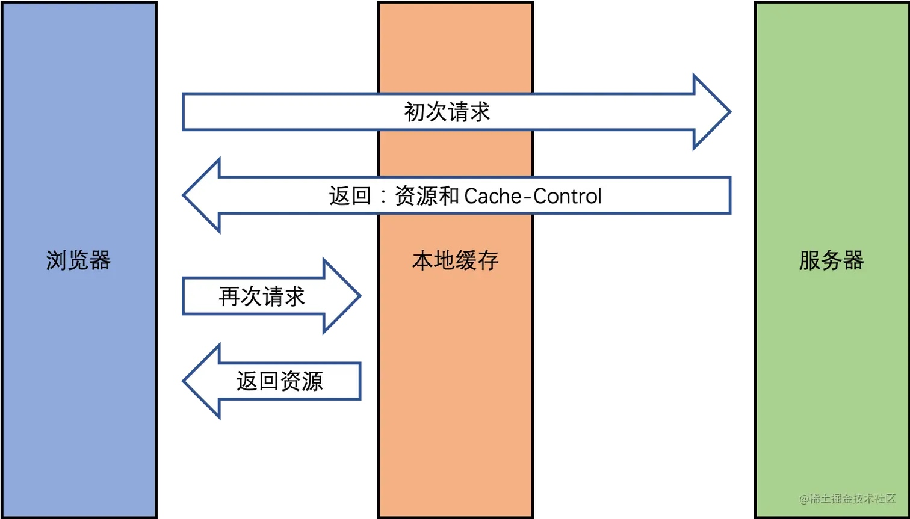
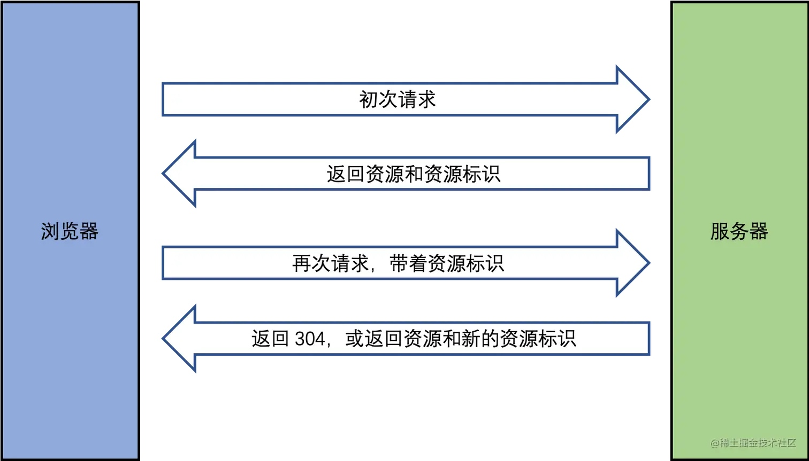
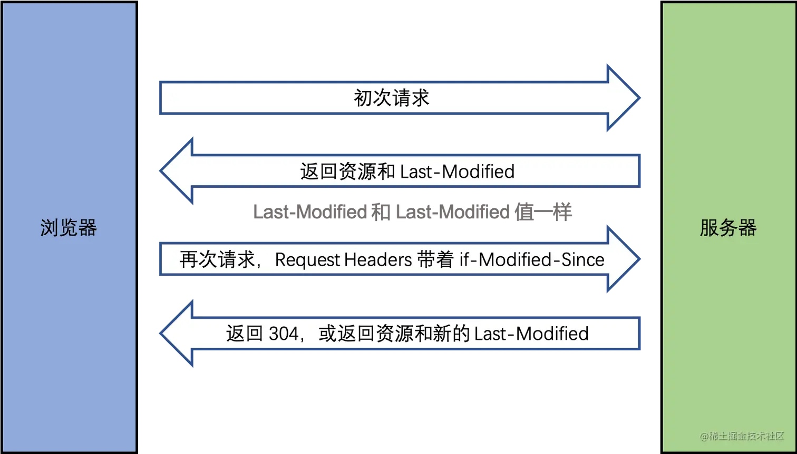
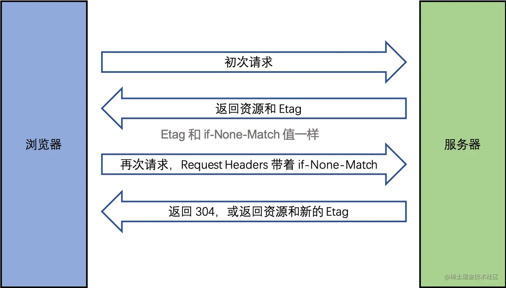
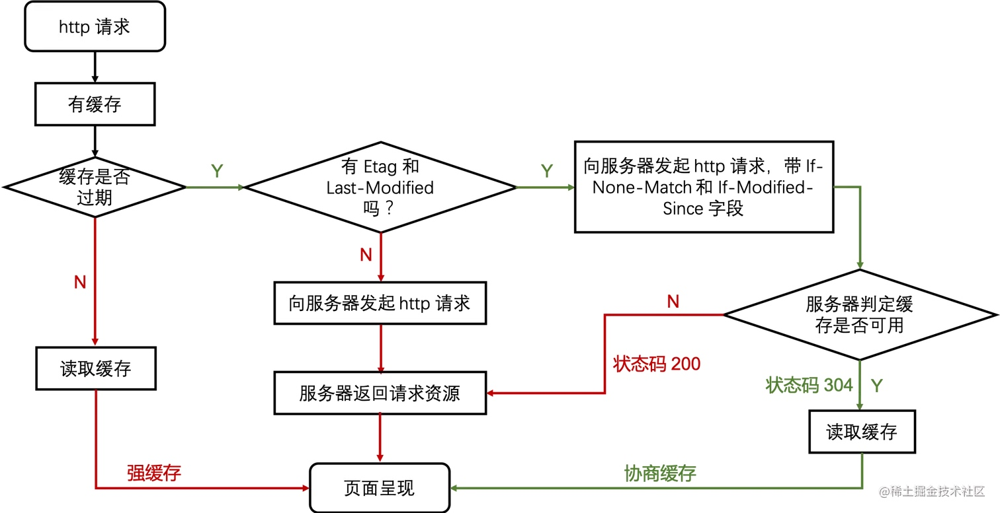

# 浏览器缓存策略

#浏览器缓存策略
解题：
● 初阶：缓存作用及成本，强缓存 vs 协商缓存，说出两者区同点，以及分别如何实现
  ○ 强缓存：若浏览器有缓存副本且未过期，则直接使用强缓存版本；
    ■ cache-control：max-age
  ○ 协商：即使本地有副本，也会到携带缓存标识(if-modified-since/if-none-match)到服务端验证副本有效性，如果生效返回304，否则直接返回结果200；
    ■ last-modified：最后更新时间
    ■ etag：内容摘要
● 中阶：
  ○ cache-control：public、private、no-cache、no-store、max-age，特别地：
    ■ no-cache：告诉浏览器、缓存服务器，不管本地副本是否过期(last-modified)，使用资源副本前，一定要到源服务器进行副本有效性校验。
    ■ no-store
    ■ must-revalidate：告诉浏览器、缓存服务器，本地副本过期前，可以使用本地副本；本地副本一旦过期，必须去源服务器进行有效性校验。
  ○ 能说出 last-modified/etag 的优缺点
  ○ 实践：
    ■ 文件名使用 hash 做路径标识，配合强缓存
    ■ SPA 应用，通常设置 html 页面为 no-cache 或 no-store
● 高阶：更进阶地，能聊到更多实现缓存的手段：
  ○ 应用缓存 —— App Cache and Manifest 文件
  ○ localstorage —— 经常有人哪来做缓存
  ○ Service Worker 实现自定义的网络请求逻辑

什么是缓存？ 把一些不需要重新获取的内容再重新获取一次
为什么需要缓存？ 网络请求相比于 CPU 的计算和页面渲染是非常非常慢的。
哪些资源可以被缓存？ 静态资源，比如 html js css img。

## 1 强制缓存

Cache-Control：

* public 所有内容都将被缓存
* private 内容只缓存到私有缓存中
* max-age：缓存最大过期时间。
* no-cache：可以在客户端存储资源，每次都必须去服务端做新鲜度校验，来决定从服务端获取新的资源（200）还是使用客户端缓存（304）。
* no-store：永远都不要在客户端存储资源，永远都去原始服务器去获取资源。
* must-revalidation/proxy-revalidation 如果缓存的内容失效，请求必须发送到服务器/代理以进行重新验证

Cache-Control：

* 在 Response Headers 中。
* 控制强制缓存的逻辑。
* 例如 Cache-Control: max-age=3153600（单位是秒）

## 2 协商缓存(对比缓存)

* 服务端缓存策略。
* 服务端判断客户端资源，是否和服务端资源一样。
* 一致则返回 304，否则返回 200 和最新的资源。

资源标识：
* 在 Response Headers 中，有两种。
* Last-Modified：资源的最后修改时间。
* Etag：资源的唯一标识（一个字符串，类似于人类的指纹）。

1. Last-Modified：
    
    服务端拿到 if-Modified-Since 之后拿这个时间去和服务端资源最后修改时间做比较，如果一致则返回 304 ，不一致（也就是资源已经更新了）就返回 200 和新的资源及新的 Last-Modified。

    原理：
       1. 客户端第一次请求，请求头啥也没有，服务器返回一个响应头含有最后修改时间Last-modified，状态码200。
       2. 客户端第二次请求，携带第一次的返回的最后修改时间If-Modified-Since。服务器拿到后对比文件的最后更新时间，一样就返回304，浏览器就会使用本地缓存。
       3. 如果文件被修改，客户端再次请求的时候获取到最新的时间，并且返回新的资源，不会使用本地缓存。

2. Etag：
    
    其实 Etag 和 Last-Modified 一样的，只不过 Etag 是服务端对资源按照一定方式（比如 contenthash）计算出来的唯一标识，就像人类指纹一样，传给客户端之后，客户端再传过来时候，服务端会将其与现在的资源计算出来的唯一标识做比较，一致则返回 304，不一致就返回 200 和新的资源及新的 Etag。

    原理：
       1. 当你第一次发起HTTP请求时，服务器会返回一个Etag。
       2. 并在你第二次发起同一个请求时，客户端会同时发送一个If-None-Match，而它的值就是Etag的值（此处由发起请求的客户端来设置）。然后，服务器会比对这个客服端发送过来的Etag是否与服务器的相同，
       3. 如果相同，就将If-None-Match的值设为false，返回状态为304，客户端继续使用本地缓存，不解析服务器返回的数据

比较 Last-Modified, Etag 两者：

* 优先使用 Etag。
* Last-Modified 只能精确到秒级。
* 如果资源被重复生成，而内容不变，则 Etag 更精确。

## 4 综述

## 5 三种刷新操作对 http 缓存的影响

* 正常操作：地址栏输入 url，跳转链接，前进后退等。
* 手动刷新：f5，点击刷新按钮，右键菜单刷新。
* 强制刷新：ctrl + f5，shift+command+r。

>正常操作：强制缓存有效，协商缓存有效。
>手动刷新：强制缓存失效，协商缓存有效。
>强制刷新：强制缓存失效，协商缓存失效。
