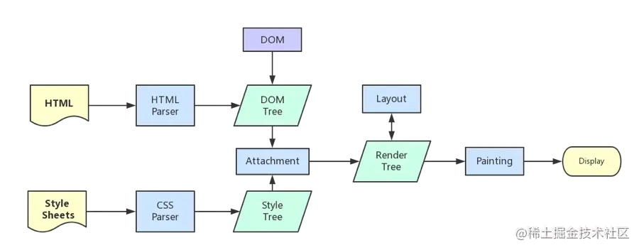

# 页面从开始请求到完成渲染的过程

- 问题：描述下浏览器从输入网址到页面展现的整个过程
    - 解题：
        - 初阶：
            - URL 输入
            - DNS 解析
            - 建立 tcp 链接
            - [可选]建立TLS连接
            - 发送 HTTP/HTTPS 请求
            - 服务器处理请求
            - 返回响应
            - 浏览器开始边下载边解析 html
            - 浏览器渲染
            - 请求结束，断开 TCP 连接
        - 中阶：深入理解每一个步骤
            - DNS 过程：
                - 先在本地 hosts 文件找
                - 发送 DNS 请求到本地服务器
                - 发送请求到 DNS 根服务器
                - 根服务器重定向到域名服务器 => 1、2、3、4 级域名，逐步迭代求解
                - 域名服务器返回 IP 地址，本地缓存结果

            - 建立 TCP 连接
                - 三次握手
                - 滑动窗口

            - 建立 TLS
                1. Client_hello：客户端发起ssl请求，携带：
                   1. TLS版本信息
                   2. 随机数1（明文）
                   3. 加密套件候选列表
                   4. 压缩算法候选列表
                   5. 扩展字段
                   6. 其他
                2. Server_hello：返回协商结果
                   1. 选择使用的TLS协议版本 version
                   2. 选择的加密套件 cipher suite
                   3. 选择的压缩算法 compression method
                   4. 随机数2(明文)
                   5. 证书
                3. 客户端使用公钥加密随机数3，发送给服务端
                4. 服务端用私钥解密随机数3，双端用 随机数1、2、3 构成对称密钥，连接建立完成
            - 发送 HTTP/HTTPS 请求，考察对 http 协议的充分理解
                - headers
                - method
                - cookie
                - 跨域
            - 服务端处理请求
            - 返回响应
                - headers
                - 状态码
                - encoding （特别是 Transfer-Encoding: chunked）
            - 浏览器处理 html
                - 遇到网络资源(css、image、js、video、audio 等)，同步加载这些资源
                - 生成 render tree，渲染页面
                - 执行 js 等
            - 浏览器渲染

            - TCP 断开链接 —— 四次挥手
        - 高阶：
            - 聊聊从上述过程对页面性能的影响，以及可以推导出来的性能优化手段
    - 资料：
        - <https://www.html5rocks.com/zh/tutorials/internals/howbrowserswork/#Introduction>
        - <https://www.zhihu.com/question/22587247/answer/66417484>

- 页面从开始请求到完成渲染的过程
    1. 输入 url 后解析出协议, 主机, 端口, 路径,参数等, 并构造一个 http 请求
    2. DNS 解析: 将域名解析为 IP 地址
       - 先在本地 hosts 文件找
       - 发送 DNS 请求到本地服务器
       - 发送请求到 DNS 根服务器
       - 根服务器重定向到域名服务器 => 1、2、3、4 级域名，逐步迭代求解
       - 域名服务器返回 IP 地址，本地缓存结果
    3. 建立 TCP/IP 连接: TCP 三次握手
        1. 第一次握手, 确认客服端的发送能力
        2. 第二次握手, 确认了服务端的接收能力和发送能力
        3. 第三次握手, 确认客户端的接收能力。
    4. 建立TLS连接
        1. Client_hello：客户端发起ssl请求，携带：
             1. TLS版本信息
             2. 随机数1（明文）
             3. 加密套件候选列表
             4. 压缩算法候选列表
             5. 扩展字段
             6. 其他
        2. Server_hello：返回协商结果
             1. 选择使用的TLS协议版本 version
             2. 选择的加密套件 cipher suite
             3. 选择的压缩算法 compression method
             4. 随机数2(明文)
             5. 证书
        3. 客户端使用公钥加密随机数3，发送给服务端
        4. 服务端用私钥解密随机数3，双端用 随机数1、2、3 构成对称密钥，连接建立完成
    5. 发送 HTTP 请求
    6. 服务器处理请求并返回 HTTP 报文
    7. 浏览器开始边下载边解析 html
    8. 浏览器渲染页面
        1. 
        2. 步骤:
            1. 解析 HTML，生成 DOM 树，解析 CSS，生成 CSSOM 树
            2. 将 DOM 树和 CSSOM 树结合，生成渲染树(Render Tree)
            3. Layout(回流):根据生成的渲染树，进行回流(Layout)，得到节点的几何信息（位置，大小）
            4. Painting(重绘):根据渲染树以及回流得到的几何信息，得到节点的绝对像素
            5. Display:将像素发送给GPU，展示在页面上
            >回流一定会触发重绘，而重绘不一定会回流
    9. 断开连接: TCP 四次挥手
        1. 第一次: 浏览器告知服务器 请求发送完毕
        2. 第二次: 服务器告知浏览器 请求接受完毕
        3. 第三次: 服务器告知浏览器 响应发送完毕
        4. 第四次: 浏览器告知服务器 响应接受完毕
