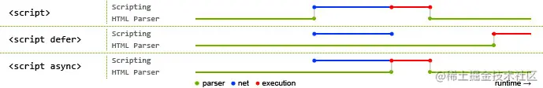

# defer 和 async 的区别

- 如果没有defer或async属性，浏览器会立即加载并执行相应的脚本，这样就阻塞了后续文档的加载。
- defer 和 async属性都是去异步加载外部的JS脚本文件，它们都不会阻塞页面的解析
- 区别
    - 
    - 执行顺序
        - 多个带async属性的标签，不能保证加载的顺序；
        - 多个带defer属性的标签，按照加载顺序执行；
    - 脚本是否并行执行
        - async属性，表示后续文档的加载和执行与 js 脚本的加载和执行是并行(异步)进行的；
        - defer属性，加载后续文档的过程和 js 脚本的加载是并行(异步)进行的，js 脚本等到文档所有元素解析完成之后才执行，DOMContentLoaded 事件触发执行之前。