# 尚硅谷 Html4

[Toc]

## 一、前序知识

### 1. 认识两位先驱

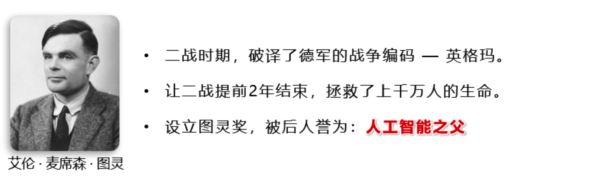


### 2. 计算机基础知识

1. `计算机` 俗称电脑，是现代一种用于高速计算的电子计算机器，可以进行数值计算、逻辑计算，还
具有存储记忆功能。
2. 计算机由`硬件+软件`成:
      硬件:看得见摸得着的物理部件。
    软件:可以指挥硬件工作的指令。
3. 软件的分类:
    1. 系统软件:Windows、Linux、Android、Harmony 等。
    2. 应用软件:微信、QQ、王者荣耀、PhotoShop 等。
4. 整体图示:
   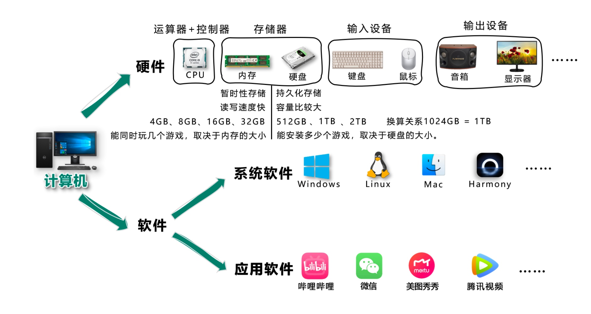

### 3. C/S架构与B/S架构

1. 上面提到的应用软件，又分为两大类:
    1. C/S架构 ，特点:需要安装、偶尔更新、不跨平台、开发更具针对性。
    2. B/S架构 ，特点:无需安装、无需更新、可跨平台、开发更具通用性。
    >名词解释:C => client(客户端)、B => browser(浏览器)、S => server(服务器)。 服务器 :为软件提供数据的设备(在背后默默的付出)。
2. 前端工程师，主要负责编写 B/S架构中的网页(呈现界面、实现交互)。
    >备注:大前端时代，我们可以用前端的技术栈，做出一个C/S架构的应用、甚至搭建一个服 务器😎。
    >
### 4. 浏览器相关知识

浏览器是网页运行的平台，常见的浏览器有: 谷歌(Chrome) 、 Safari 、 IE 、 火狐(Firefox) 、欧朋(Opera) 等，以上这些是常用的五大浏览器。

1. 各大浏览器市场份额:
    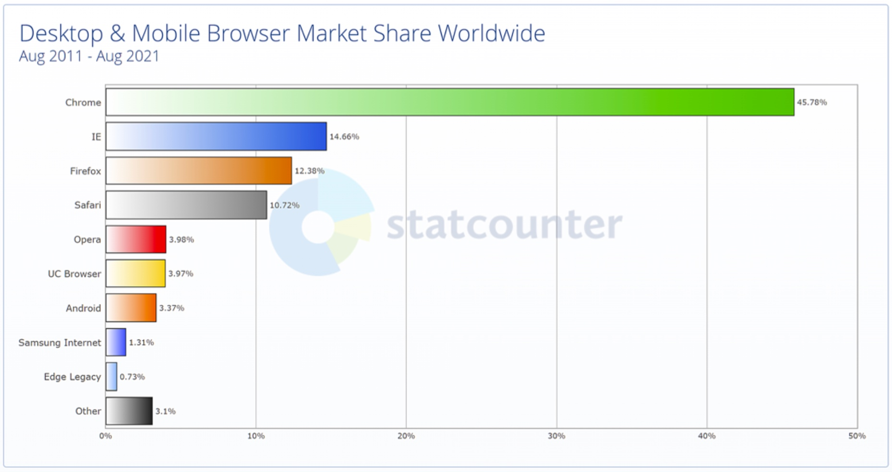

1. 常见浏览器的内核:
    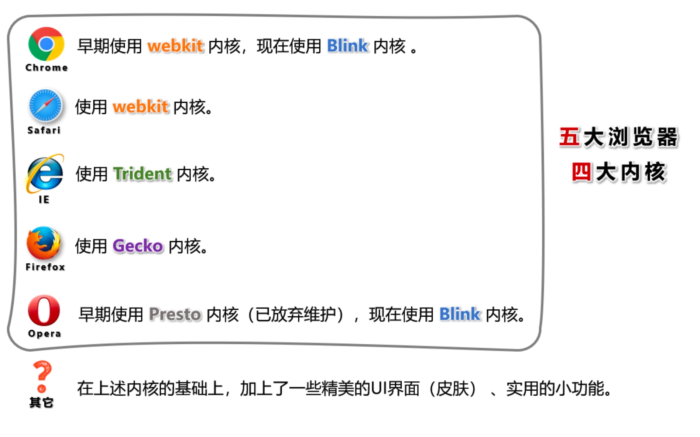

### 5. 网页相关概念

1. 网址:我们在浏览器中输入的地址。
2. 网页:浏览器所呈现的每一个页面。
3. 网站:多个网页构成了一个网站。
4. 网页标准:
    

## 二、HTML 简介

1. 什么是 HTML?
全称:HyperText Markup Language(超文本标记语言)。
   >超文本:暂且简单理解为 “超级的文本”，和普通文本比，内容更丰富。
   标 记:文本要变成超文本，就需要用到各种标记符号。
   语 言:每一个标记的写法、读音、使用规则，组成了一个标记语言。
2. 相关国际组织(了解)
    1. IETF
    >全称:Internet Engineering Task Force(国际互联网工程任务组)，成立于1985年底，是一个权威 的互联网技术标准化组织，主要负责互联网相关技术规范的研发和制定，当前绝大多数国际互联网 技术标准均出自IETF。官网: <https://www.ietf.org>
    1. W3C
    >全称:World Wide Web Consortium(万维网联盟)，创建于1994年，是目前Web技术领域，最具影 响力的技术标准机构。共计发布了200多项技术标准和实施指南，对互联网技术的发展和应用起到 了基础性和根本性的支撑作用，官网: <https://www.w3.org>
    1. WHATWF
    >全称:Web Hypertext Application Technology Working Group(网页超文本应用技术工作小组)成立 于2004年，是一个以推动网络HTML 5 标准为目的而成立的组织。由Opera、Mozilla基金会、苹果， 等这些浏览器厂商组成。官网: <https://whatwg.org/>
3. HTML 发展历史(了解)
 从 HTML 1.0 开始发展，期间经历了很多版本，目前HTML的最新标准是:HMTL 5，具体发展史如图(了 解即可)。
 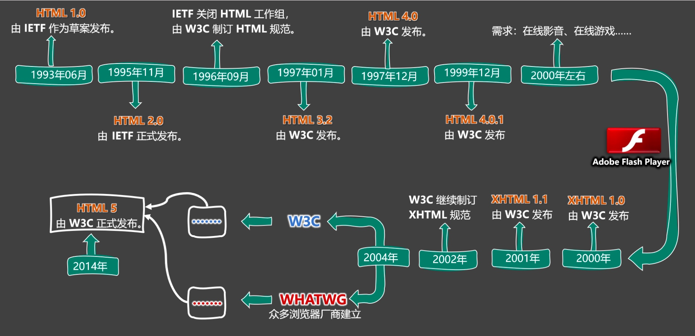

## 三、准备工作

1. 常用电脑设置
    1. 查看文件夹内容的几种布局。
    2. 展示文件扩展名(文件后缀)。
    3. 使用指定程序打开文件。
    4. 配置文件的默认打开方式。
2. 安装Chrome浏览器
    1. 下载地址: <https://www.google.cn/chrome> 。
    2. 若上述地址打不开，或无法安装，请使用资料中的离线安装包。
    3. 详细步骤请参考视频。

## 四、HTML 入门

### 1. HTML 初体验

1. 第一步:鼠标右键 => 新建 => 文本文档 => 输入以下内容，并保存。
    `<marquee>尚硅谷，让天下没有难学的技术!</marquee>`
2. 第二步:修改后缀为 .html ，然后双击打开即可。
    >这里的后缀名，使用 .htm 也可以，但推荐使用更标准的 .html 。
3. 程序员写的叫 源代码 ，要交给浏览器进行渲染。
4. 借助浏览器看网页的 源代码 ，具体操作:
    >在网页空白处:鼠标右键 ==> 查看网页源代码
    >
### 2. HTML 标签

1. 标签 又称 元素，是HTML的基本组成单位。
2. 标签分为: 双标签 与 单标签 (绝大多数都是双标签)。
3. 标签名不区分大小写，但推荐小写，因为小写更规范。
4. 双标签:
    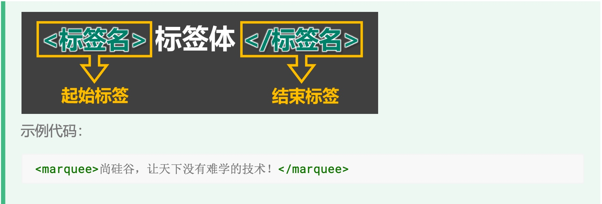

5. 单标签:
    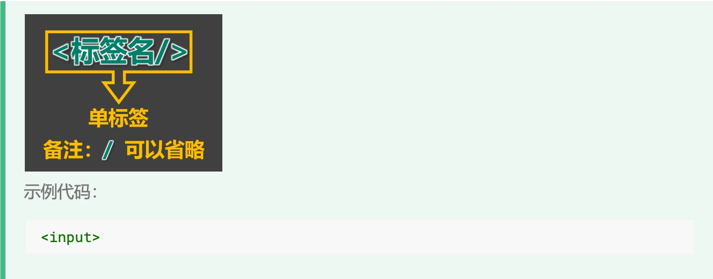

6. 标签之间的关系:并列关系、嵌套关系，可以使用 tab 键进行缩进:

```js
<marquee>尚硅谷，让天下没有难学的技术!</marquee>
    示例代码:
<input>
    <marquee>
        尚硅谷，让天下没有难学的技术!
        <input>
    </marquee>
<input>
```

### 3. HTML 标签属性

1. 用于给标签提供 附加信息 。
2. 可以写在: 起始标签 或 单标签中 ，形式如下:
   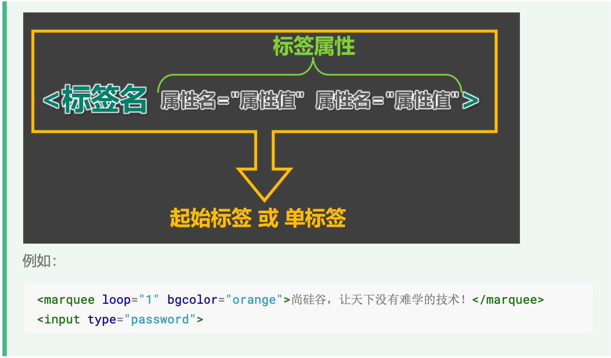
3. 有些特殊的属性，没有属性名，只有属性值，例如: `<input disabled>`
4. 注意点:
    1. 不同的标签，有不同的属性;也有一些通用属性(在任何标签内都能写，后面会详细 总结)。
    2. 属性名、属性值不能乱写，都是W3C规定好的。
    3. 属性名、属性值，都不区分大小写，但推荐小写。
    4. 双引号，也可以写成单引号，甚至不写都行，但还是推荐写双引号。
    5. 标签中不要出现同名属性，否则后写的会失效，例如:
        `<input type="text" type="password">`
  
### 4. HTML 基本结构

1. 在网页中，如何查看某段结构的具体代码?—— 点击鼠标右键，选择“检查”。
2. 【检查】 和 【查看网页源代码】的区别:

>【查看网页源代码】看到的是:程序员编写的源代码。
>【检查】看到的是:经过浏览器 “处理” 后的源代码。
>备注:日常开发中，【检查】用的最多。

1. 网页的 基本结构 如下:
    1. 想要呈现在网页中的内容写在 body 标签中。
    2. head 标签中的内容不会出现在网页中。
    3. head 标签中的 title 标签可以指定网页的标题。
    4. 图示: 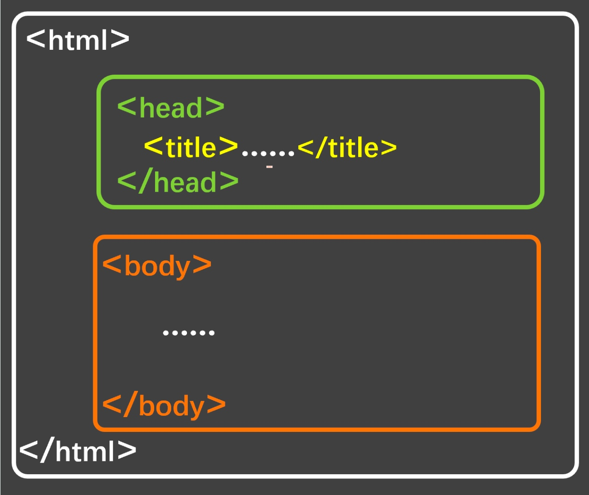
    5. 代码:

    ```html
    <html>
        <head>
            <title>网页标题</title> 
        </head>
        <body>
        ......
        </body>
    </html>
    ```

### 5. 安装 VSCode

1. 安装中文语言包。
2. 使用 VSCode打开文件夹的两种方式。
3. 调整字体大小。
4. 设置主题。
5. 安装图标主题: vscode-icons 。

>备注:详细安装步骤请参考视频。
>
### 6. 安装 Live Server 插件

1. 可以更加方便的打开网页。
2. 打开网页的方式更贴近项目上线。
3. 代码出现改动后，可以自动刷新。
4. 根据自己的情况，去配置一下 VSCode 的自动保存。

>注意1:务必使用VSCode打开的是文件夹，否则 Live Server 插件无法正常工作!
>注意2:打开的网页必须是标准的HTML结构，否则无法自动刷新!

### 7. HTML 注释

1. 特点:注释的内容会被浏览器所忽略，不会呈现到页面中，但源代码中依然可见。
2. 作用:对代码进行解释和说明。
3. 写法:

    ```html
    <!-- 下面的文字只能滚动一次 --> <marquee loop="1">尚硅谷</marquee>
    <!-- 下面的文字可以无限滚动 --> <marquee>尚硅谷123</marquee>
    ```

4. 注释不可以嵌套，以下这么写是错的(反例)。

### 8. HTML 文档声明

1. 作用:告诉浏览器当前网页的版本。
2. 写法:
    - 旧写法 :要依网页所用的HTML版本而定，写法有很多。
    >具体有哪些写法请参考 : W3C官网-文档声明 (了解即可，千万别背!)
    - 新写法:一切都变得简单了!W3C 推荐使用 HTML 5 的写法。

        ```html
           <!DOCTYPE html>
            或
            <!DOCTYPE HTML>
            或
            <!doctype html>
        ```

3. 注意:文档声明，必须在网页的第一行，且在 html 标签的外侧。

### 9. HTML 字符编码

1. 计算机对数据的操作:
    - 存储时，对数据进行: 编码 。
    - 读取时，对数据进行: 解码 。
2. 编码、解码，会遵循一定的规范 —— 字符集 。
3. 字符集有很多中，常见的有(了解):

  > 1. ASCII:大写字母、小写字母、数字、一些符号，共计128个。
  > 2. ISO8859-1:在 ASCII 基础上，扩充了一些希腊字符等，共计是256个。
  > 3. GB2312:继续扩充，收录了 6763 个常用汉字、682个字符。
  > 4. GBK :收录了的汉字和符号达到 20000+ ，支持繁体中文。
  > 5. UTF-8 :包含世界上所有语言的:所有文字与符号。—— 很常用。

1. 使用原则是怎样的?

- 原则1:存储时，务必采用合适的字符编码 。
否则:无法存储，数据会丢失!

- 原则2:存储时采用哪种方式编码 ，读取时就采用哪种方式解码。
否则:数据错乱(乱码)!

>例如下面文字中，包含有:中文、英文、泰文、缅甸文

```sh
我爱你
I love you!
```

  若使用 ISO8859-1 编码存储，在存入的那一刻，就出问题了，因为 ISO8859-1 仅支持英 文!
  为保证所有的输入，都能正常存储和读取，现在几乎全都采用: UFT-8 编码。 所以我们编写 html 文件时，也都统一用 UFT-8 编码。

1. 总结:
    - 平时编写代码时，统一采用 UTF-8 编码(最稳妥)。
    - 为了让浏览器在渲染 html 文件时，不犯错误，可以通过 meta 标签配合 charset 属性指 定字符编码。

```html
<head>
    <meta charset="UTF-8"/>
</head>
```

### 10. HTML 设置语言

1. 主要作用:

- [x] 让浏览器显示对应的翻译提示。
- [x] 有利于搜索引擎优化。

1. 具体写法:
       `<html lang="zh-CN">`
2. 扩展知识: lang 属性的编写规则(作为一个课外扩展知识，了解即可)。
    1. 第一种写法( 语言-国家/地区 )，例如:
    zh-CN:中文-中国大陆(简体中文)
    zh-TW:中文-中国台湾(繁体中文)
    zh :中文
    en-US:英语-美国
    en-GB:英语-英国
    2. 第二种写法( 语言—具体种类)已不推荐使用，例如:
    zh-Hans:中文—简体
    zh-Hant:中文—繁体
    3. W3School 上的说明: 《语言代码参考手册》 、 《国家/地区代码参考手册》
    4. W3C官网上的说明: 《Language tags in HTML》

### 11. HTML标准结构

HTML标准结构如下:

 ```html
<!DOCTYPE html>
<html lang="zh-CN">
    <head>
        <meta charset="UTF-8">
        <title>我是一个标题</title>
    </head>
    <body>
    </body>
</html>
```

- 输入 `!` ，随后回车即可快速生成标准结构。 生成的结构中，有两个meta标签，我们暂时用不到，可以先删掉。
- 配置 `VScode` 的内置插件 `emmet` ，可以对生成结构的属性进行定制。
- 在存放代码的文件夹中，存放一个 `favicon.ico` 图片，可配置网站图标。

## 五、HTML 基础

### 1. 开发者文档

- W3C官网:www.w3c.org

- W3School:www.w3school.com.cn
- MDN: developer.mozilla.org—— 平时用的最多。

### 2. 排版标签

 

  1. h1 最好写一个， h2~h6 能适当多写。
  2. h1~h6 不能互相嵌套，例如: h1 标签中最好不要写 h2 标签了。
  3. p 标签很特殊!它里面不能有: h1~h6 、 p 、 div 标签(暂时先这样记，后面会说规律)。

### 3. 语义化标签

- 概念:用特定的标签，去表达特定的含义。

- 原则:标签的默认效果不重要(后期可以通过 CSS 随便控制效果)，语义最重要!
- 举例:对于 h1 标签，效果是文字很大(不重要)，语义是网页主要内容(很重要)。
- 优势:
  - 代码结构清晰可读性强。
  - 有利于 SEO(搜索引擎优化)。
  - 方便设备解析(如屏幕阅读器、盲人阅读器等)。

### 4. 块级元素 与 行内元素

1. 块级元素 :独占一行(排版标签都是块级元素)。
2. 行内元素:不独占一行(目前只学了: input ，稍后会学习更多)。
3. 使用原则:
   1. 块级元素 中能写 行内元素 和 块级元素(简单记:块级元素中几乎什么都能写)。
   2. 行内元素 中能写 行内元素，但不能写 块级元素。
   3. 一些特殊的规则:
    - h1~h6 不能互相嵌套。
    - p 中不要写块级元素。
   >备注: marquee 元素设计的初衷是:让文字有动画效果，但如今我们可以通过 CSS 来实现了，而且还可以实现的更加炫酷，所以 marquee 标签已经:过时了(废弃了)，不推荐使用。我们只是在开篇的时候，用他做了一个引子而已，在后续的学习过程中，这些已经废弃的标签，我们直接跳过。

### 5.文本标签_常用的

1. 用于包裹:词汇、短语等。
2. 通常写在排版标签里面。
3. 排版标签更宏观(大段的文字)，文本标签更微观(词汇、短语)。
4. 文本标签通常都是行内元素。
    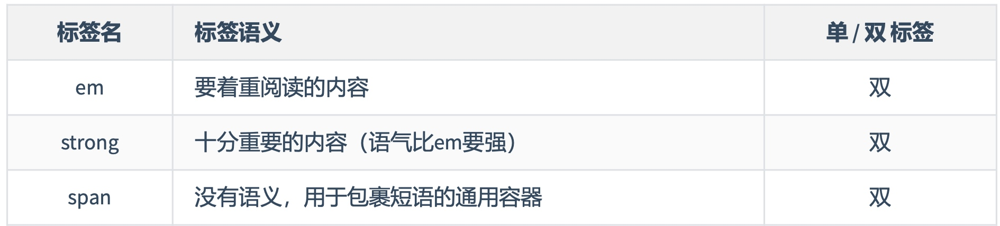
    >生活中的例子: div 是大包装袋， span 是小包装袋。
    >
### 6. 文本标签_不常用的

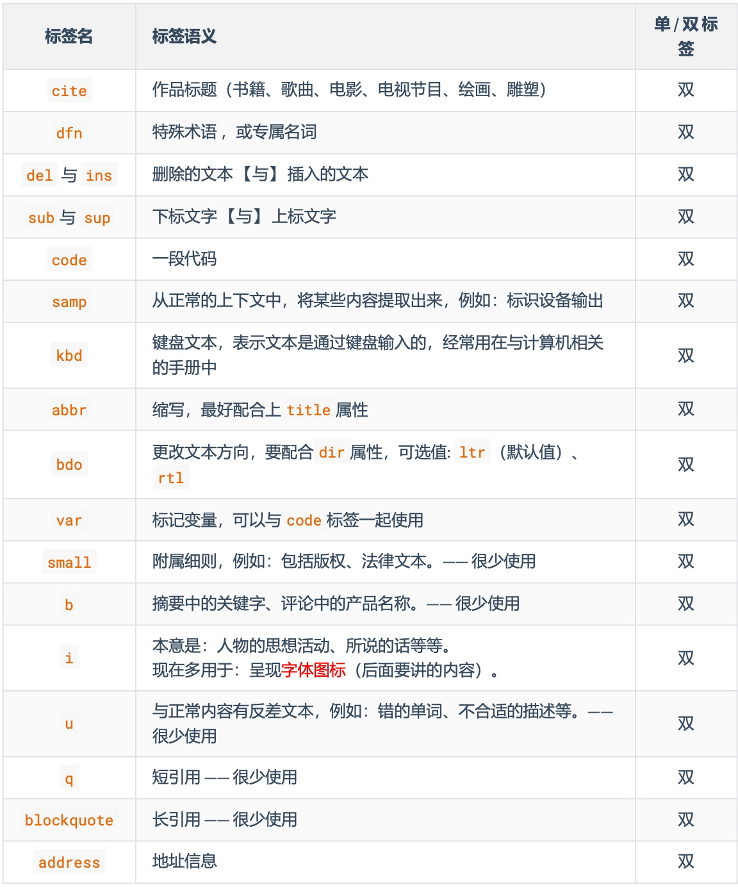

>备注:
>
> 1. 这些不常用的文本标签，编码时不用过于纠结(酌情而定，不用也没毛病)。
> 2. blockquote 与 address 是块级元素，其他的文本标签，都是行内元素。
> 3. 有些语义感不强的标签，我们很少使用，例如:
> small 、 b 、 u 、 q 、 blockquote
> 4. HTML标签太多了!记住那些:重要的、语义感强的标签即可;截止目前，有这些:
> h1~h6 、 p 、 div 、 em 、 strong 、 span

### 7. 图片标签

1. 基本使用
    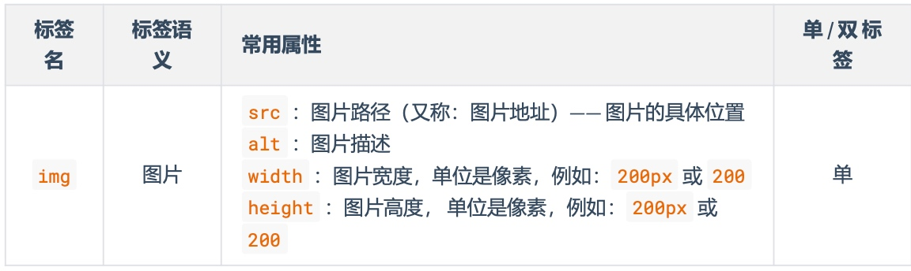

总结:
>
>   1. 像素( px )是一种单位，学到 CSS 时，我们会详细讲解。
>   2. 尽量不同时修改图片的宽和高，可能会造成比例失调。
>   3. 暂且认为 img 是行内元素(学到 CSS 时，会认识一个新的元素分类，目前咱们只知道: 块、行内)。
>   4. alt 属性的作用:
>     搜索引擎通过 alt 属性，得知图片的内容。—— 最主要的作用。 当图片无法展示时候，有些浏览器会呈现 alt 属性的值。 盲人阅读器会朗读 alt 属性的值。

1. 路径的分类
1. 相对路径:以当前位置作为参考点，去建立路径。
./ 同级 引入【怪兽.jpg】: ``
../ 上一 引入【奥特曼.jpg】:`  `级
     已有结构 符号 含义 举例(在 .html 中)
试测
           /
下一
``
      引入【喜羊羊.jpg】:

2. 绝对路径:以根位置作为参考点，去建立路径。 1. 本地绝对路径:   。(很少使用)
2. 网络绝对路径:
3. 常见图片格式
1. jpg 格式:
2. png 格式:
3. bmp 格式:
4. gif 格式:
。
E:/a/b/c/奥特曼.jpg
 <http://www.atguigu.com/images/index_new/logo.png>
  注意点:
   使用本地绝对路径，一旦更换设备，路径处理起来比较麻烦，所以很少使用。
   使用网络绝对路径，确实方便，但要注意:若服务器开启了防盗链，会造成图片引入
   失败。
   概述:扩展名为 .jpg 或 .jpeg ，是一种有损的压缩格式(把肉眼不容易观察出来的细节 丢弃了)。
主要特点: 支持的颜色丰富、占用空间较小 、不支持透明背景、不支持动态图。
使用场景:对图片细节没有极高要求的场景，例如:网站的产品宣传图等 。—— 该格式网 页中很常见。
  概述:扩展名为 .png ，是一种无损的压缩格式，能够更高质量的保存图片。 主要特点: 支持的颜色丰富 、占用空间略大、 支持透明背景 、不支持动态图。
使用场景:1想让图片有透明背景;2想更高质量的呈现图片;例如 :公司logo图、重要配 图等。
  概述:扩展名为 .bmp ，不进行压缩的一种格式，在最大程度上保留图片更多的细节。 主要特点: 支持的颜色丰富、保留的细节更多 、占用空间极大、不支持透明背景、不支持动
态图。
使用场景:对图片细节要求极高的场景，例如:一些大型游戏中的图片 。(网页中很少使 用)
  概述:扩展名为 .gif ，仅支持256种颜色，色彩呈现不是很完整。 主要特点:支持的颜色较少、 支持简单透明背景、支持动态图 。 使用场景:网页中的动态图片。
5. webp 格式:
 注意点:
相对路径中的 ./ 可以省略不写。 相对路径依赖的是当前位置，后期若调整了文件位置，那么文件中的路径也要修改。

   6. base64 格式
图片的格式非常多，上面这些，只是一些常见的、我们前端人员常接触到的。 8. 超链接
主要作用:从当前页面进行跳转。
可以实现:1跳转到指定页面、2跳转到指定文件(也可触发下载)、3跳转到锚点位置、4唤起指定
应用。
1. 本质:一串特殊的文本，要通过浏览器打开，传统看图应用通常无法打开。
2. 原理:把图片进行 base64 编码，形成一串文本。
3. 如何生成:靠一些工具或网站。
4. 如何使用:直接作为 img 标签的 src 属性的值即可，并且不受文件位置的影响。
5. 使用场景:一些较小的图片，或者需要和网页一起加载的图片。
       标签名 标签语义 常用属性 单/双标签
  a
 超链接
href :指定要跳转到的具体目标。
target :控制跳转时如何打开页面，常用值如下:
_self :在本窗口打开。
_blank :在新窗口打开。 id :元素的唯一标识，可用于设置锚点。
name : 元素的名字，写在 a 标签中，也能设置锚点。
    双
1. 跳转到页面

```html
 <!-- 跳转其他网页 -->
<a href="https://www.jd.com/" target="_blank">去京东</a>
<!-- 跳转本地网页 -->
<a href="./10_HTML排版标签.html" target="_self">去看排版标签</a>
```

  注意点:

1. 代码中的 多个空格 、 多个回车 ，都会被浏览器解析成一个空格!
2. 虽然 a 是行内元素，但 a 元素可以包裹除它自身外的任何元素!
想展示多个回车或空格，怎么办呢? —— 后面会讲。
  概述:扩展名为 .webp ，谷歌推出的一种格式，专门用来在网页中呈现图片。 主要特点:具备上述几种格式的优点，但兼容性不太好，一旦使用务必要解决兼容性问题。 使用场景:网页中的各种图片。

1. 跳转到文件

```html
  <!-- 浏览器能直接打开的文件 -->
<a href="./resource/自拍.jpg">看自拍</a>
<a href="./resource/小电影.mp4">看小电影</a>
<a href="./resource/小姐姐.gif">看小姐姐</a>
<a href="./resource/如何一夜暴富.pdf">点我一夜暴富</a>
<!-- 浏览器不能打开的文件，会自动触发下载 -->
<a href="./resource/内部资源.zip">内部资源</a>
<!-- 强制触发下载 -->
<a href="./resource/小电影.mp4" download="电影片段.mp4">下载电影</a>
```

  注意1:若浏览器无法打开文件，则会引导用户下载。 注意2:若想强制触发下载，请使用 download 属性，属性值即为下载文件的名称。
 3. 跳转到锚点
什么是锚点?—— 网页中的一个标记点。 具体使用方式:
第一步:设置锚点
 <!-- 第一种方式:a标签配合name属性 --> <a name="test1"></a>
<!-- 第二种方式:其他标签配合id属性 --> <h2 id="test2">我是一个位置</h2>
  注意点:

1. 具有 href 属性的 a 标签是超链接，具有 name 属性的 a 标签是锚点。 2. name 和 id 都是区分大小写的，且 id 最好别是数字开头。
第二步:跳转锚点

```html
 <!-- 跳转到test1锚点-->
<a href="#test1">去test1锚点</a>
<!-- 跳到本页面顶部 --> <a href="#">回到顶部</a>
<!-- 跳转到其他页面锚点 -->
<a href="demo.html#test1">去demo.html页面的test1锚点</a>
<!-- 刷新本页面 -->
<a href="">刷新本页面</a>
<!-- 执行一段js,如果还不知道执行什么，可以留空，javascript:; --> <a href="javascript:alert(1);">点我弹窗</a>
```

4. 唤起指定应用
通过 a 标签，可以唤起设备应用程序。
9. 列表
1. 有序列表
概念:有顺序或侧重顺序的列表。
1. 无序列表 概念:无顺序或不侧重顺序的列表。

```html
 <!-- 唤起设备拨号 -->
<a href="tel:10010">电话联系</a>
<!-- 唤起设备发送邮件 -->
<a href="mailto:10010@qq.com">邮件联系</a> <!-- 唤起设备发送短信 -->
<a href="sms:10086">短信联系</a>
  <h2>要把大象放冰箱总共分几步</h2> <ol>
<li>把冰箱门打开</li> <li>把大象放进去</li> <li>把冰箱门关上</li>
</ol>
 <h2>我想去的几个城市</h2> <ul>
<li>成都</li> <li>上海</li> <li>西安</li> <li>武汉</li>
</ul>
3. 列表嵌套 概念:列表中的某项内容，又包含一个列表(注意:嵌套时，请务必把解构写完整)。
 <h2>我想去的几个城市</h2> <ul>
<li>成都</li> <li>
<span>上海</span> <ul>
<li>外滩</li> <li>杜莎夫人蜡像馆</li> <li>
<a href="https://www.opg.cn/">东方明珠</a> </li>
<li>迪士尼乐园</li> </ul>
</li>
```

 注意: li 标签最好写在 ul 或 ol 中，不要单独使用。 4. 自定义列表

1. 概念:所谓自定义列表，就是一个包含 术语名称 以及 术语描述 的列表。
2. 一个 dl 就是一个自定义列表，一个 dt 就是一个术语名称，一个 dd 就是术语描述(可以有多
个)。

```html
<h2>如何高效的学习?</h2> <dl>
<dt>做好笔记</dt> <dd>笔记是我们以后复习的一个抓手</dd> <dd>笔记可以是电子版，也可以是纸质版</dd> <dt>多加练习</dt> <dd>只有敲出来的代码，才是自己的</dd> <dt>别怕出错</dt> <dd>错很正常，改正后并记住，就是经验</dd>
</dl>
```

10. 表格 1. 基本结构
1. 一个完整的表格由: 表格标题 、 表格头部 、 表格主体 、 表格脚注 ，四部分组成。
2. 表格涉及到的标签: table :表格
caption :表格标题 thead :表格头部
    `<li>西安</li>`
`<li>武汉</li> </ul>`

 :表格主体 tfoot :表格注脚
tr :每一行
th 、 td :每一个单元格(备注:表格头部中用 th ，表格主体、表格脚注中用: td )
    3. 具体编码:
tbody

```html
 <table border="1"> <!-- 表格标题 -->
<caption>学生信息</caption> <!-- 表格头部 -->
<thead>
<tr> <th>姓名</th>
<th>性别</th> <th>年龄</th> <th>民族</th> <th>政治面貌</th>
        </tr>
    </thead>
 ```

1. 常用属性

```html
 <!-- 表格主体 --> <tbody>
<tr> <td>张三</td>
<td>男</td> <td>18</td> <td>汉族</td> <td>团员</td>
</tr> <tr>
<td>李四</td> <td>女</td> <td>20</td> <td>满族</td> <td>群众</td>
</tr> <tr>
<td>王五</td> <td>男</td> <td>20</td> <td>回族</td> <td>党员</td>
</tr> <tr>
<td>赵六</td> <td>女</td> <td>21</td> <td>壮族</td> <td>团员</td>
        </tr>
    </tbody>
<!-- 表格脚注 --> <tfoot>
        <tr>
            <td></td>
<td></td> <td></td> <td></td> <td>共计:4人</td>
        </tr>
    </tfoot>
</table>
```

      标签名 标签语义 常用属性
单/双标 签
      :设置表格宽度。
:设置表格 最小 高度，表格最终高度可能比设置
的值大。
    :设置表格边框宽度。
: 设置单元格之间的间距。
width
 height
 table
表格
双
 border
 cellspacing
       thead
表格头部
height
 align

1. 2. 3.
1. 2. 3.

left :左对齐 :中间对齐
:右对齐
:设置单元格的 垂直 对齐方式，可选值如下:
top :顶部对齐 :中间对齐
:底部对齐
:设置表格头部高度。
: 设置单元格的水平对齐方式，可选值如下:
 center
 right
双
 valign
 middle
 bottom
   tbody 表格主体
tfoot 表格脚注
常用属性与 thead 相同。 双 常用属性与 thead 相同。 双
     tr 行 常用属性与 thead 相同。 双
       td
 普通单元 格
  width :设置单元格的宽度，同列所有单元格全都受影 响。
heigth :设置单元格的高度，同行所有单元格全都受影 响。
   :设置单元格的水平对齐方式。
    :设置单元格的垂直对齐方式。
    :指定要跨的行数。
    :指定要跨的列数。
  align
 valign
 rowspan
 colspan
   双
th 表头单元 格
注意点:
常用属性与 td 相同。 双
      1. <table> 元素的 border 属性可以控制表格边框，但 border 值的大小，并不控制单元格 边框的宽度，
只能控制表格最外侧边框的宽度，这个问题如何解决?—— 后期靠 CSS 控制。
2. 默认情况下，每列的宽度，得看这一列单元格最长的那个文字。
3. 给某个 th 或 td 设置了宽度之后，他们所在的那一列的宽度就确定了。
4. 给某个 th 或 td 设置了高度之后，他们所在的那一行的高度就确定了。

3. 跨行跨列
1. :指定要跨的行数。
2. :指定要跨的列数。
课程表效果:
  rowspan
 colspan
 编写思路:
 11.常用标签补充

  br 换行
hr 分隔
pre 按原文显示(一般用于在页面中嵌入大段代码)
单
单
双
            注意点:

1. 不要用 <br> 来增加文本之间的行间隔，应使用 <p> 元素，或后面即将学到的 CSS margin 属性。
2. <hr> 的语义是分隔，如果不想要语义，只是想画一条水平线，那么应当使用 CSS 完成。
12. 表单 概念:一个包含交互的区域，用于收集用户提供的数据。
1. 基本结构 简单梳理:
      标签名 标签 常用属性 单/双 语义 标签
   form
   表单
 action :用于指定表单的提交地址(需要与后端人员沟通后确 定)。
target :用于控制表单提交后，如何打开页面，常用值如下: :在本窗口打开。
:在新窗口打开。
method :用于控制表单的提交方式，暂时只需了解，在后面
Ajax 的课程中，会详细讲解。
  _self
 _blank
    双
  input
  输入 框
 type :设置输入框的类型，目前用到的值是 text ，表示普通 文本。
name :用于指定提交数据的名字，(需要与后端人员沟通后确 定)。
   单
  button 按钮 本小节暂不涉及
 在本小节，我们先记住表单的整体形式，稍后会对表单控件进行详细讲解。
示例代码:
双

```html
     <form action="https://www.baidu.com/s" target="_blank" method="get"> <input type="text" name="wd">
<button>去百度搜索</button>
</form>
   标签名 标签含义 单/双标签
```

2. 常用表单控件 1 文本输入框
  `<input type="text">`
2 密码输入框
  `<input type="password">`
3 单选框
    常用属性如下:
name 属性:数据的名称。
value 属性:输入框的默认输入值。 maxlength 属性:输入框最大可输入长度。
     常用属性如下:
name 属性:数据的名称。
value 属性:输入框的默认输入值(一般不用，无意义)。 maxlength 属性:输入框最大可输入长度。
  `<input type="radio" name="sex" value="female">女 <input type="radio" name="sex" value="male">男`
  常用属性如下:
name 属性:数据的名称，注意:想要单选效果，多个 radio 的 name 属性值要保持一致。 value 属性:提交的数据值。
checked 属性:让该单选按钮默认选中。
   4 复选框
 `<input type="checkbox" name="hobby" value="smoke">抽烟 <input type="checkbox" name="hobby" value="drink">喝酒 <input type="checkbox" name="hobby" value="perm">烫头`
  常用属性如下::
name 属性:数据的名称。
value 属性:提交的数据值。 checked 属性:让该复选框默认选中。
  
5 隐藏域
 `<input type="hidden" name="tag" value="100">`
6 提交按钮
    用户不可见的一个输入区域，作用是: 提交表单的时候，携带一些固定的数据。 name 属性:指定数据的名称。
value 属性:指定的是真正提交的数据。
  `<input type="submit" value="点我提交表单"> <button>点我提交表单</button>`
  注意:

1. 标签 type 属性的默认值是 submit 。 2.   不要指定 name 属性
 button
button
3.

标签编写的按钮，使用 value 属性指定按钮文字。
input
7 重置按钮
 `<input type="reset" value="点我重置"> <button type="reset">点我重置</button>`
  注意点:

1. 不要指定 name 属性
2. 标签编写的按钮，使用 value 属性指定按钮文字。
 button
  input
8 普通按钮
9文本域
`<textarea name="msg" rows="22" cols="3">我是文本域</textarea>`
10 下拉框
 `<input type="button" value="普通按钮"> <button type="button">普通按钮</button>`
   注意点:普通按钮的 type 值为 button ，若不写 type 值是 submit 会引起表单的提交。
   常用属性如下:
1. rows 属性:指定默认显示的行数，会影响文本域的高度。 2. cols 属性:指定默认显示的列数，会影响文本域的宽度。 3. 不能编写 type 属性，其他属性，与普通文本输入框一致。

   常用属性及注意事项:
1. name 属性:指定数据的名称。
2. option 标签设置 字;如果设置了
3. option 标签设置了
属性， 如果没有   属性，提交的数据是   中间的文 属性，提交的数据就是   的值(建议设置   属性)
属性，表示默认选中。
value
value
option
 value
value
value
  selected
3. 禁用表单控件
给表单控件的标签设置 disabled 既可禁用表单控件。
4.label 标签
label 标签可与表单控件相关联，关联之后点击文字，与之对应的表单控件就会获取焦点。
两种与 label 关联方式如下:
1. 让 label 标签的 for 属性的值等于表单控件的 id 。
2. 把表单控件套在 label 标签的里面。
5. fieldset 与 legend 的使用(了解)
fieldset 可以为表单控件分组、 legend 标签是分组的标题。
示例:
        input 、 textarea 、 button 、 select 、 option 都可以设置 disabled 属性

```html
       <fieldset>
<legend>主要信息</legend>
<label for="zhanghu">账户:</label>
<input id="zhanghu" type="text" name="account" maxlength="10"><br> <label>
密码:
        <input id="mima" type="password" name="pwd" maxlength="6">
    </label>
<br>
性别:
<input type="radio" name="gender" value="male" id="nan"> <label for="nan">男</label>
<label>
<input type="radio" name="gender" value="female" id="nv">女 </label>
</fieldset>
<select name="from">
<option value="黑">黑龙江</option> <option value="辽">辽宁</option>
<option value="吉">吉林</option>
<option value="粤" selected>广东</option>
</select>
```

6. 表单总结
  
             标签名

标 签 语 义
常用属性
      action
 target
 method
  form
表 单
属性: 表单要提交的地址。
属性: 要跳转的新地址打开位置; 值: _self 、_blank
属性: 请求方式，值: get 、 post
         res
  input
多 种 形 式 的 表 单 控 件
type 属性:指定表单控件的类型。
值: text 、 password 、 radio 、 checkbox 、 hidden 、 submit 、
button 等。
name 属性:指定数据名称 value 属性:
对于输入框:指定默认输入的值;
对于单选和复选框:实际提交的数据;
对于按钮:显示按钮文字。
属性: 设置表单控件不可用。
属性: 用于输入框，设置最大可输入长度。
属性: 用于单选按钮和复选框，默认选中
   disabled
 maxlength
 checked
      文 本 域
name 属性:指定数据名称
rows 属性:指定默认显示的行数，影响文本域的高度。 cols 属性:指定默认显示的列数，影响文本域的宽度。 disabled 属性:设置表单控件不可用。
属性: 设置拉下选项不可用。 属性: 该选项事件提交的数据
(不指定value，会把标签中的内容作为提交数据) selected 属性:默认选中。
for 属性: 值与要关联的表单控件的ID值相同。
 textarea
     下 拉 框
name 属性:指定数据名称
disabled 属性: 设置整个下拉框不可用。
 select
     option
下 拉 框 的 选 项
disabled
 value
      button
按 disabled 属性:设置按钮不可用。
钮 type 属性: 设置按钮的类型，值: submit (默认)、 reset 、 button
         label
与 表 单 控 件 做 关 联
     表 单 边 框
 fieldset

  13.框架标签
      标签名 功能和语义 属性
单/双标 签
   iframe
 框架(在网页中嵌入其他
文件)
 name :框架名字，可以与 target 属 性配合。
: 框架的宽。
: 框架的高度。
 width
 height
 frameborder
或者1。
:是否显示边框，值:0
   双
   iframe 标签的实际应用:

1. 在网页中嵌入广告。
2. 与超链接或表单的 target 配合，展示不同的内容。
 14.HTML实体
在 HTML 中我们可以用一种特殊的形式的内容，来表示某个符号，这种特殊形式的内容，就是 HTML 实 体。比如小于号 < 用于定义HTML标签的开始。如果我们希望浏览器正确地显示这些字符，我们必须 在 HTML 源码中插入字符实体。
常见字符实体总结:
   字符实体由三部分组成:一个 & 和 一个实体名称(或者一个 # 和 一个实体编号)，最后加上一 个分号 ; 。

   空格 &nbsp;
< 小于号 &lt;

> 大于号 &gt;
" 引号 &quot;
¢ 分(cent) &cent;
¥ 元(yen) &yen;
© 版权(copyright) &copy;
TM 商标 &trade;
÷ 除号 &divide;
完整实体列表，请参考: HTML Standard (whatwg.org) 15.HTML全局属性
常用的全局属性:
&#160;
   &#60;
&#62;
&#34;
&#162;
&#165;
&#169;
&#8482;
&#247;
      & 和号 &amp; &#38;
        ́ 反引号 &acute; &#180;
       £ 镑(pound) &pound; &#163;
       € 欧元(euro) &euro; &#8364;
       ® 注册商标 &reg; &#174;
       × 乘号 &times &#215;
        属性名 含义
  id
 给标签指定唯一标识，注意: id 是不能重复的。
作用:可以让 label 标签与表单控件相关联;也可以与 CSS 、 JavaScript 配合使 用，。
     class 给标签指定类名，随后通过 CSS 就可以给标签设置样式。
   style 给标签设置 CSS 样式。
dir 内容的方向，值: ltr 、 rtl
title 给标签设置一个文字提示，一般超链接和图片用得比较多。
lang 给标签指定语言，具体规范和可选值请参考【10. HTML 设置语言】。
           完整的全局属性，请参考: 全局属性 - HTML(超文本标记语言) | MDN (mozilla.org)
    描述 实体名称 实体编号

16.meta 元信息

1. 配置字符编码
`<meta charset="utf-8">`
2. 针对 IE 浏览器的兼容性配置。
`<meta http-equiv="X-UA-Compatible" content="IE=edge">`
3. 针对移动端的配置(移动端课程中会详细讲解)
`<meta name="viewport" content="width=device-width, initial-scale=1.0">`
4. 配置网页关键字
`<meta name="keywords" content="8-12个以英文逗号隔开的单词/词语">`
5. 配置网页描述信息
`<meta name="description" content="80字以内的一段话，与网站内容相关">`
6. 针对搜索引擎爬虫配置:
`<meta name="robots" content="此处可选值见下表">`
值 描述
              index
follow
all
noarchive
允许搜索爬虫索引此页面。 允许搜索爬虫跟随此页面上的链接。 与 index, follow 等价 要求搜索引擎不缓存页面内容。
    noindex 要求搜索爬虫不索引此页面。
       nofollow 要求搜索爬虫不跟随此页面上的链接。
       none 与 noindex, nofollow 等价
        nocache noarchive 的替代名称。
7. 配置网页作者:
`<meta name="author" content="tony">`
8. 配置网页生成工具
`<meta name="generator" content="Visual Studio Code">`
9. 配置定义网页版权信息:
`<meta name="copyright" content="2023-2027©版权所有">`
   10. 配置网页自动刷新

 完整的网页元信息，请参考: 文档级元数据元素 | MDN 17. HTML总结
 `<meta http-equiv="refresh" content="10;url=http://www.baidu.com">`
