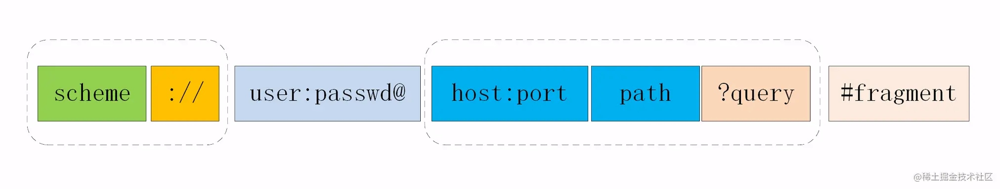

# URI

统一资源标识符,区分互联网上不同的资源。

1. URI 真正最完整的结构
    

    * scheme 表示协议名，比如http, https, file等等。后面必须和://连在一起。
    * user:passwd@ 表示登录主机时的用户信息，不过很不安全，不推荐使用，也不常用。
    * host:port表示主机名和端口。
    * path表示请求路径，标记资源所在位置。
    * query表示查询参数，为key=val这种形式，多个键值对之间用&隔开。
    * fragment表示 URI 所定位的资源内的一个锚点，浏览器可以根据这个锚点跳转到对应的位置。

2. URI 编码
URI 只能使用ASCII,非 ASCII 码字符和界定符转为十六进制字节值，然后在前面加个%
