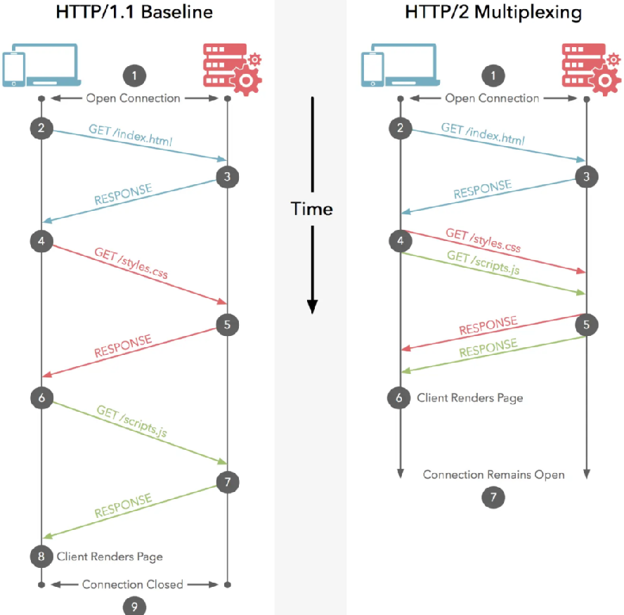

# HTTP/2 有哪些改进？

- why
    - HTTP/1.1 的问题
        1. 队头阻塞
            - 在 HTTP 请求应答过程中，如果出现了某种情况，导致响应一直未能完成，那后面所有的请求就会一直阻塞着，这种情况叫队头阻塞。
        2. 低效的 TCP 利用
            - 由于 TCP 慢启动机制，导致每个 TCP 连接在一开始的时候传输速率都不高，在处理多个请求后，才会慢慢达到“合适”的速率。对于请求数据量很小的 HTTP 请求来说，这种情况就是种灾难。
        3. 臃肿的消息首部
            - HTTP/1.1 的首部无法压缩，再加上 cookie 的存在，经常会出现首部大小比请求数据大小还大的情况。
        4. 受限的优先级设置
            - HTTP/1.1 无法为重要的资源指定优先级，每个 HTTP 请求都是一视同仁。
- what
    - HTTP/2 是 HTTP/1.x 的扩展，而非替代。
    - 解决 HTTP/1.1 的问题
        - 使用 HPAKC 算法，进行头部压缩
        - 采用帧结构，解决队头阻塞问题
        - 通过多路复用、服务端推送，二进制报文分帧，解决低效的 TCP 利用问题
    - 特性
        - 二进制分帧层
        - 多路复用
            - 
        - 头部压缩
            - 在 HTTP2 中，设计了 HPACK 压缩算法对头部协议内容进行压缩传输，这样不仅数据传输速度加快，也能节省网络流量。
            - HPACK 原理:
                - 客户端和服务端共同维护了一份静态字典表（Static Table），其中包含了常见头部名及常见头部名称与值的组合的代码。
                - 客户端和服务端根据先入先出的原则，共同维护了一份能动态添加内容的动态字典表（Dynamic Table）。
                - 客户端和服务端支持基于静态哈夫曼码表的哈夫曼编码（Huffman Coding）
        - 服务器推送
            - 服务器可以对客户端的一个请求发送多个响应。除了对原始请求响应外，还可以向客户端推送额外的数据。
            - 目的是让服务器通过预测它收到请求后有哪些相关资源需要返回，从而减少资源请求往返次数。
        - 流量控制和资源优先级
            - 基于 WINDOW_UPDATE 帧 实现流量控制
                - 具有方向性，总体控制是由接收端提供的。
                - 流量控制窗口的初始值大小为 65535 字节。
                - 只有 DATA 帧是流控的作用对象
                - 端点可以选择禁用自己的流量控制
            - 流优先级
                - 每个流可以分配一个 1-256 范围之间整数权重
                - 每个流都可以被赋予对另外一个流的依赖性
    - 帧、流、消息
        - 帧
            - HTTP/2 的基本通信单位，是 HTTP/2 连接中进行交换的最小数据单位。
            - 帧包含了帧头和帧载荷两部分。
        - 消息
            - 消息是指由一个或多个帧组成的序列。
            - 消息的类型由帧的类型决定。
            - 消息的开始由一个帧的首部标识，消息的结束由一个帧的首部标识。
        - 流
            - HTTP/2 一个“虚拟连接通道”，承载双向字节流，即客户端和服务端可以进行双向通信的字节序列。
            - 每个流都有一个唯一的整数 ID（stream identifier） 标识，由发起流的一端分配给流。
            - 单个 HTTP2 连接可以包含多个同时打开的流，任何一个端点（客户端和服务端）都可以将多个流的消息进行传输。
                - 多路复用的关键
            - 任何一端都可以关闭流。
- how
    - HTTP 升级
        - 客户端发起一个 HTTP/1.1 请求，头部包含 `Upgrade: h2c` 和 `HTTP2-Settings` 字段。
    - HTTPS 升级

    - HTTP/1.1 升级
        - 取消合并资源
        - 取消域名拆分
- 拓展
    - HTTPS 如何升级 HTTP/2 //todo
- 参考文档
    - [HTTP2 协议长文详解](https://www.cnblogs.com/jiujuan/p/16939688.html)
