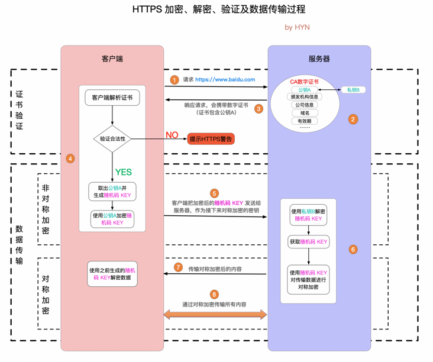
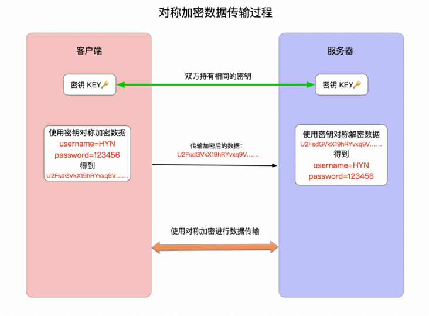
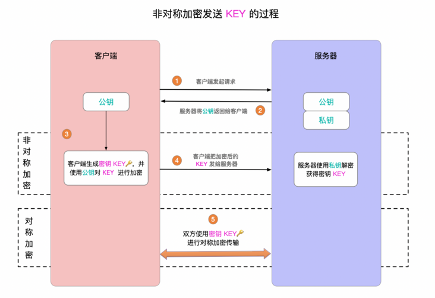
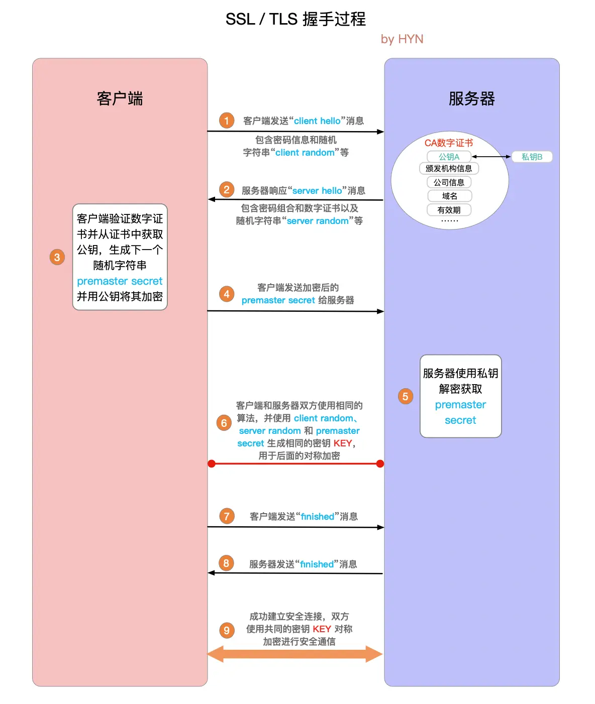

# HTTPs

- 关键字
    #安全
    #TLS握手
- why
    - 安全需求：
        - 数据加密 传输内容进行混淆
        - 身份验证 通信双方验证对方的身份真实性
        - 数据完整性保护 检测传输的内容是否被篡改或伪造
    - HTTP 在传输数据的过程中，所有的数据都是明文传输
- what
    - HTTPS 是 对 HTTP 的扩展
    - 加密、解密、验证及数据传输过程
        - 
        1. 客户端请求网络，连接到 443 端口
        2. 服务器返回证书，包含公钥
        3. 客户端解析证书并对其进行验证。
           1. 证书中的域名与实际域名不一致，或者证书已经过期，就会向访问者显示一个警告，由其选择是否还要继续通信。
        4. 客户端生成随机数，用公钥加密，发送给服务器
        5. 服务器用私钥解密，得到随机数
        6. 服务器用随机数加密数据，发送给客户端
        7. 客户端使用随机数解密数据

    - HTTPs 与 HTTP 的区别
        - HTTP 是明文传输，HTTPs 是加密传输
        - HTTPS 协议需要申请 CA 证书
        - HTTP 比 HTTPS 页面响应速度更快，服务器资源消耗更小
        - HTTP 的端口是 80，HTTPs 的端口是 443

    - HTTPs 的缺点
        - 在相同网络环境中，HTTPS 相比 HTTP 无论是响应时间还是耗电量都有大幅度上升。
        - HTTPS 的安全是有范围的，在黑客攻击、服务器劫持等情况下几乎起不到作用。
        - 在现有的证书机制下，中间人攻击依然有可能发生。
        - HTTPS 需要更多的服务器资源，也会导致成本的升高。
- 拓展
    - 加密方式
        - 对称加密
            - 
            - 优点：算法公开、计算量小、加密速度快、加密效率高，适合加密比较大的数据。
            - 缺点：
                - 密钥的传输无法得到安全保证
                - 每次都需要新的密钥，密钥管理困难。在分布式网络系统上使用较为困难，成本较高。
        - 非对称加密
            - 
            - 加密和解密需要使用两个不同的密钥：公钥和私钥
            - 公钥和私钥是一对，公钥加密的数据只能用私钥解密，私钥加密的数据只能用公钥解密。
            - 优点：算法公开，加密和解密使用不同的钥匙，私钥不需要通过网络进行传输，安全性很高。
            - 缺点：计算量比较大，加密和解密速度相比对称加密慢很多。
    - 数字签名
        - 数字签名是附加在报文上的特殊加密校验码，可以证明是作者编写了这条报文，前提是作者才会有私钥，才能算出这些校验码。
        - 数字签名会随着文本数据的变化而变化
        - 生成和验证流程如下：
            1. 服务器对证书内容进行信息摘要计算 (常用算法有 SHA-256等)，得到摘要信息，再用私钥把摘要信息加密，就得到了数字签名
            2. 服务器把数字证书连同数字签名一起发送给客户端
            3. 客户端用公钥解密数字签名，得到摘要信息
            4. 客户端用相同的信息摘要算法重新计算证书摘要信息，然后对这两个摘要信息进行比对，如果相同，则说明证书未被篡改，否则证书验证失败
    - 数字证书
        - 证书认证机构发布的证书
        - 包含
            - 证书所有者的公钥
            - 证书所有者的专有名称
            - 证书颁发机构的专有名称
            - 证书的有效起始日期
            - 证书的过期日期
            - 证书数据格式的版本号
            - 序列号，这是证书颁发机构为该证书分配的唯一标识符
    - 证书链
        - 也称为证书路径，是用于认证实体合法身份的证书列表，具体到 HTTPS 通信中，就是为了验证服务器的合法身份。
        - 保证根证书 (root CA certificate)的安全
        - 客户端在验证证书链时，必须对链中所有证书的数字签名进行验证，直到达到根证书为止。
    - 密码规范和密码组合 (CipherSpecs 和 CipherSuites)
        - CipherSpecs 用于认证加密算法和信息摘要算法的组合，通信双方必须同意这个密码规范才能进行通信。
        - CipherSuites 则定义了 SSL / TLS 安全连接中所使用的加密算法的组合，该组合包含三种不同的算法：
            - 握手期间所使用的的密钥交换和认证算法 (最常用的是 RSA 算法)
            - 加密算法 (用于握手完成后的对称加密，常用的有 AES、3DES等)
            - 信息摘要算法 (常用的有 SHA-256、SHA-1 和 MD5 等)
    - SSL / TLS
        - SSL (Secure Sockets Layer 安全套接层)
        - TLS  (Transport Layer Security 安全传输层协议)
        - SSL 已经逐渐被 TLS 取代
        - TLS 握手是启动 HTTPS 通信的过程，类似于 TCP 建立连接时的三次握手。
        - SSL/TLS 握手
            - 
            1. Client_hello：
               - 客户端发起 SSL请求，携带：
                  1. TLS版本信息
                  2. 随机数1（明文）
                  3. 加密套件候选列表
                  4. 压缩算法候选列表
                  5. 扩展字段
                  6. 其他
            2. Server_hello：
               - 返回协商结果
                  1. 选择使用的 TLS 协议版本 version
                  2. 选择的加密套件 cipher suite
                  3. 选择的压缩算法 compression method
                  4. 随机数2(明文)
                  5. 证书
            3. 客户端使用公钥加密随机数3，发送给服务端
            4. 服务端用私钥解密随机数3，双端用随机数1、2、3 构成对称密钥，连接建立完成
    - HTTPS 与 [HTTP2](./http2.md) 的关系
    - TLS 会话复用
    - HTTPS 如何确保通讯内容不被窃听、篡改
    - 了解CA证书以及证书验证
    - 了解采用对称 + 非对称加密算法原因
    - TLS 如何预防伪造会话
- 参考
    - [HTTPS 详解一：附带最精美详尽的 HTTPS 原理图](https://segmentfault.com/a/1190000021494676)
    - [HTTPS详解二：SSL / TLS 工作原理和详细握手过程](https://segmentfault.com/a/1190000021559557)
    - 
