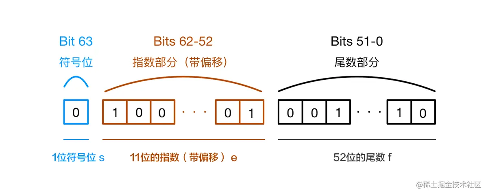
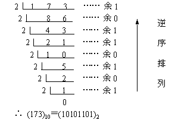

# 0.1+0.2 ! == 0.3

- 解答
    ● 初阶：能说出浮点数存储与计算导致精度损失；
    ● 中阶：能说出解决方案，比如：
        ○ 将数字转成整数后再运算 —— 缺点是对大数支持差
        ○ 用 Math.js 等运算库
        Number.EPSILON
    ● 高阶：
        ○ 对浮点数进度、进制转换、浮点数运算有深入了解，能讲出细节
        ○ 广度：能提及 TC39 Decimal Proposal（Stage 1）
- 原因：
    - 计算机是通过二进制的方式存储数据的，所以计算机计算0.1+0.2的时候，实际上是计算的两个数的二进制的和。
    - 0.1 和 0.2 在二进制中的表示是无限循环的，计算机只保留 53 位有效数字，所以会出现精度丢失的问题。
    - 0.1和0.2的二进制数相加，再转化为十进制数就是：0.30000000000000004
- 解决方法：
    - 1. Number.EPSILON: 通过设置一个误差范围，通常称为“机器精度”，只要判断0.1+0.2-0.3是否小于Number.EPSILON，如果小于，就可以判断为0.1+0.2 ===0.3
    - 2. 通过使用第三方库，比如：BigNumber.js

知识点：
● 浮点数存储规则：V = -1^(S) * (1 + Fraction) * 2^E
    
● 进制转换，导致进度损失：

● 运算过程四舍五入：
  ○ 对阶
  ○ 尾数计算
  ○ 规格化
  ○ 舍入处理
  ○ 溢出判断
