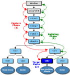

# DOM 的事件模型

#DOM
#事件模型

- 解题：
    - 初阶：能说清楚 DOM 事件的三个阶段，及传播路径
    - 中阶
        补充说明如何优化性能，例如事件委托、降低单次事件处理函数的复杂度等
    - 高阶：
        能罗列 DOM 规范定义的事件类型，
        能说出部分事件不支持冒泡特性；
        事件有同步异步特性；

- 知识点：
    - 事件传播的三个阶段：捕获、目标、冒泡
        - 
        - 捕获（capture）：从window对象传导到目标节点（上层传到底层）
        - 目标（target）：在目标节点上触发
        - 冒泡（bubbling）：从目标节点传导回window对象（从底层传回上层）
    - 传播路径：window => html =>...=>具体节点，冒泡阶段反之
    - 作用：事件委托
        - 由于事件会在冒泡阶段向上传播到父节点，因此可以把子节点的监听函数定义在父节点上，由父节点的监听函数统一处理多个子元素的事件。
    - 类型：焦点/滚轮/鼠标/输入/键盘事件、mutation 事件(DOM 变更事件，已过期，使用 MutationObserver 接口替换)、文档事件(load/unload/submit 等)
    - 事件处理器对页面响应性能的影响
    - 是否冒泡：
        - 大部分事件都有冒泡特性，
        - 部分没有，例如 load, scroll, blur & focus, Media 事件, mouseleave & mouseenter
    - 同步 and 异步
        - 大部分交互事件 —— 鼠标、键盘等都是同步，同步能确保事件的执行是 FIFO 的，前一个事件执行完才开始下一个
        - 部分事件是异步的，如 load ，这会导致其实不能严格保证 load的时序性
    - 事件阻止
        - stopPropagation
            - 分别在捕获阶段和冒泡阶段，阻止了事件的传播。
            - 但是不包括在当前节点上其他的事件监听函数。
            - 相当于 Event.cancelable 为 true
        - stopImmediatePropagation
            - 彻底取消该事件，不再触发后面所有的监听函数。
        - preventDefault
            - 取消浏览器对当前事件的默认行为。不会阻止事件的传播。
            - 在 Event.cancelable 为 true 时生效。
