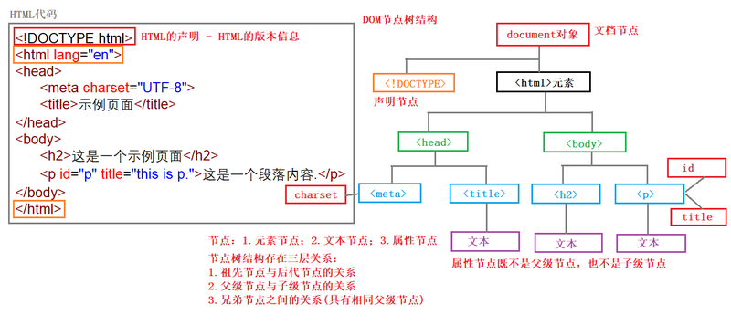
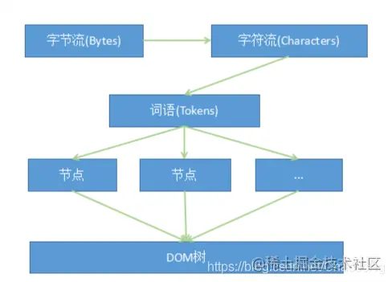
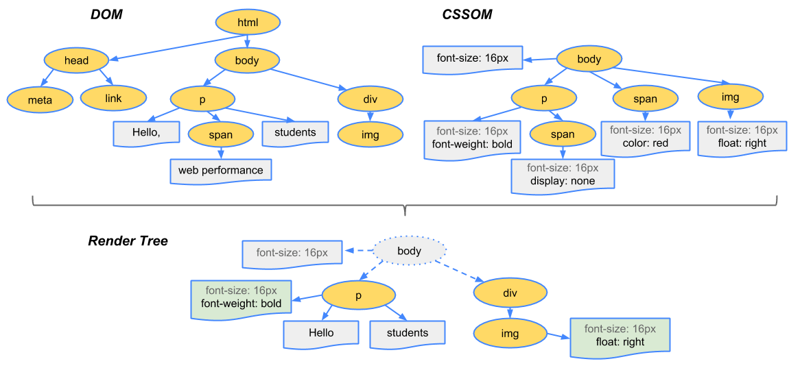
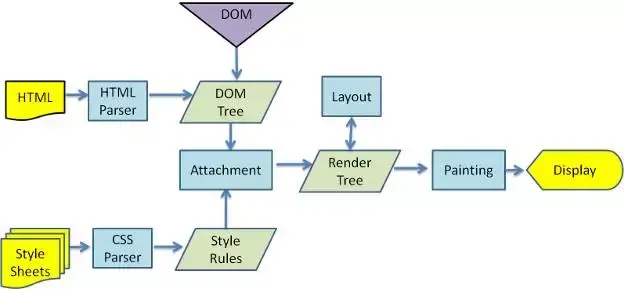

# DOM 树

- 解题：
    - 初阶：文档对象模型 (DOM) 是HTML和XML文档的编程接口。它提供了对文档的结构化的表述，并定义了一种方式可以使从程序中对该结构进行访问，从而改变文档的结构，样式和内容。
        - DOM 是对 HTML/XML 的一种结构化表达方式
        - DOM 提供了一系列维护文档结构、样式和内容的接口
        - DOM 树包含标签节点、属性节点、内容节点
            - 
    - 中阶：聊原理
        - 能解释 DOM 树的解析、构建过程
        - script 与 css 对构建的影响
        - 进而推导出，从性能角度我们应该注意什么
    - 高阶：聊生态
        - 各家浏览器实现不一，存在兼容性问题
        - DOM 接口繁琐且兼容性问题较大
            - 早期 JQuery 只是解决了接口上的问题，思维没有变，还是面向过程、命令式，这就导致出现非常多面条式、低效代码；
            - 后来慢慢过渡到 extjs 一类的重 OOP 组件库
            - 再过渡到 MVVM 这种响应式编程框架
        - DOM 对象的操作很重，所以 MVVM 框架纷纷实现一套更轻量级的虚拟 DOM 框架
    知识点：
        - DOM - Document Object Model，用于将 HTML 字符串转换为对象树，树节点为具体文档节点；节点间关系为文档内容的父子关系；DOM 协议可以说是 Web 的基石了
        - DOM 是页面的基础，样式(css 选择器)依赖于 DOM 结构；JS 也需要通过 DOM 接口才能对页面产生影响
        - DOM 解析过程
            - 页面收到内容之后就开始边接受边解析
            - 词法解析生成 Token => Token 合并成DOM节点 => DOM 节点合并到 DOM 树
                - 
            - 读到 Script 标签的时候暂停DOM解析，调用 JS 引擎执行 Script 代码
                - 把 Script 放到文档后面
                - 加 async/defer 标签
            - 遇到 css 代码的时候，调用渲染引擎将内容转化为 CSSOM，CSSOM + DOM 合并成 RenderTree
                - 
                - CSS  不阻塞DOM树构建，但可能阻塞渲染，浏览器会等到 CSS 解析完才开始真正渲染内容
                    - css 代码放在 head 中
                    - 
            - 问题：
                - 各家浏览器实现不一，存在兼容性问题
                - DOM 对象的操作很重，所以 MVVM 框架纷纷实现一套更轻量级的虚拟DOM框架

- what
    - 是什么
        - DOM 是对 HTML/XML 的一种结构化表达方式
        - DOM 提供了一系列维护文档结构、样式和内容的接口
        - DOM 树包含标签节点、属性节点、内容节点
            - 
    - HTML 解析
        - 边加载边解析
            - 网络进程通过响应头 Content-Type 判断文件类型 text/html 选择解析引擎
            - 创建对应的渲染进程，并与之简历共享数据的通道
            - 网络进程收到数据后通过将数据发送给渲染进程
            - 渲染进程收到数据后，将数据传递给解析器
        - 解析过程
            - 分词器将字符流转换为 Token 流
            - 通过 Token 栈计算节点关系，生成 DOM 节点
            - 将 DOM 节点添加到 document 上，形成 DOM 树
            - 遇到 JS
                - 过程
                    - 暂停 HTML 解析
                    - 下载 js 文件
                    - 直接执行 script 代码
                        - 有修改 DOM 树的操作，会重新构建 DOM 树
                        - 如果 CSS 未下载完成，会等待 CSS 下载完成，再构建 DOM 树
                    - 重新开始 HTML 解析
                - 优化
                    - 加速下载
                        - 文件压缩
                        - CDN 优化
                    - 异步加载
                        - defer 异步加载，稍后执行
                        - async 异步加载，立即执行（执行依然阻断 HTML 解析）
                    - 把 script 放到文档后面
                    - 将 css 代码放到 head 中
            - 遇到 CSS
                - 直接加载 CSS 代码
                - CSS 解析不阻塞 DOM 树构建，但可能阻塞渲染，浏览器会等到 CSS 解析完才开始真正渲染内容。
