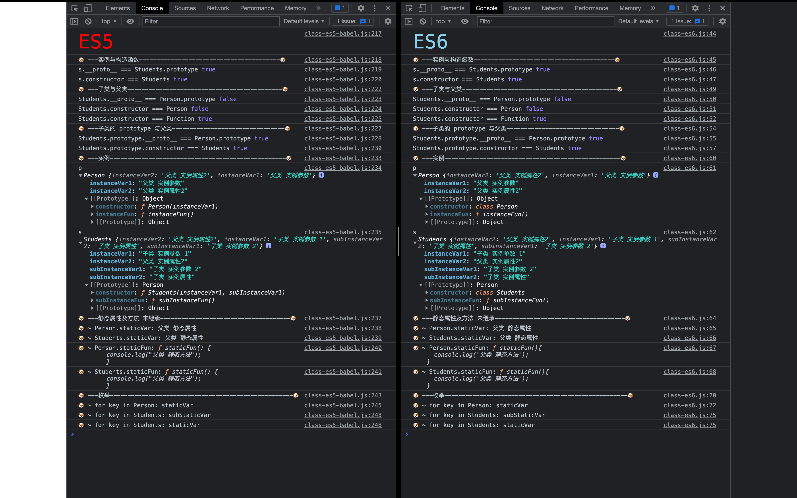

# ES5 中 class 的实现

类的特点：
 1 类必须使用new调用，否则会报错。ES的构造函数是可以当成普通函数使用的
 2 类的内部所有定义的方法，都是不可枚举的。（包括内部定义的静态方法）
 3 类的所有属性和方法都可以被子类继承
 4 可以继承原生构造函数

缺点：
    未实现方法的不可枚举
    静态属性和静态方法未继承

```js
/**
 * ES5 中的类
 */

//父类 构造方法
function Phone(brand, price){
    //实例属性
    this.brand = brand;
    this.price = price;
}

//实例方法
Phone.prototype.call = function(){
    console.log("我可以打电话!!");
}

//静态属性
Phone.name = '手机';

//静态方法
Phone.change = function(){
    console.log("我可以改变世界");
}


//子类 继承：只能继承父类的属性，不能继承父类的方法
function SmartPhone(brand, price, color, size){
    //构造函数继承：只能继承父类的属性
    Phone.call(this, brand, price); 
    //子类的实例属性
    this.color = color;
    this.size = size;
}

//原型继承：只能继承父类方法
SmartPhone.prototype = new Phone();
SmartPhone.prototype.constructor = SmartPhone;

//子类的实例方法
SmartPhone.prototype.photo = function(){
    console.log("我可以拍照")
}

var sp = new SmartPhone('锤子',2499,'黑色','5.5inch');

//实例与构造函数
console.log('sp.__proto__ === SmartPhone.prototype', sp.__proto__ === SmartPhone.prototype);//true
console.log('sp.constructor === SmartPhone', sp.constructor === SmartPhone);//true

//子类与父类
console.log('SmartPhone.__proto__ === Phone', SmartPhone.__proto__ === Phone);//false
console.log('SmartPhone.constructor === Phone', SmartPhone.constructor === Phone);//false
console.log('SmartPhone.constructor === Function', SmartPhone.constructor === Function);//true

console.log('SmartPhone.prototype.__proto__ === Phone.prototype', 
    SmartPhone.prototype.__proto__ === Phone.prototype);//true
console.log('SmartPhone.prototype.constructor === SmartPhone', 
    SmartPhone.prototype.constructor === SmartPhone);//true
```


