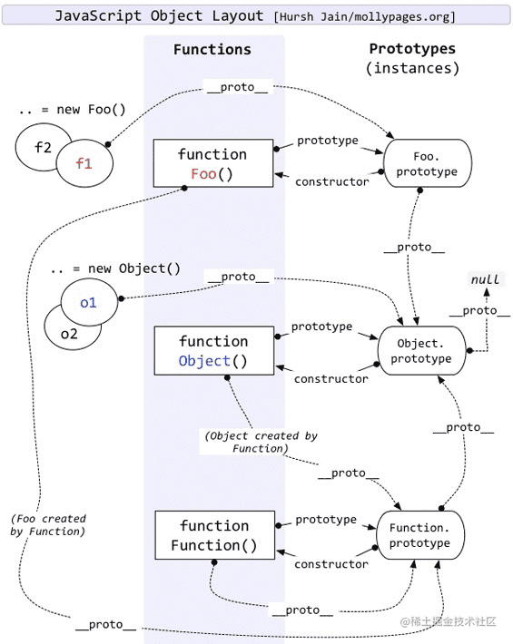
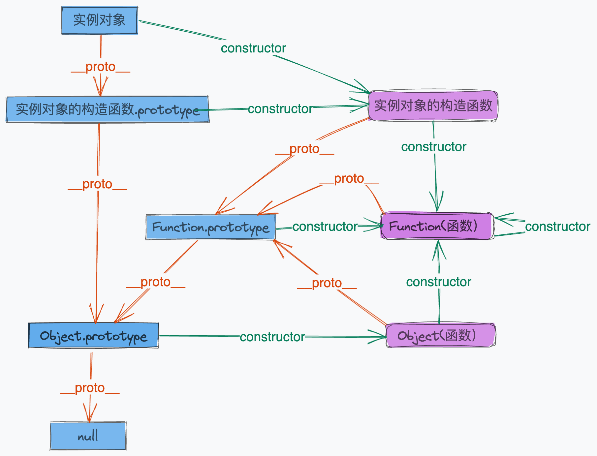
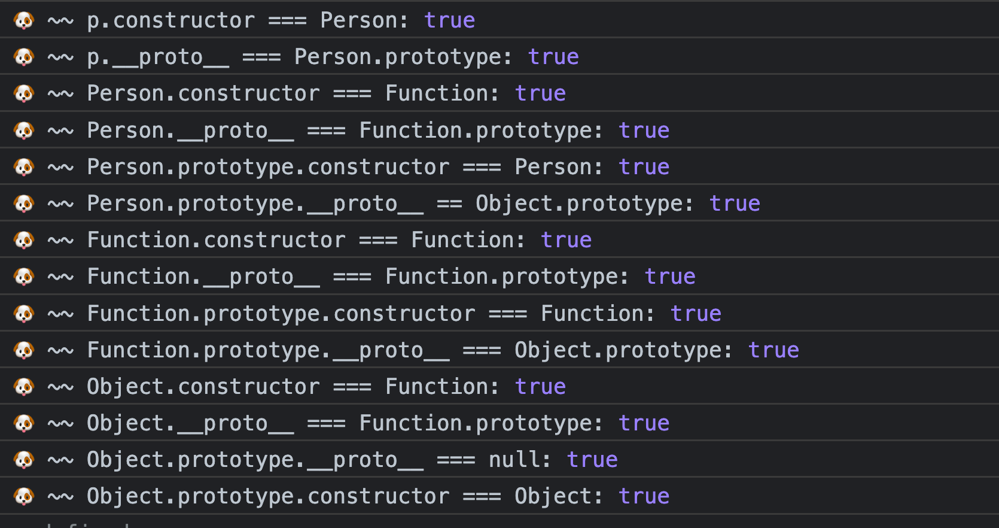

# 原型和原型链

[toc]

## 相关问题

1. 为什么 typeof 判断 null 是 Object 类型？
2. Function 和 Object 是什么关系？
3. new 关键字具体做了什么？手写实现。
4. prototype 和__proto__是什么关系？什么情况下相等？
5. ES5 实现继承有几种方式，优缺点是啥
6. ES6 如何实现一个类
7. ES6 extends 关键字实现原理是什么

## 关键属性

1. constructor：对象属性，是一个对象，指向该对象的构造函数
2. \_\_proto__：对象属性，是一个对象，指向对象的原型，也就是该对象的构造函数的 prototype 属性。
3. prototype：函数独有，是一个对象，实例对象的原型

注：函数也是对象

## 原型链图解




注：
Function.__proto__ === Function.prototype
Object.constructor === Function
Function.prototype === Object.prototype
Object.prototype === null

```js
//原型链的验证
function Person(){}
var p = new Person();

console.log("🐶 ~~ p.constructor === Person:", p.constructor === Person)

console.log("🐶 ~~ p.__proto__ === Person.prototype:", p.__proto__ === Person.prototype)

console.log("🐶 ~~ Person.constructor === Function:", Person.constructor === Function)

console.log("🐶 ~~ Person.__proto__ === Function.prototype:", Person.__proto__ === Function.prototype)

console.log("🐶 ~~ Person.prototype.constructor === Person:", Person.prototype.constructor === Person)

console.log("🐶 ~~ Person.prototype.__proto__ == Object.prototype:", Person.prototype.__proto__ == Object.prototype)

console.log("🐶 ~~ Function.constructor === Function:", Function.constructor === Function)

console.log("🐶 ~~ Function.__proto__ === Function.prototype:", Function.__proto__ === Function.prototype)

console.log("🐶 ~~ Function.prototype.constructor === Function:", Function.prototype.constructor === Function)

console.log("🐶 ~~ Function.prototype.__proto__ === Object.prototype:", Function.prototype.__proto__ === Object.prototype)

console.log("🐶 ~~ Object.constructor === Function:", Object.constructor === Function)

console.log("🐶 ~~ Object.__proto__ === Function.prototype:", Object.__proto__ === Function.prototype)

console.log("🐶 ~~ Object.prototype.__proto__ === null:", Object.prototype.__proto__ === null)

console.log("🐶 ~~ Object.prototype.constructor === Object:", Object.prototype.constructor === Object)

```

验证结果


## [typeof & instanceof](./typeof_and_instanceof.md)

## [继承](./inherit.md)

## [ES5 中类的实现](./class-in-es5.md)
