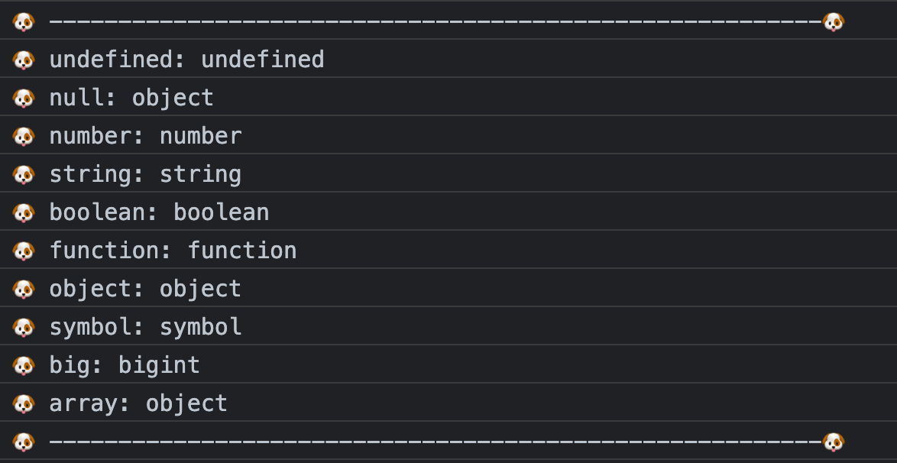

# typeof

输出 变量的类型
    能判断除 null 以外的基本数据类型
    不能判断出 null, array 的类型

```js
var u = undefined, 
    n = 1, 
    str = 'string',
    b = true, 
    f = function(){}, 
    o = {}, 
    s = Symbol('s'), 
    big = BigInt(Number.MAX_SAFE_INTEGER),
    a = [];

console.log("🐶 --------------------------------------------------------🐶")
console.log("🐶 undefined:", typeof u)//undefined
console.log("🐶 null:", typeof null)//object
console.log("🐶 number:", typeof n)//number
console.log("🐶 string:", typeof str)//string
console.log("🐶 boolean:", typeof b)//boolean
console.log("🐶 function:", typeof f)//function
console.log("🐶 object:", typeof o)//object
console.log("🐶 symbol:", typeof s)//symbol
console.log("🐶 big:", typeof big)//bigint
console.log("🐶 array:", typeof a)//object

console.log("🐶 --------------------------------------------------------🐶")
```




- typeof null; // "object"
    - 是 JavaScript 设计的一个 bug
    - 在 JavaScript 最初的实现中，JavaScript 中的值是由一个表示类型的标签和实际数据值表示的。对象的类型标签是 0。由于 null 代表的是空指针（大多数平台下值为 0x00），因此，null 的类型标签是 0，typeof null 也因此返回 "object"。
  1. 在 JavaScript 第一个版本中，所有值都存储在 32 位的单元中，每个单元包含一个小的 类型标签(1-3 bits) 以及当前要存储值的真实数据。类型标签存储在每个单元的低位中，共有五种数据类型：
     1. 000: object   - 当前存储的数据指向一个对象。
     2. 1: int        - 当前存储的数据是一个 31 位的有符号整数。
     3. 010: double   - 当前存储的数据指向一个双精度的浮点数。
     4. 100: string   - 当前存储的数据指向一个字符串。
     5. 110: boolean  - 当前存储的数据是布尔值。

      - 如果最低位是 1，则类型标签标志位的长度只有一位；
      - 如果最低位是 0，则类型标签标志位的长度占三位，为存储其他四种数据类型提供了额外两个 bit 的长度。
  2. 有两种特殊数据类型：
      1. undefined的值是 (-2)^30(一个超出整数范围的数字)；
      2. null 的值是机器码 NULL 指针(null 指针的值全是 0)

  3. 那也就是说null的类型标签也是000，和Object的类型标签一样，所以会被判定为Object。

- typeof NaN; // "number"
    - NaN 指“不是一个数字”，是一个“警戒值”，用于指出数字类型中的错误情况，即“执行数学运算没有成功，这是失败后返回的结果”。
    - NaN 与任何值都不相等，包括它自己，因此 NaN === NaN 为 false。
