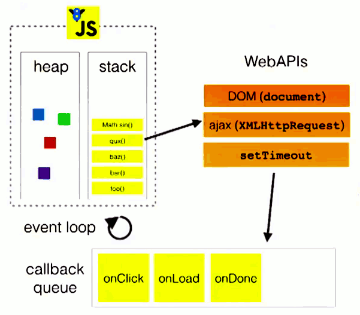

# 事件循环机制

#EventLoop
#事件循环

- 解题：
    - 初阶：
        - JS 的基本执行逻辑 —— 执行上下文
        - 遇到异步操作的时候会把回调放进任务队列中
        - 任务队列分微任务、宏任务，先取微任务，再取宏任务
        - 任务都执行完毕后，进入休眠
    - 中阶：有自己的思考
        - 为什么要这么设计？有什么优缺点？
            - 为什么：JS 是一种异步非阻塞的语言
            - 优点：
                - 代码流程逻辑更简单，不用考虑多线程各种锁、竞态之类的问题；
                - 适合IO密集型应用；
                - 响应速度更快，因为不需要坐等阻塞任务
            - 缺点：
                - CPU 性能差，没法高效利用现代多核计算机资源
                    - PM2 or 其它手段启动都进程；
                    - webworker；
                    - c++/rust 写计算逻辑，再放到 node 中调用
    - 高阶：有扩展
        - 聊聊 webworker 概念，跟普通 js 环境有什么区别？适合用来做什么？
        - 聊聊 node 事件循环与浏览器的区别，这些阶段分别是什么？
            - Timers: 计时器回调
            - poll：异步操作结束 or 接收到 IO 数据，等
            - check：setImmediate调用，可以在 poll 后马上执行
            - process.nextTick and promise.then在任意时刻执行
- 知识点：
    - JS 执行上下文概念，执行栈为空的时候，先取微任务队列，再取宏任务队列
    - 宏任务 vs 微任务，大概记住哪些调用触发宏/微任务
        - 宏任务：setTimeout、
        - 微任务：promise.then、setImmediate、MutationObserver

- EventLoop
    - JS
        - 单线程
            - 只有一个主线程来执行任务
            - 优点：保证了同一时间只有一个 DOM 操作
            - 缺点：执行效率低
                - webworker
                    - 受限于主线程，为主线程分担计算认为，不能独立执行
                    - 没有 I/O 权限
        - 非阻塞
            - 执行异步任务时，会被挂起，不会阻塞主线程，等待异步任务完成后，再按照一定规则执行相应的回调
    - 执行栈和事件队列
        - 
    - 宏任务（macro task）和微任务(micro task)
        - 宏任务
            - setTimeout
            - setInterval
        - 微任务
            - promise.then
            - mutationObserver
    - 事件循环的流程
        1. 按照入队顺序，找到第一个宏任务，放入调用栈，开始执行；
        2. 执行完该宏任务下所有同步任务后，即调用栈清空后，该宏任务被推出宏任务队列，然后微任务队列开始按照入队顺序，依次执行其中的微任务，直至微任务队列清空为止
        3. 当微任务队列清空后，一个事件循环结束
        4. 接着从宏任务队列中，找到下一个执行的宏任务，开始第二个事件循环，直至宏任务队列清空为止。
        - 注：
            - 事件循环是从第一个宏任务开始的
            - 如果在执行微任务的过程中，产生新的微任务添加到微任务队列中，也需要一起清空，微任务队列没清空之前，是不会执行下一个宏任务的。
- Node 中的事件循环
    - 图解
                   ┌───────────────────────────┐
                ┌─>│           timers          │
                │  └─────────────┬─────────────┘
                │           nextTickQueue
                │  ┌─────────────┴─────────────┐
                │  │     pending callbacks     │
                │  └─────────────┬─────────────┘
                │           nextTickQueue
                │  ┌─────────────┴─────────────┐
                |  |     idle, prepare         │
                |  └─────────────┬─────────────┘
        nextTickQueue     nextTickQueue
                |  ┌─────────────┴─────────────┐
                |  │           poll            │
                │  └─────────────┬─────────────┘
                │           nextTickQueue
                │  ┌─────────────┴─────────────┐
                │  │           check           │
                │  └─────────────┬─────────────┘
                │           nextTickQueue
                │  ┌─────────────┴─────────────┐
                └──┤       close callbacks     │
                   └───────────────────────────┘
        - timers：执行 setTimeout 和 setInterval 回调
        - pending callbacks：执行系统操作的回调，如 TCP 错误类型的回调
        - idle, prepare：仅系统内部使用
        - poll：取出新完成的 I/O 事件；执行与 I/O 相关的回调，适当的条件下 node 将阻塞在这里
        - check：执行 setImmediate 回调
        - close callbacks：执行 socket 的 close 事件回调
    - setTimeout 和 setImmediate
        - setTimeout 指定时间间隔后，将回调函数放入 timers 阶段的任务队列中，等待执行
        - setImmediate 当前 poll 阶段执行完毕后立即执行的回调
