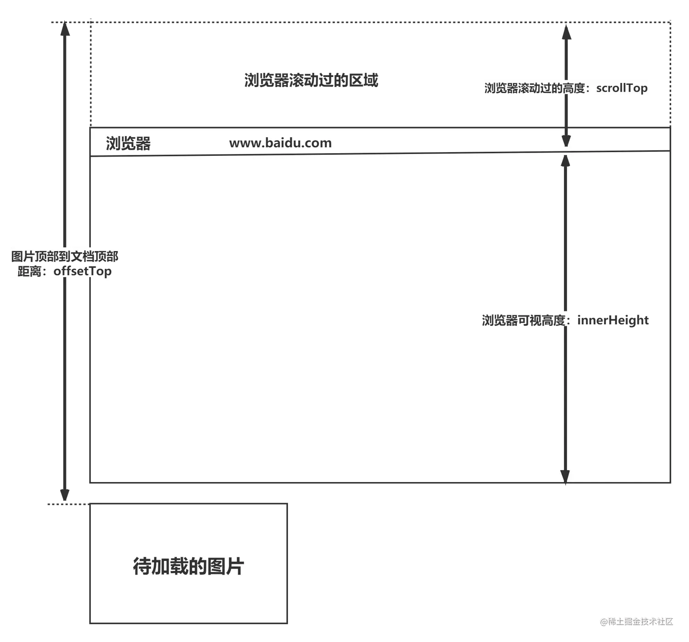

# 如何判断元素是否到达可视区域

- 
- 浏览器可视区的高度：`window.innerHeight`
- 浏览器滚动的过的距离：`document.body.scrollTop || document.documentElement.scrollTop`
- 元素顶部距离文档顶部的高度（包括滚动条的距离）：`imgs.offsetTop`
- 内容达到显示区域：`img.offsetTop < window.innerHeight + document.body.scrollTop`
