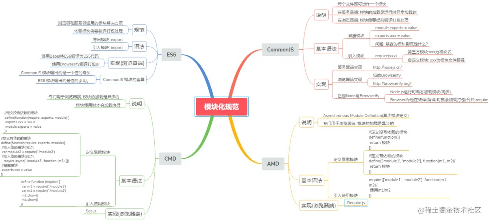

# 前端模块化

- 解题：
    - 初阶：能讲出现存知名模块化方案，能说出它们的特点
        - CommonJS：同步模块加载方案，适用于 Node 场景，浏览器端可使用 Browserify/Webpack 兼容
            - 所有代码都运行在模块作用域，不会污染全局作用域。
            - 独立性是模块的重要特点就，模块内部最好不与程序的其他部分直接交互。
            - 模块可以多次加载，但是只会在第一次加载时运行一次，然后运行结果就被缓存了，以后再加载，就直接读取缓存结果。要想让模块再次运行，必须清除缓存。
            - 模块加载的顺序，按照其在代码中出现的顺序。
        - AMD(Asynchronous Modules Definition)：异步模块加载方案，require.js 实现，支持浏览器、Node场景
        - CMD(Common Module Definition)：异步模块加载方案，与AMD相比，支持延迟加载 —— 用到的时候再加载
        - UMD(Universal Module Definition)：统一浏览器端以及非浏览器端的模块化方案的规范，流行度更高，说白了：
            - 先判断是否支持 AMD（define 是否存在），存在则使用 AMD 方式加载模块；
            - 再判断是否支持 Node.js 模块格式（exports 是否存在），存在则使用 Node.js 模块格式；
            - 前两个都不存在，则将模块公开到全局（window 或 global）；
        - ES Modules：前面都是基于模块对象导出，ESM 是基于 import/export命令导出
    - 中阶：
        - 能深入聊聊任意一种模块化方案的细节，例如 ES6：
            - 有什么特点？为什么能支持 Tree-Shaking？
            - 怎么解决循环依赖的呢？ESM 只是生成一个指向被加载模块的引用，等到真正用到这个值的时候才动态取值，所以可以大幅度减少循环引用带来的问题
    - 高阶：
        - 聊聊历史进程呗，最开始 0=>IIEF=>AMD(CMD/CommonJS)=>UMD=>ES Module，串着历史背景讲解各个方案，最后突出 ESM 的优点，以及解决了什么问题

- what
    - 模块：应该是职责单一、相互独立、低耦合的、高内聚且可替换的离散功能块。
    - 模块化：是通过分解复杂系统为独立的模块来实现细粒度的精细控制。
- 模块化的好处
    - 代码可复用
    - 高可维护性
- why
    - ajax 前后端分离
    - spa 前端路由、状态管理
    - node 前端编写后端代码
- 发展
    1. 全局函数
    2. 将函数封装到对象命名空间下
       1. 立即函数调用表达式 IIFE
            - 必须记得每一个模块中返回对象的命名，才能在其他模块使用过程中正确的使用；
            - 代码写起来混乱不堪，每个文件中的代码都需要包裹在一个匿名函数中来编写；
            - 在没有合适的规范情况下，每个人、每个公司都可能会任意命名、甚至出现模块名称相同的情况；
            - 模块之间的依赖关系不明显，需要自己去维护。
    3. CommonJS
        1. 服务端规范
           1. Node是CommonJS在服务器端一个具有代表性的实现；
           2. Browserify是CommonJS在浏览器中的一种实现；
           3. webpack打包工具具备对CommonJS的支持和转换
        2. 核心变量
           1. require 可以帮助我们导入其他模块中的内容
           2. exports module.exports的引用。一起负责对模块中的内容进行导出
           3. module 全局对象，代表当前模块。里面保存了模块的信息路径、父子结构信息、曝露出的对象信息。
        3. 不适用于前端
            1. 采用同步加载模块的方式，加载完才能执行后面的操作。
            2. 前端需要等代码模块下载完毕，并运行之后才能得到模块。
    4. AMD
       1. 浏览器端规范，RequireJS 实现
       2. 通过 define方法，将代码定义为模块；通过require方法，实现代码的模块加载。
       3. 异步加载，提前执行。
       4. 缺点：
          1. 开发成本高，代码的阅读和书写比较困难，模块定义方式的语义不顺畅
          2. 不符合通用的模块化思维方式
    5. CMD
       1. 浏览器端规范，SeaJS 实现
       2. 专门用于浏览器端，异步加载，模块使用时才会加载执行。
       3. 缺点：
          1. 依赖 SPM 打包，模块的加载逻辑偏重
    6. ESM（ES6 Module）
       1. export 命令用于规定模块的对外接口，import 命令用于输入其他模块提供的功能。
       2. 编译时加载：尽量的静态化，编译时就能确定模块的依赖关系，以及输入和输出的变量。

- ES6模块与CommonJS模块有什么异同？
    - 区别
        1. CommonJS 模块输出的是一个值的拷贝（不动态更新），ESM输出的是值的只读引用（可获取实时的值）。
        2. CommonJS 模块是运行时加载，ESM是编译时加载。
        3. CJS 是同步加载，ESM 是异步加载。
        4. 分别导出时，CJS 全部加载生成对象，从对象上取，ESM 可以直接导出。
    - 共同点
        1. 一个模块一个文件
        2. 内部变量只有导出后才能被其他模块访问

- ESM
    - 设计思想： 静态化，编译时确定模块的依赖关系，以及输入和输出的变量。
    - 优势：
        - 不再需要对象作为命名空间（避免命名冲突）
        - 不需要 UMD 了（兼容多种模块规范）
    - 加载模块
        - ``
            - 相当于 defer
        - ``
    - 语法：
        - export
            - export default 默认导出
                - 一个模块只能有一个默认导出
            - export xxx 分别导出
            - export {} 批量导出
            - export {A as B} 重命名导出
            - 注
                - 动态绑定，可以取得模块内部实时的值
                - 导出实例时，是同一个
                - 可以出现在块级作用域外的任何位置
                - 可以出现 0-n 次
        - import
            - import xxx from 'xxx' 默认导入
            - import {xxx} from 'xxx' 分别导入
            - import * as xxx from 'xxx' 批量导入
            - import {xxx as yyy} from 'xxx' 重命名导入
            - import 'xxx' 只执行，不导入
            - 注
                - 导入为只读，不能修改
                - from 后路径可为相对路径，也可为绝对路径，也可为第三方模块（需要配置文件说明）
                - 导入会被提升到顶部，首先执行
        - import() 动态导入
            - import() 返回一个 Promise 对象
            - import() 可以用在任何地方，不仅仅是模块，但是只能在模块顶层
            - import() 是运行时执行，可以写在条件语句中，这意味着可以实现按需加载
            - import() 会被编译成一个单独的 chunk，这个 chunk 会被单独请求
            - import() 会触发 Lazy Loading
            - 使用场景：
                - 按需加载
                - 条件加载
                - 动态加载
- CJS 与 ESM 混编
    - 在 CJS 中使用 ESM
        - 通常情况下，CJS 不能加载 ESM 模块
        - `(async () => {
                await import('./my-app.mjs');
            })();`
    - 在 ESM 中使用 CJS
        - 多数情况下，ES Module可以加载CommonJS，但是只能整体加载，不能只加载单一的输出项。
        - 使用 Node.js 内置的module.createRequire()方法
            - `import { createRequire } from 'module';
                const require = createRequire(import.meta.url);
                const fs = require('fs');`  
    - 使模块同时支持 ESM 和 CJS
        - ESM 给出一个整体输出接口，比如 export default
        - CJS 加一个包装层
            - `import cjsModule from '../index.js';
                export const foo = cjsModule.foo;`
- 循环加载
    - ESM
        - 会报错
    - CJS
        - 只输出已经执行的部分，还未执行的部分不会输出。
- Node中的 ESM
    - .mjs文件总是以 ES6 模块加载
    - .cjs文件总是以 CommonJS 模块加载
    - .js文件的加载取决于package.json里面type字段的设置
- 参考文档
    - [前端模块化详解(完整版)](https://juejin.cn/post/6844903744518389768#heading-47)
    - 