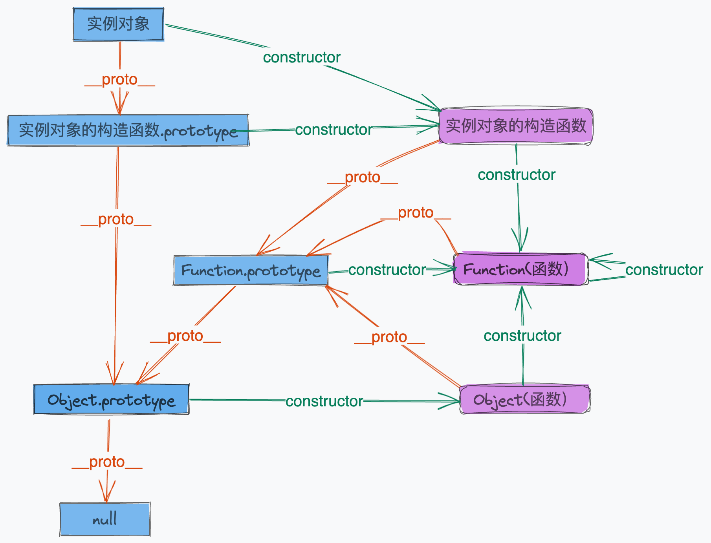
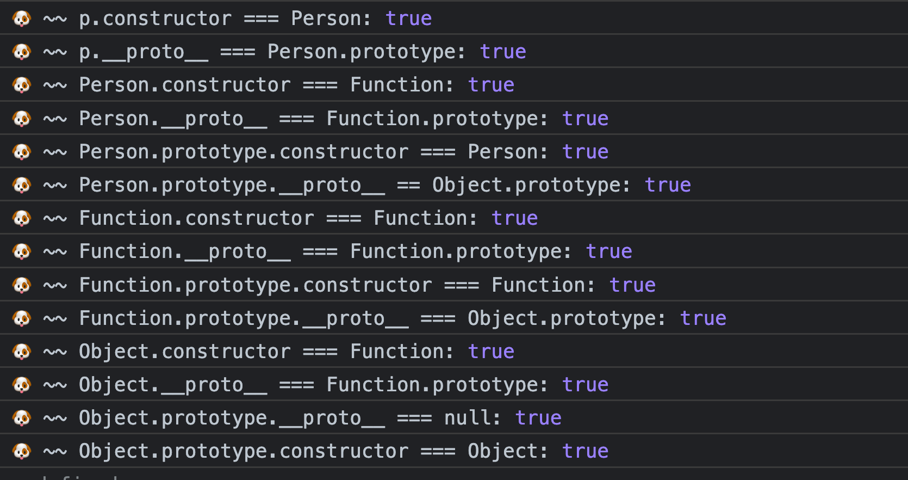

# 原型和原型链

#原型
#原型链

- 解答
    ● 初阶：
        能说清楚原型链的基本形态(fn.prototype、obj.__proto__)；
        能说清楚属性查找的过程(沿原型链逐级向上查找，找不到的时候返回 undefined )
    ● 中阶：原型链是基于链接而不是复制，这很多时候容易造成问题
        ○ 性能：在原型链上查找属性是有性能损耗的，特别是试图查找不存在的属性的时候，需要完整遍历整个原型链
        ○ 预期之外：例如修改原型链上某引用类型，会影响到其它实例值
    ● 高阶：更进一步的，能聊聊JS基于原型 OOP 与其它语言(如 C#、Java)OOP 设计上有什么区别，有什么优劣势(表现力更强)，表达能力是否能对齐；甚至，能聊聊 OOP、FP、面向过程编程的特点
- 相似题目：
● Object.create接口，例如 Object.create(null)，有什么特别的？
● 说出下述代码的运行结果：

```js
const Person = function(){};
Person.prototype = {name:'foo', address:{province:'广东省', city:'深圳市' }}

const a = new Person();
const b = new Person();

a.name = 'Bin';
console.log(a.name, b.name); // 分别会是什么？

a.address.city = '广州市';
console.log(a.address.city, b.address.city); // 分别是什么，为什么？
```

## 关键属性

1. constructor：对象属性，是一个对象，指向该对象的构造函数
2. \_\_proto\_\_：对象属性，是一个对象，指向对象的原型，也就是该对象的构造函数的 prototype 属性。
    - 显式的属性，可以访问被定义为隐式属性的 prototype
    - 属性既不能被 for in 遍历出来，也不能被 Object.keys(obj) 查找出来。
    - 访问对象的 obj.\_\_proto\_\_属性，默认走的是 Object.prototype 对象上 \_\_proto\_\_ 属性的 get/set 方法。
3. prototype：函数独有，是一个对象，实例对象的原型
    - 原型：给其它对象提供共享属性的对象
    - 所有 object 对象都有一个的隐式引用(不是由开发者亲自创建/操作)

注：函数也是对象

## 原型链图解




- 原型
    - 在JavaScript中是使用构造函数来新建对象，构造函数内都有 prototype 属性，是一个对象，包含了该构造函数所有实例共享的属性和方法。
    - 构造函数新建对象后，对象的内部将包含一个指针\_\_proto\_\_，指向构造函数的 prototype 属性，这个指针被称为对象的原型。
    - 通过Object.getPrototypeOf() 方法来获取对象的原型。
- 原型链
    - 访问对象属性时，如果象内部不存在，那么就去它的原型对象里找，原型对象又有自己的原型，于是就这样一直找下去，也就是原型链的概念。
    - 原型链的尽头一般来说都是 Object.prototype。Object.prototype.__proto__=== null
    - 特点：实例对象实体中并没有自己的原型副本。当修改原型时，与之相关的对象也会继承这一改变。
    - 原型链上的所有原型都是对象，对象最终是由Object构造的
- 原型链的指向
    - 实例对象.constructor === 构造函数
    - 实例对象.\_\_proto\_\_ === 构造函数.prototype
    - 函数.constructor === Function
    - 函数.\_\_proto\_\_ === Function.prototype
    - 函数.prototype.constructor === 函数
    - 函数.prototype.\_\_proto\_\_ === Object.prototype
- 注：
    Function.\_\_proto\_\_ === Function.prototype
    Function.prototype.\_\_proto\_\_ === Object.prototype
    Object.constructor === Function
    Object.prototype.__proto__=== null
- 原型修改、重写
    - 修改原型

        ```js
        Person.prototype.getName = function() {}
        ```

    - 重写原型：会造成实例对象的构造函数指向的根构造函数Object

        ```js
        Person.prototype = {
            getName: function() {}
        }

## 原型的继承

### 显式原型继承

亲自将某个对象设置为另一个对象的原型。有两种方法：

- Object.setPrototypeOf

    ```js
    const obj_a = {a: 1}
    const obj_b = {b: 1}
    //将 a 设置为 b 的原型
    Object.setPrototypeOf(obj_b, obj_a) 
    ```

- Object.create

    ```js
    const obj_a = {a: 1}
    const obj_b = Objeact.create(obj_a);
    ```

- Object.setPropertyOf 和 Object.create 的差别在于：
    - Object.setPropertyOf，给我两个对象，我把其中一个设置为另一个的原型。
    - Object.create，给我一个对象，它将作为我创建的新对象的原型。

### 隐式原型继承

无感知的完成创建对象、原型继承和属性初始化的过程

- 构造函数
    - 普通函数创建时，自带 prototype， 包含一个 constructor， 指向构造函数
    - js 提供了几个内总 constructor 的函数，如： Object，Array，Boolean，String，Number 等
    - 对象、数组字面量创建时，隐式的通过 new 去创建， 并隐式的进行原型继承

验证
[验证](./原型链的验证.js)


[类和继承](./类和继承.md)

## 思考题解答

1. 为什么 typeof 判断 null 是 Object 类型？
    - [typeof](./typeof.md)
    - 延展：[instanceof 运算符](./instanceof.md)

2. Function 和 Object 是什么关系？
    - 一切对象都最终继承自Object对象，Object对象直接继承自根源对象null
    - 一切函数对象（包括Object对象）都直接继承自Function对象
    - Object对象直接继承自Function对象
    - Function对象直接继承自己，最终继承自Object对象
    - Object.\_\_proto\_\_ == Function.prototype
    - Function.prototype.\_\_proto\_\_ == Object.prototype

3. new 关键字具体做了什么？

    （1）首先创建了一个新的空对象
    （2）设置原型，将对象的原型设置为函数的 prototype 对象。
    （3）让函数的 this 指向这个对象，执行构造函数的代码（为这个新对象添加属性）
    （4）判断函数的返回值类型，如果是值类型，返回创建的对象。如果是引用类型，就返回这个引用类型的对象。
    [手写实现](new-eg.js)

4. prototype 和 \_\_proto\_\_ 是什么关系？什么情况下相等？

    - 对象的 \_\_proto\_\_ 指向它的构造函数的 prototype
    - Function.\_\_proto\_\_ === Function.prototype

5. ES5，ES6 如何实现一个类

    - [ES5 中类的实现](类的实现es5.js)
    - [ES6 中类的实现](类的实现es6.js)

6. ES5 实现继承有几种方式，优缺点是啥
    [ES5 中类的继承](类和继承.md)

7. ES6 extends 关键字实现原理是什么
    [extends的实现](./class-es6-babel.js)

8. ConstructorB 如何继承 ConstructorA

    - 方法一 ES5 实现
        - [ES5 中类的继承](类和继承.md)

    - 方法二 ES6 extends
        - 通过 extends

9. 思考题
   1. 为什么 typeof 判断 null 是 Object 类型？
   2. Function 和 Object 是什么关系？
   3. new 关键字具体做了什么？手写实现。
   4. prototype 和 \_\_proto\_\_ 是什么关系？什么情况下相等？
   5. ES5 实现继承有几种方式，优缺点是啥
   6. ES6 如何实现一个类
   7. ES6 extends 关键字实现原理是什么
   8. ConstructorB 如何继承 ConstructorA
   9. [思考题](prototype-q.html)
