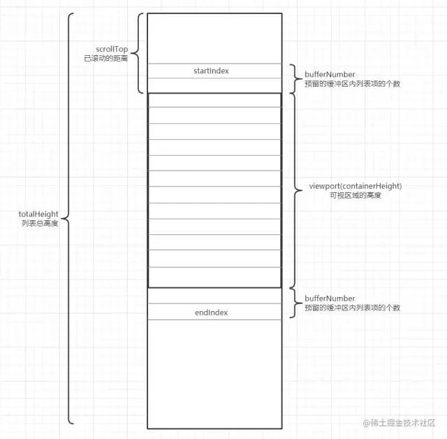

# 性能优化

- 问题：前端性能优化
    - 解答
        - 初阶：罗列常见的优化手段，及基本原理
            - 产物压缩合并、缓存、DNS 与解析、
        - 中阶：融会贯通
            - 结合浏览器的工作过程，结构化地描述各种优化方法
        - 高阶：有故事
            - 有过线上性能监控、防劣化的经历
                - 怎么收集性能数据，关注哪些性能指标
                    - FMP/FCP/FP/LCP
                    - TTI/TBT/CLS
                    - RAIL 模型
                    - Performance API
                - 曾经用过哪些工程化手段确保性能提升？
                    - tree-shaking
                    - code split
                    - 按需加载
                    - 微前端
            - 结合自己的工作履历，说说自己真实经历过的性能优化，要提现出更深入的认知
                - 小程序、ssr、h5、音视频
            - 【亮点】熟悉JIT 优化：尽量复用函数、避免动态添加属性、尽量保持变量类型一致、避免数组元素类型转换
- 问题：怎么优化页面白屏时间
    - 解答：
        - 初阶：
            能正确讲出白屏时间的数据口径；
            能讲出一些优化方法：产物压缩合并、骨架屏、缓存等，以及背后原理；
        - 中阶：
            能比较详尽讲解[页面从开始请求到完成渲染的过程](../HTML&Browser/页面从开始请求到完成渲染的过程.md)
            能体系化讲解各个步骤可做的优化点
            - 网络层面：
                - 基础设施：DNS 优化(预解析、更稳定可靠的DNS 服务器)；CDN；SSL 会话复用；http2;
                - 前端：GZip；缓存；产物压缩；
            - 服务端：正确使用数据缓存；优化代码逻辑；优化数据库性能；
            - 页面：精简html结构；CSS 放前面，JS 放后面；Critical CSS；骨架屏；按需加载
        - 高阶：讲述自己亲身经历过的性能优化，最好能讲出复杂度、遇到什么难点以及怎么突破。

- 结合浏览器的工作过程，结构化地描述各种优化方法
    - 网络通讯：减少通讯次数、减少内容量
        - DNS 预解析，更稳定可靠的 DNS 服务器
        - 缓存
        - CDN（常用的第三方库使用 CDN 服务）
        - TLS 会话复用 Keep Alive
        - 压缩合并（GZip 压缩）
        - 减少 cookie
        - 多域名
        - 图片：压缩、使用 webp、svg、去掉图片中的 metadata、慎用 base64、lazyload
            1. 图片的动态裁剪
                  1. 阿里云、七牛云只需在图片的 url 地址上动态添加参数，就可以得到你所需要的尺寸大小
            2. 图片的懒加载
                  1. 插件 vue-lazyload
                  2. 可以通过 html5 自定义属性 data-xxx 先暂存 src 的值，然后在图片出现在屏幕可视区域的时候，再将 data-xxx 的值重新赋值到 img 的 src 属性即可
            3. 使用字体图标
            4. 小图片转 base64 格式
        - 使用 http2
        - 删除无用js、css
        - 服务端渲染
    - 服务端：数据读写提速
        - 缓存
        - 上云
        - 数据库读写分离、分库分表等
        - graphql —— 合并接口
    - 页面解析：
        - 尽量避免使用iframe
        - JS 放后面，或标注 async/defer
        - css 放前面
        - Critical CSS
        - 精简 dom 结构
    - 页面渲染：保持较高fps
        - 尽量避免重排
        - 使用 flexbox
        - 减少 dom 数量
            - 虚拟长列表
        - 优化 css 选择器结构，避免使用关系选择器，统配选择器
        - 避免使用 CSS 表达式
        - 尽量避免使用 table
        - 尽可能使用 gpu 加速
            - 过多地开启硬件加速可能会耗费较多的内存，因此什么时候开启硬件加速，给多少元素开启硬件加速，需要用测试结果说话。
    - 页面响应：
        - webworker 分离 CPU 操作
        - 尽量使用 requestAnimationFrame 替代 setTimeout
        - 慎用闭包、全局状态
        - 避免死循环，慎用递归
        - 保持代码的优良设计，减少冗余代码
        - 不要在循环中重复读取页面样式
        - 避免使用 getClientRect 等接口
        - 灵活使用防抖和节流（resize，scroll）
    - 代码层面
        1. 减少 DOM 操作。
        2. 长列表虚拟滚动（只渲染可见区域，滚动时动态更新可视区域）
            1. 
            2. 计算出 totalHeight 列表总高度，并在触发时滚动事件时根据 scrollTop 值不断更新 startIndex 以及 endIndex ，以此从列表数据 listData 中截取对应元素
            3. 插件 vue-virtual-scroller、vue-virtual-scroll-list、react-tiny-virtual-list、react-virtualized
        3. 按需加载，路由懒加载，组件懒加载
    - 构建方面
      1. 压缩代码文件:
             1. 使用 terser-webpack-plugin 压缩 Javascript 代码；
             2. 使用 css-minimizer-webpack-plugin 压缩 CSS 代码；
             3. 使用 html-webpack-plugin 压缩 html 代码。
      2. 开启 gzip 压缩:
             1. webpack 中使用 compression-webpack-plugin
             2. node 作为服务器也要开启，使用 compression。
      3. 代码分割 和 tree shaking（只对使用 export 导出的变量生效）
      4. 骨架屏（打包时将骨架屏的内容放在 html 文件的跟节点中）
            1. 插件 vue-skeleton-webpack-plugin
      5. js 预加载
            1. 正常模式
               1. 阻塞 dom 渲染，必须等待 js 加载和执行完成后才能去做其它事情
            2. async
               1. 无序，异步加载，加载完立即执行。
               2. 使用场景：加载第三方库，不依赖其它 js 文件
            3. defer
               1. 有序，异步加载，html 解析完后执行
               2. 使用场景：一般情况下都可以使用 defer，特别是需要控制资源加载顺序时
            4. module 模式
               1. 浏览器会对其内部的 import 引用发起 HTTP 请求，获取模块内容。这时 script 的行为会像是  defer 一样，在后台下载，并且等待 DOM 解析
               2. Vite 就是利用浏览器支持原生的 es module 模块，开发时跳过打包的过程，提升编译效率
            5. preload（link）
               1. 用于提前加载一些需要的依赖，这些资源会优先加载
               2. 在浏览器渲染机制之前进行处理的，并且不会阻塞 onload 事件
               3. 其加载和执行的过程是分离的，即 preload 会预加载相应的脚本代码，待到需要时自行调用；
            6. prefetch（link）
               1. 利用浏览器的空闲时间，加载页面将来可能用到的资源的一种机制
               2. 用于加载其他页面（非首页）所需要的资源，以便加快后续页面的打开速度
               3. 可以获取非当前页面所需要的资源，并且将其放入缓存至少 5 分钟
               4. 当页面跳转时，未完成的 prefetch 请求不会被中断

- RAIL 测量模型：google提出的一个可以量化网站性能的测量标准
    - 目标
        - Response：响应时间，用户与网站交互后，网站响应的时间
        - Animation：动画时间，网站动画的时间
        - Idle：空闲时间，网站空闲的时间
        - Load：加载时间，网站加载的时间
    - RAIL 评估标准：
        - 响应：处理事件应在50ms以内完成。
        - 动画：每10ms产生一帧。
        - 空闲：尽可能增加空闲时间。
        - 加载：在5s内完成内容加载并可以交互。
    - 测量工具
        - Chrome DevTools 开发调试、性能评测
        - Lighthouse 网站整体质量评估
        - WebPageTest 多测试地点、全面性能报告
- 常用的性能测量 APIs
    - 关键时间节点
        - performance.getEntriesByType['navigation'](0)
        - 重要时间节点计算公式
            - 数据传输耗时: responseEnd - responseStart
            - 资源加载耗时: loadEventStart - domContentLoadedEventEnd
            - 白屏时间: responseEnd - fetchStart
            - 首次可交互时间: domInteractive - fetchStart
            - 页面完全加载时间: loadEventStart - fetchStart
            - 重定向耗时: redirectEnd - redirectStart
            - DNS 解析耗时: domainLookupEnd - domainLookupStart
            - TCP 连接耗时: connectEnd - connectStart
            - SSL 安全连接耗时: connectEnd - secureConnectionStart
            - 网络请求耗时 (TTFB): responseStart - requestStart
            - DOM 解析耗时: domInteractive - responseEnd
            - First Byte时间: responseStart - domainLookupStart
            - DOM Ready 时间: domContentLoadEventEnd - fetchStart
            - http 头部大小： transferSize - encodedBodySize
            - 重定向次数：performance.navigation.redirectCount
    - 网络状态(Network APIs)

        ```js
        // 监听用户网络状态
        let connection = navigator.connection || navigator.mozConnection || navigator.webkitConnection;
        let type = connection.effectiveType;
        function updateConnectionStatus() {
            console.log("connection type of change from" + type + "to" + connection.effectiveType);
        }
        connection.addEventListener('change',updateConnectionStatus,false);

        ```  

    - 网页显示状态(UI APIs)

- PRPL 模式
    - PRPL 是一个首字母缩写词，它描述了一种用于使网页加载并变得更快的交互模式：
        - Push (or preload)：推送或预加载最重要的资源
        - Render：尽快渲染初始路径
        - Pre-cache：预缓存剩余资源
        - Lazy load：延迟加载其他路由和非关键资源
- 参考资料
    - [](https://juejin.cn/post/6968040264883666981)
    - [](https://web.dev/i18n/zh/rail/)
    - [](https://alienzhou.com/projects/fe-performance-journey/)#%E6%97%85%E9%80%94%E7%9A%84%E8%A1%8C%E7%A8%8B%E8%B7%AF%E7%BA%BF
    - [](https://www.chenliqiang.cn/post/google-web-app-performance-guide.html)
