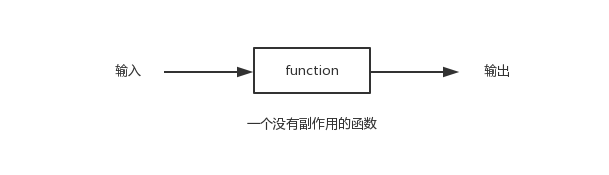

# 柯里化

- 函数式编程
    - 函数式（纯函数）
        - 
        - 像数学函数那样，接收一个或多个输入，生成一个或多个结果，并且没有副作用
    - 特性
        - 函数是一等公民
            - 每一个函数都是为了用小函数组织成更大的函数
            - 函数的参数也是函数，函数返回的也是函数。
        - 高阶函数
            - 参数或返回值是函数的函数
        - 柯里化
            - 就是把一个多参数的函数 f，转换为单参数函数 g，并且这个函数的返回值也是一个函数。
- 拓展
    - 实现 add(1)(2)(3)

        ```js
        // 不建议
        const add= (x, y)=>(z) => x+y+z


        // 中阶：柯里化
        const _add = (a,b,c)=>a+b+c;

        const curry = (fn, ...arg)=>{
        return arg.length >= fn.length ? 
            fn(...arg):(..._arg)=>curry(fn, ...arg, ..._arg);
        }
        const add =curry(_add)

        add(1)(2)(6)
        ```

    - FP 有怎样基本概念
    - lodash/ramda 的实现原理 //todo
