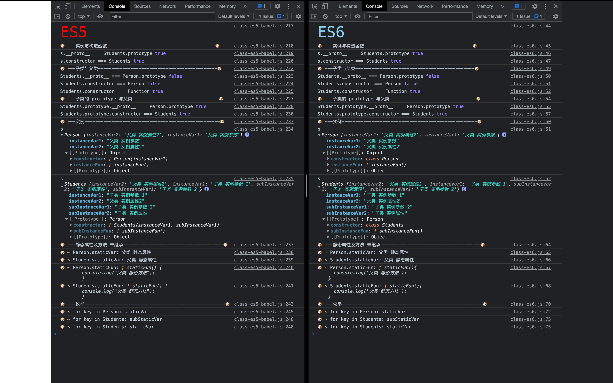

# 类和继承

## ES5 中 class 的实现

类的特点：
    1 类必须使用new调用，否则会报错。ES的构造函数是可以当成普通函数使用的
    2 类的内部所有定义的方法，都是不可枚举的。（包括内部定义的静态方法）
    3 类的所有属性和方法都可以被子类继承
    4 可以继承原生构造函数

缺点：
    未实现方法的不可枚举
    静态属性和静态方法未继承
实现：
[类的实现](./类的实现es5.js)

## 两条继承链

（1）子类的 \_\_proto\_\_ 属性，表示构造函数的继承，总是指向父类。
（2）子类的 prototype 属性的 \_\_proto\_\_ 属性，表示方法的继承，总是指向父类的 prototype 属性。

## ES5 中 类的继承

1. 原型链继承
    缺点：
        1. 引用类型属性，会被所有实例共享
        2. 创建子类的时候，无法向父类传递参数。实例化父类的时候无法进行属性初始化
2. 构造函数继承
    优点：
        1. 避免了引用类型的属性被所有实例共享
        2. 可以在 Child 中向 Parent 传参
    缺点：
        - 方法都在构造函数中定义，每次创建实例都会创建一遍方法。

3. 组合式继承

    优点：融合原型链继承和构造函数的优点，是 JavaScript 中最常用的继承模式。
    缺点：会调用两次父构造函数。

4. 原型式继承

    对类式继承的一个封装
    缺点：存在实例共享引用类型的属性

5. 寄生式继承

    对原型继承的拓展，这样新创建的对象不仅仅有父类的属性和方法，还新增了别的属性和方法。
    缺点：跟借用构造函数模式一样，每次创建对象都会创建一遍方法。

6. 寄生组合式继承

    优点：
        只调用了一次 Parent 构造函数，并且因此避免了在 Parent.prototype 上面创建不必要的、多余的属性。
        原型链保持不变

## ES6 中的 class

实现：
[类的实现](./类的实现es6.js)

[babel 编译结果解析](class-es6-babel.js)

