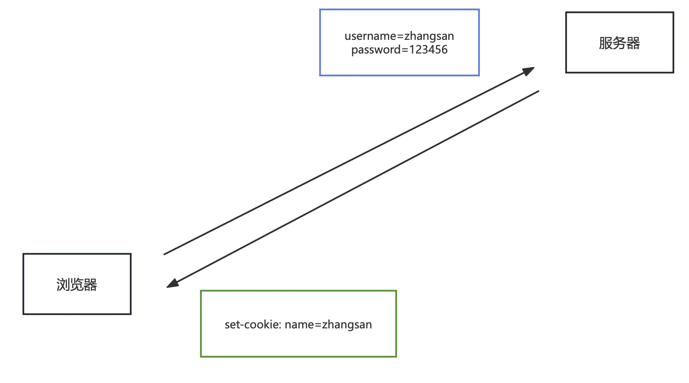

# cookie

[toc]

## 2.1 cookie 是什么

cookie 是 HTTP 服务器发送到用户浏览器并保存在本地的一小块数据
**cookie 是保存在浏览器端的一小块数据**
**cookie 是按照域名划分保存的**
简单示例:


## 2.2 cookie 的特点

浏览器向服务器发送请求时，会自动将 **当前域名下** 可用的 cookie 设置在请求头中，然后传递给服务器，这个请求头的名字也叫 **cookie** ，所以将 **cookie 理解为一个 HTTP 的请求头也是可以的**

## 2.3 cookie 的运行流程

填写账号和密码校验身份，校验通过后下发 cookie

有了 cookie 之后，后续向服务器发送请求时，就会自动携带 cookie


## 2.4 浏览器操作 cookie

浏览器操作 cookie 的操作，使用相对较少，大家了解即可

* 1. 禁用所有cookie
* 2. 删除cookie
* 3. 查看cookie

## 2.5 cookie 的代码操作

express中可以使用 **cookie-parser** 进行处理

```js
const express =require('express');
//1. 安装 cookie-parser npm i cookie-parser 
//2. 引入 cookieParser 包
const cookieParser = require('cookie-parser');
const app = express();
//3. 设置 cookieParser 中间件
app.use(cookieParser());
//4-1 设置 cookie
app.get('/set-cookie', (request, response) => {
    // 不带时效性
    response.cookie('username','wangwu');
    // 带时效性
    response.cookie('email','23123456@qq.com', 
        {maxAge: 5*60*1000}
    ); 
    //响应
    response.send('Cookie的设置');
});
//4-2 读取 cookie
app.get('/get-cookie', (request, response) => {
//读取 
cookie console.log(request.cookies); 
//响应体 
response.send('Cookie的读取');
});
 //4-3 删除cookie
app.get('/delete-cookie', (request, response) => {
    //删除 
    response.clearCookie('username'); 
    //响应
    response.send('cookie 的清除');
});
//4. 启动服务 
app.listen(3000, () => {
    console.log('服务已经启动....'); 
});
```

>不同浏览器中的 cookie 是相互独立的，不共享
