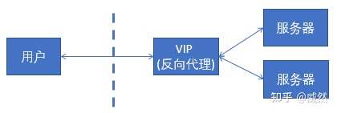
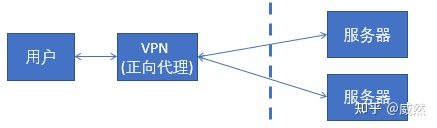

# nginx

## 常用命令

1. 安装  brew install nginx

    ```sh
        Docroot is: /opt/homebrew/var/www

        The default port has been set in /opt/homebrew/etc/nginx/nginx.conf to 8080 so that
        nginx can run without sudo.

        nginx will load all files in /opt/homebrew/etc/nginx/servers/.

        To restart nginx after an upgrade:
        brew services restart nginx
        Or, if you don't want/need a background service you can just run:
        /opt/homebrew/opt/nginx/bin/nginx -g daemon off;
        ==> Summary
        🍺  /opt/homebrew/Cellar/nginx/1.23.4: 26 files, 2.2MB
    ```

2. 启动服务
   1. nginx
   2. brew services start nginx
3. 重新启动
   1. nginx -s reload
   2. brew services restart nginx
4. 查看配置
   1. brew info nginx
   2. cat /opt/homebrew/etc/nginx/nginx.conf
   3. sudo open /opt/homebrew/etc/nginx/nginx.conf -a 'sublime text'（使用编辑器sublime打开）
5. 检查配置是否正确
   1. nginx -t
6. 关闭服务
   1. nginx -s stop
   2. brew services stop nginx
   3. kill -QUIT 72 (从容的停止，即不会立刻停止)
   4. Kill -TERM 72 （立刻停止）
   5. Kill -INT 72 （和上面一样，也是立刻停止）
   6. kill -9 pid 杀死进程
7. 查看是否启动
   1. ps -ef|grep nginx

## 常见的配置

nginx的配置文件路径：/opt/homebrew/etc/nginx/nginx.conf
nginx的服务器默认路径：/usr/local/var/www
nginx的安装路径：/opt/homebrew/Cellar/nginx/1.23.4

## 代理

1. 反向代理：
    - 
    - 在服务端，是一个虚拟 ip
    - 对于用户的一个请求，会转发到多个后端处理器中的一台来处理该请求
2. 正向代理：
    - 
    - 在客户端
    - 客户端先访问 vpn 地址，vpn 地址转发请求，并将结果原路返回

- 参考文档：<https://zhuanlan.zhihu.com/p/364588916>

## 配置文件描述

```nginx.conf
#运行用户
user www-data;    
#启动进程,通常设置成和cpu的数量相等
worker_processes  1;
​
#全局错误日志及PID文件
error_log  /var/log/nginx/error.log;
pid        /var/run/nginx.pid;
​
#工作模式及连接数上限
events {
    accept_mutex on;   #设置网路连接序列化，防止惊群现象发生，默认为on
    multi_accept on;  #设置一个进程是否同时接受多个网络连接，默认为off

    #epoll是多路复用IO(I/O Multiplexing)中的一种方式,但是仅用于linux2.6以上内核,可以大大提高nginx的性能
    use epoll;
    #单个后台worker process进程的最大并发链接数
    worker_connections  1024;
    # multi_accept on; 
}
​
#设定http服务器，利用它的反向代理功能提供负载均衡支持
http {
    #设定mime类型,类型由mime.type文件定义
    include       /etc/nginx/mime.types;
    default_type  application/octet-stream;
    #设定日志格式
    access_log    /var/log/nginx/access.log;
​
    #sendfile 指令指定 nginx 是否调用 sendfile 函数（zero copy 方式）来输出文件，对于普通应用，
    #必须设为 on,如果用来进行下载等应用磁盘IO重负载应用，可设置为 off，以平衡磁盘与网络I/O处理速度，降低系统的uptime.
    sendfile        on;
    #tcp_nopush     on;
​
    #连接超时时间
    #keepalive_timeout  0;
    keepalive_timeout  65;
    tcp_nodelay        on;
    
    #开启gzip压缩
    gzip  on;
    gzip_disable "MSIE [1-6]\.(?!.*SV1)";
​
    #设定请求缓冲
    client_header_buffer_size    1k;
    large_client_header_buffers  4 4k;
​
    include /etc/nginx/conf.d/*.conf;
    include /etc/nginx/sites-enabled/*;
​
    #设定负载均衡的服务器列表
     upstream mysvr {
        #weigth参数表示权值，权值越高被分配到的几率越大
        #本机上的Squid开启3128端口
        server 192.168.8.1:3128 weight=5;
        server 192.168.8.2:80  weight=1;
        server 192.168.8.3:80  weight=6;
    }
​
   server {
       #监听80端口
        listen       80;
        #定义使用www.javaqf.com访问
        server_name  www.javaqf.com;
​
        #设定本虚拟主机的访问日志
        access_log  logs/www.javaqf.com.access.log  main;
​
    #默认请求
    location / {
          root   /root;      #定义服务器的默认网站根目录位置
          index index.php index.html index.htm;   #定义首页索引文件的名称
​
          fastcgi_pass  www.javaqf.com;
         fastcgi_param  SCRIPT_FILENAME  $document_root/$fastcgi_script_name; 
          include /etc/nginx/fastcgi_params;
        }
​
    # 定义错误提示页面
    error_page   500 502 503 504 /50x.html;  
        location = /50x.html {
        root   /root;
    }
​
    #静态文件，nginx自己处理
    location ~ ^/(images|javascript|js|css|flash|media|static)/ {
        root /var/www/virtual/htdocs;
        #过期30天，静态文件不怎么更新，过期可以设大一点，如果频繁更新，则可以设置得小一点。
        expires 30d;
    }
    #PHP 脚本请求全部转发到 FastCGI处理. 使用FastCGI默认配置.
    location ~ \.php$ {
        root /root;
        fastcgi_pass 127.0.0.1:9000;
        fastcgi_index index.php;
        fastcgi_param SCRIPT_FILENAME /home/www/www$fastcgi_script_name;
        include fastcgi_params;
    }
    #设定查看Nginx状态的地址
    location /NginxStatus {
        stub_status            on;
        access_log              on;
        auth_basic              "NginxStatus";
        auth_basic_user_file  conf/htpasswd;
    }
    #禁止访问 .htxxx 文件
    location ~ /\.ht {
        deny all;
    }
     
     }
}

```
