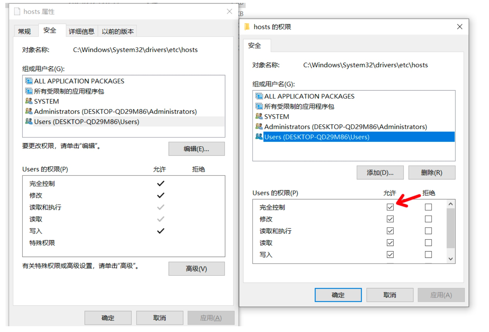

# 会话控制

## 一、介绍

所谓会话控制就是 对会话进行控制
HTTP 是一种无状态的协议，它没有办法区分多次的请求是否来自于同一个客户端， 无法区分用户 而产品中又大量存在的这样的需求，所以我们需要通过 会话控制 来解决该问题
常见的会话控制技术有三种:

* cookie
* session
* token

## 二、[cookie](cookie.md)

## 三、[session](session.md)

## 四、[session 和 cookie 的区别](session和cookie的区别.md)

## 五、[token](token.md)

### 5.5 JWT

JWT(JSON WebToken)是目前最流行的跨域认证解决方案，可用于基于 token 的身份验证
JWT 使 token 的生成与校验更规范
我们可以使用 jsonwebtoken 包 来操作token

```js
//导入 jsonwebtokan
const jwt = require('jsonwebtoken');
//创建 token
// jwt.sign(数据, 加密字符串, 配置对象) 
let token = jwt.sign({
  username: 'zhangsan'
}, 'atguigu', {
    expiresIn: 60 //单位是 秒 
})
//解析 token
jwt.verify(token, 'atguigu', (err, data) => {
    if(err){ 
        console.log('校验失败~~'); 
        return
    }
    console.log(data);
})
```

> 扩展阅读: <https://www.ruanyifeng.com/blog/2018/07/json_web_token-tutorial.html>

## 六、附录

### 6.1 本地域名

所谓本地域名就是 只能在本机使用的域名 ，一般在开发阶段使用

#### 6.1.1 操作流程

编辑文件 C:\Windows\System32\drivers\etc\hosts

```sh
127.0.0.1    www.baidu.com
```

如果修改失败， 可以修改该文件的权限


##### 6.1.2 原理

在地址栏输入 域名 之后，浏览器会先进行 DNS(Domain Name System) 查询，获取该域名对应的 IP 地址
请求会发送到DNS服务器，可以根据域名返回 IP 地址
可以通过 ipconfig /all 查看本机的DNS服务器
hosts 文件也可以设置域名与IP的映射关系，在发送请求前，可以通过该文件获取域名的IP地址
