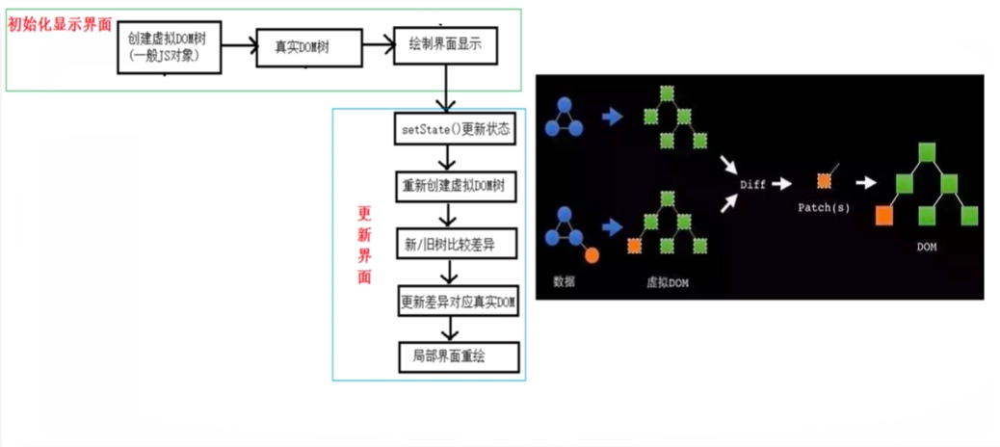

# React全家桶

[Toc]

## 第1章：React入门

### React简介

#### 官网

- 英文官网: <https://reactjs.org/>
- 中文官网: <https://react.docschina.org/>

#### 介绍描述

- 用于动态构建用户界面的 JavaScript 库(只关注于视图)
- 由Facebook开源

#### React的特点

- 声明式编码
- 组件化编码
- React Native 编写原生应用
- 高效（优秀的Diffing算法）

#### React高效的原因

- 使用虚拟(virtual)DOM, 不总是直接操作页面真实DOM。
- DOM Diffing算法, 最小化页面重绘。

### React的基本使用

#### 相关js库

- react.js：React核心库。
- react-dom.js：提供操作DOM的react扩展库。
- babel.min.js：解析JSX语法代码转为JS代码的库。

#### 创建虚拟DOM的两种方式

- 纯JS方式(React.createElement多次嵌套，一般不用)
  - 语法:  `ReactDOM.render(virtualDOM, containerDOM)`
  - 作用: 将虚拟DOM元素渲染到页面中的真实容器DOM中显示
  - 参数说明
    - 参数一: 纯js或jsx创建的虚拟dom对象
    - 参数二: 用来包含虚拟DOM元素的真实dom元素对象(一般是一个div)
- JSX
    [JSX](JSX.md)方式

#### 虚拟DOM与真实DOM

- React提供了一些API来创建一种 “特别” 的一般js对象
  - `const VDOM = React.createElement('xx',{id:'xx'},'xx')`
  - 上面创建的就是一个简单的虚拟DOM对象
- 虚拟DOM对象最终都会被React转换为真实的DOM
- 我们编码时基本只需要操作react的虚拟DOM相关数据, react会转换为真实DOM变化而更新界面。

### 模块与组件、模块化与组件化的理解

[模块与组件、模块化与组件化的理解](模块与组件、模块化与组件化的理解.md)

## 第2章：React面向组件编程

- Chorme 开发者工具调试 `React Developer Tools

### 组件

[组件](组件.md)

#### 组件三大核心属性1: state

[组件三大核心属性1：state](组件三大核心属性1：state.md)

#### 组件三大核心属性2: props

[组件三大核心属性2：props](组件三大核心属性2：props.md)

#### 组件三大核心属性3: refs与事件处理

[组件三大核心属性3：refs与事件处理](组件三大核心属性3：refs与事件处理.md)

### 表单数据

#### 包含表单的组件分类

[包含表单的组件分类](包含表单的组件分类.md)

#### 高阶函数和函数柯里化

[高阶函数和函数柯里化](高阶函数和函数柯里化.md)

### 组件的生命周期

[组件的生命周期](组件的生命周期.md)

### 虚拟DOM与DOM Diffing算法

### key

[key](key.md)

## 第3章：React应用(基于React脚手架)

### 使用create-react-app创建react应用

[使用create-react-app创建react应用](使用create-react-app创建react应用.md)

### 组件的组合使用-TodoList

  1. 拆分组件、实现静态组件，注意：className、style的写法
  2. 动态初始化列表，如何确定将数据放在哪个组件的state中？
      - 某个组件使用：放在其自身的state中
      - 某些组件使用：放在他们共同的父组件state中（官方称此操作为：状态提升）
  3. 关于父子之间通信：
      - 【父组件】给【子组件】传递数据：通过props
      - 【子组件】给【父组件】传递数据：通过props，父给子传递一个函数，子通过参数传递数据给父
  4. 注意 `defaultChecked` 和 `checked` 的区别，类似的还有：`defaultValue` 和 `value`
        - `defaultChecked` 只在第一次的时候起效
  5. 状态在哪里，操作状态的方法就在哪里

## 第4章：React 网络通信

### 理解

#### 前置说明

- React本身只关注于界面, 并不包含发送ajax请求的代码
- 前端应用需要通过ajax请求与后台进行交互(json数据)
- react应用中需要集成第三方ajax库(或自己封装)

#### 常用的ajax请求库

- jQuery: 比较重, 如果需要另外引入不建议使用
- [axios](../JavaScript/尚硅谷axios.md): 轻量级, 建议使用
  - 封装XmlHttpRequest对象的[ajax](../JavaScript/尚硅谷ajax.md)
  - [Promise](../JavaScript/尚硅谷Promise从入门到自定义.md)风格
  - 可以用在浏览器端和node服务器端

#### 配置代理(解决跨域)

- 前端
  - [配置代理 package.json](配置代理package.json.md)
  - [配置代理 setupProxy.js](配置代理setupProxy.js.md)
- 后端
  - [core](../../后端/Node/core.md)

### [axios](../JavaScript/尚硅谷axios.md)

### 案例—github用户搜索

  1. 网络请求的状态设计: 初始状态、loading状态、错误状态、获得数据状态。
  2. ES6小知识点：[解构赋值](../JavaScript/解构赋值.md)+重命名

### 消息订阅-发布机制

[消息订阅-发布机制](../JavaScript/消息订阅-发布机制.md)

### Fetch

[fetch](../JavaScript/fetch.md)

## 第5章：React Router

[React Router 5](ReactRouter5.md)

## 第6章：React UI组件库

### 流行的开源React UI组件库

#### material-ui(国外)

- 官网: <http://www.material-ui.com/#/>
- github: <https://github.com/callemall/material-ui>

#### Ant Design

[Ant Design](AntDesign.md)

## 第7章：redux

[redux](redux.md)
