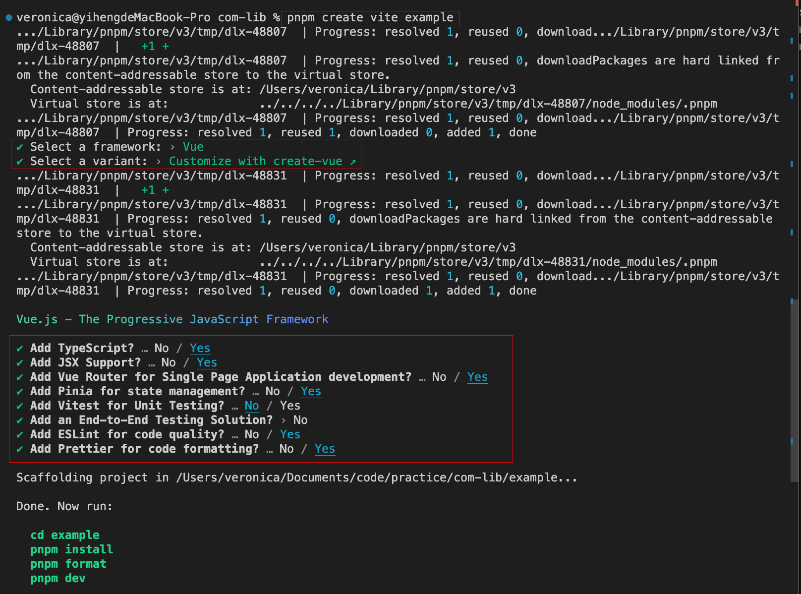
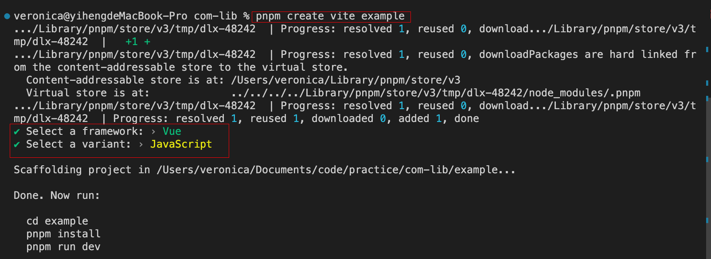

# 搭建组件库

[参考文档](https://juejin.cn/post/7212538330829996092#heading-1)

1. 创建目录 com-lib
2. 初始化
   1. pnpm init
3. 创建目录 packages
4. 创建配置文件 pnpm-workspace.yaml
5. 创建示例项目 pnpm create vite example
    
6. 创建组件库 pnpm create vite components
   
7. 安装插件
   1. components目录下
      1. pnpm add vite-plugin-vue-setup-extend -D
      2. pnpm add sass -D
      3. pnpm add element-plus
      4. vite.config.js

        ```js
        import { defineConfig } from 'vite'
        import vue from '@vitejs/plugin-vue'
        import VueSetupExtend from 'vite-plugin-vue-setup-extend'

        export default defineConfig({
            plugins: [vue(),VueSetupExtend()],
        })
        ```

   2. 根目录下
       1. pnpm -F example add sass
            - \# --filter 或者 -F <package_name> 可以在指定目录 package 执行任务
            - \# 在根目录中向 example 目录安装 sass

8. 编写组件

   ```js
   components
    ···
    ├─ src
        ├─ button
            ├─ src
                └─ index.vue // 我们的组件代码
        └─ index.js // 用于导出button组件
    └─ index.js // 集中导出src下的所有组件
    ···
   ```

   ```js
   // vite.config.js
    import { defineConfig } from 'vite'
    import vue from '@vitejs/plugin-vue'
    import VueSetupExtend from 'vite-plugin-vue-setup-extend'

    export default defineConfig({
    plugins: [vue(),VueSetupExtend()]
    })
   ```

   ```vue
   // button/src/index.vue
    <template>
        <button class="button" :class="typeClass">
        <slot></slot>
        </button>
    </template>
    
    // vite-plugin-vue-setup-extend
    <script name="VButton" setup>
    import { computed } from 'vue'
    const props = defineProps({
        type: {
        type: String,
        default: 'default'
        }
    })
    const typeClass = computed(() => `button-${props.type}`)
    </script>
    
    <style lang="scss" scoped>
    .button {
        border-radius: 4px;
        padding: 8px 16px;
        font-size: 16px;
        cursor: pointer;
    
        &-default {
        background-color: #eee;
        color: #333;
        }
    
        &-primary {
        background-color: #007bff;
        color: #fff;
        }
    }
    </style>
   ```

9. 导出组件

    ```js
    // components/src/utils/withInstall.js
    export default comp => {
    comp.install = app => {
        // 当组件是 script setup 的形式时，会自动以为文件名注册，会挂载到组件的__name 属性上
        // 所以要加上这个条件
        const name = comp.name || comp.__name
        //注册组件
        app.component(name, comp)
    }
    return comp
    }

    ```

    ```js
    // src/button/index.js
    import { withInstall } from '../utils/withInstall';
    import button from './src/index.vue';

    // 导出 install
    const Button = withInstall(button);
    // 导出button组件
    export default Button;

    ```

    ```js
    // components/src/index.js
    import SButton from './button'
    import SInput from './input'


    export { SButton, SInput }

    export default [SButton, SInput]

    ```

    ```js
    // components/index.js
    import components from './src/index';

    export * from './src/index';

    export default {
    install: app => components.forEach(c => app.use(c)),
    };
    ```

10. 配置打包

    ```js
    import { defineConfig } from 'vite'
    import vue from '@vitejs/plugin-vue'
    import { resolve } from 'path'
    import VueSetupExtend from 'vite-plugin-vue-setup-extend'

    // https://vitejs.dev/config/
    export default defineConfig({
    plugins: [vue(),VueSetupExtend()],
    base: './',
    build: {
        target: 'modules',
        //打包文件目录
        outDir: 'es',
        //压缩
        minify: true,
        //css分离
        //cssCodeSplit: true,
        rollupOptions: {
        //忽略打包vue、element-plus
        external: ['vue', 'element-plus'],
        input: ['index.js'],
        output: [
            {
            format: 'es',
            //不用打包成.es.js,这里我们想把它打包成.js
            entryFileNames: '[name].js',
            //让打包目录和我们目录对应
            preserveModules: true,
            exports: 'named',
            //配置打包根目录
            dir: resolve(__dirname, './ui/es'),
            },
            {
            format: 'cjs',
            entryFileNames: '[name].js',
            //让打包目录和我们目录对应
            preserveModules: true,
            exports: 'named',
            //配置打包根目录
            dir: resolve(__dirname, './ui/lib'),
            },
        ],
        },
        lib: {
        entry: './index.js',
        name: 'shuge',
        formats: ['es', 'cjs'],
        },
    },
    })
    ```

11. 引用组件库

    ```js
    {
    "name": "@vmkt/shuge-ui",
    // 代表我们这个组件库需要对外发布
    "private": false,
    "version": "0.0.1",
    // 使用 require('xxx') 方式引入时
    "main": "./ui/lib/index.js",
    // 使用 import x from 'xxx' 方式引入组件时
    "module": "./ui/es/index.js",
    "type": "module",
    // 配置打包上传文件到npm的文件夹内容
    "files": [
        "ui"
    ],
    "scripts": {
        "dev": "vite",
        "build": "vite build",
        "preview": "vite preview"
    },
    "dependencies": {
        "element-plus": "^2.3.0",
        "vue": "^3.2.47"
    },
    "devDependencies": {
        "@vitejs/plugin-vue": "^4.1.0",
        "sass": "^1.59.3",
        "vite": "^4.2.0",
        "vite-plugin-vue-setup-extend": "^0.4.0"
    }
    }
    ```

12. 打包

    ```js
    pnpm run build
    ```

13. 在 example 中引入组件库
    pnpm add ../components
