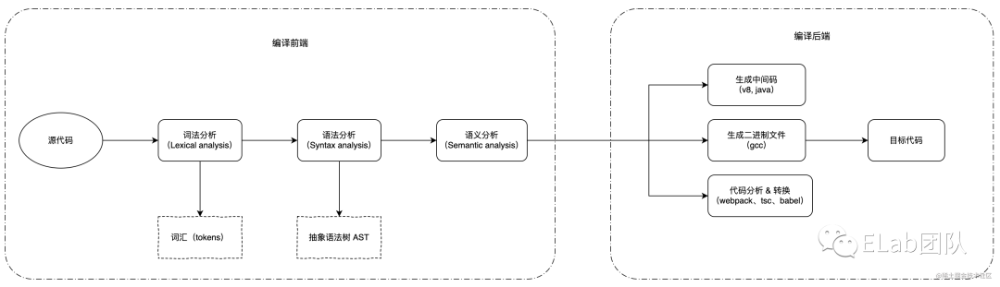

# babel

- 解题：
    - 初阶：说出基本作用 + AST
        - 1是将代码转化为向后兼容的js语法，2是根据环境配置加入 polyfill
        - 基本原理是将代码转译为 ast，之后遍历 ast 树，运行相应插件，在插件中完成代码转换
    - 中阶：详细说出 babel 的执行流程
        - parse => transform => generate
        - parse 调用 babylon 完成代码 => AST 转换，我们也可以通过插件扩展 babel 能处理的语法
        - transform 对 AST 做DFS，遍历过程调用 插件 对节点增删查改
        - generate：根据新的 AST 生成源码
    - 高阶：思考 + 扩展
        - 聊聊你觉得 babel 设计的好的点
            - 扩展性强，能力都通过插件实现，babel 本身只完成核心流程
            - preset 设计的很好，降低配置复杂度
        - 可以结合自身经验聊聊缺点，比如：
            - 运行性能差，之前专门做了优化xxx，最后提升了多少性能
            - ast 规则复杂繁琐，插件开发成本高
        - esbuild、swc 也能实现一样的功能，但性能更佳，未来blabla(你的看法)

- 知识点：
    - 编译：词法分析 => 语法分析 => 语义分析
    - tokenize(token 流) => 语法分析(AST) => 语义分析(babel 没有)
    - AST，特别是 estree 规范

- babel
    - 作用
        1. 将代码转化为向后兼容的js语法
        2. 根据环境配置加入 polyfill
    - 基本原理
        - parse(解析)：将代码转译为 ast
            - @babel/parser
        - transform(转换)：对 ast 做 DFS，遍历过程调用 插件 对节点增删查改
            - @bable/traverse
        - generate(生成)：根据新的 ast 生成源码
            - @babel/generator
- 编译型语言和解释型语言
    - 编译型语言：运行前转换成机器码
        - 优点：运行效率高
        - 缺点：开发效率低
        - 例子：C/C++
    - 解释型语言：运行时转换成机器码
        - 优点：开发效率高
        - 缺点：运行效率低
        - 例子：js、python
- 高级语言和低级语言
    - 高级语言：有很多用于描述逻辑的语言特性，比如分支、循环、函数、面向对象等，接近人的思维，可以让开发者快速的通过它来表达各种逻辑。比如 c++、javascript。
    - 低级语言：与硬件和执行细节有关，会操作寄存器、内存，具体做内存与寄存器之间的复制，需要开发者理解熟悉计算机的工作原理，熟悉具体的执行细节。比如汇编语言、机器语言。
- 编译过程
    - 
    - 编译前端主要就是帮助计算机阅读源代码并理解源代码的结构、含义、作用等，将源代码由一串无意义的字符流解析为一个个的有特定含义的构件。通常情况下，编译前端会产生一种用于给编译后端消费的中间产物，比如我们常见的抽象语法树 AST.
    - 编译后端则是在前端解析的结果和基础上，进一步优化和转换并生成最终的目标代码。
- 编译器工作流
    - 词法分析
        - 从左到右扫描源代码，将源代码分割成一个个的 token 流
        - 根据词法规则，进行模式匹配，识别 token 类型
    - 语法分析
        - 将 token 流转换为 AST
    - 语义分析
        - 检查 AST 是否符合语义规则
    - 中间代码生成与优化
        - 好处：
            - 降低编译器开发难度
            - 增加编译器模块化、可扩展性、可移植性
            - 有利于代码优化
    - 生成目标代码
- 文法
    - 语法：定义语句及语句之间的关系
    - 词法：定义语句中的单词及单词之间的关系
