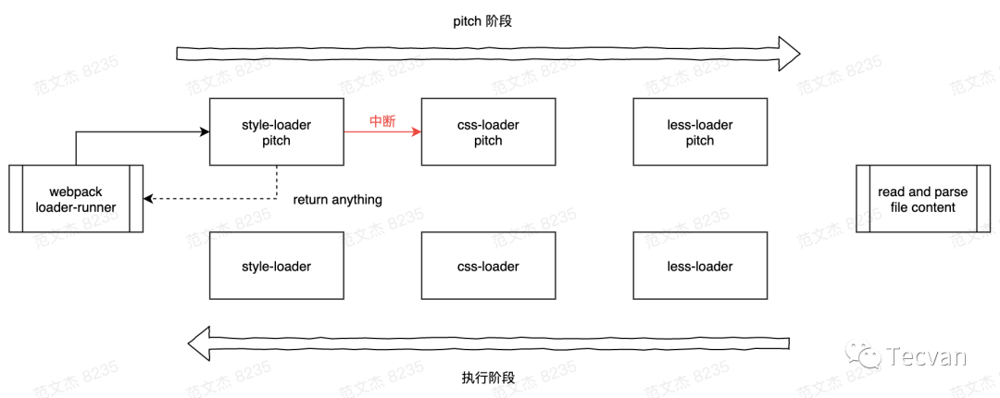
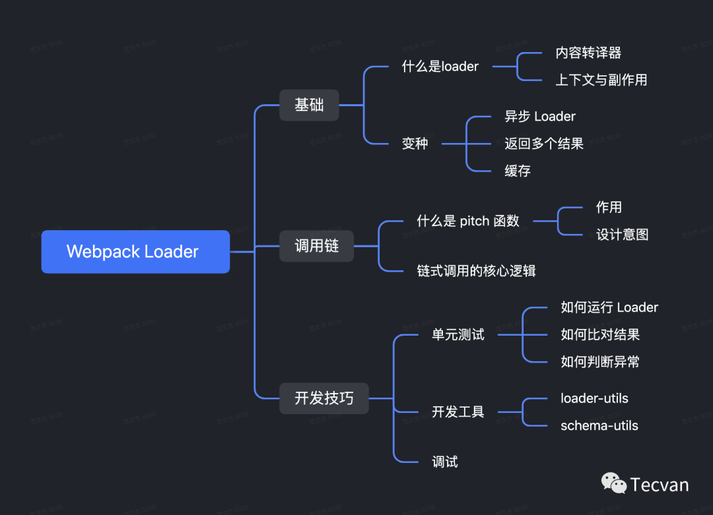
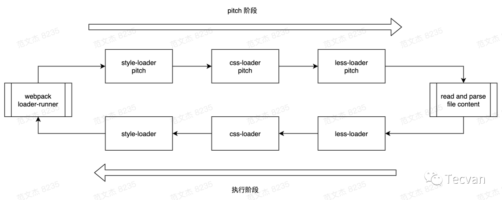

# loader

- 解题：
    - 初阶：知道 Loader 是什么，以及怎么配置，怎么用
        - 最最核心的功能，就是做内容翻译，例如可以将 图片 转译成 Base64
    - 中阶：对 Loader 机制有认知
        - 为什么需要 Loader？因为 webpack 只能处理标准 JS 内容(Webpack 5 之后，原生支持图片、JSON 等常见资源文件)
        - 性能可能会有问题
        - 什么是 Pitch 函数，有什么作用，为什么要这么设计
        - Loader 链式调用的核心逻辑是怎么样的
    
    - 高阶：知道怎么开发一个 Loader
        - Loader 与 Plugin 的区别
        - 怎么开发一个 Loader
            - function(content: String | AST) => String | AST | undefined
        - 有哪些常见的 Loader 开发工具
            - 单元测试工具、Loader-utils、schema-utils 等
    知识点：
        - 
        - 本质上是一种带副作用的内容转移器
        - 建议多看几个常用 Loader 的源码，包括 img-loader、file-loader、ts-loader、babel-loader、eslint-loader 等

- 基础
    - what
        - 内容转译器
            - webpack 只识别 JS 格式，loader 将各式各样的资源转化为标准 JavaScript 内容格式
        - 原理
            - loader 的参数
                - source 资源输入
                    - 资源文件的内容或上一个 loader 的输出
                - sourceMap
                    - 代码的 sourceMap
                - data
                    - 其他在 loader 链中传递的数据
            - loader 的返回值
                - 通过 return 直接返回转译后的内容
                - 通过 this.callback(err, content, sourceMap, meta) 返回
            - 异步
                1. 通过 `this.async()` 获取异步回调函数，将 loader 设置为异步模式，挂起当前执行队列，直到异步回调函数 callback 被调用。
                    - `const callback = this.async()`
                2. 将资源转译
                3. 调用异步回调函数
                    - `callback(err, content, sourceMap, meta)`
        - 缓存
            - loader 的缓存机制
                - loader 的缓存机制是基于文件级别的，即只要文件内容不变，webpack 就不会重新执行 loader
                - 但是如果 loader 有副作用，比如写入文件，那么就需要在 loader 中自己实现缓存机制

        - 上下文与副作用
            - 上下文通过 this 获取
                - getOptions 获取 loader 的配置项
                - emitWarning 发出警告
                - emitError 发出错误，不中断打包
                - resourcePath 资源路径
                - emitFile 发出文件
                - addContextDependency 添加上下文依赖，会导致资源重新编译
        - 链式调用
            - loader 的链式调用是通过 pipeline 的方式实现的，即上一个 loader 的输出会作为下一个 loader 的输入
            - loader 的问题
                - 一旦启动，就会一直执行到链式调用结束，除非抛出异常
                - 某些不关心资源内容，只关心资源路径的 loader，需要等待内容读取之后才能执行，就会浪费时间
        - pitch
            - 可以解决 loader 的链式调用的问题
            - what
                - 参数
                    - remainingRequest
                        - 剩余的 loader 链
                    - precedingRequest
                        - 前置的 loader 链
                    - data
                        - 其他在 loader 链中传递的数据
                - 
            - why
                - 阻断 loader 链的执行
                    - 可以通过 return false 来阻断 loader 链的执行
                - eg：style-loader
        - 性能问题
            - loader 的缓存机制会导致性能问题，因为 loader 的执行是在主线程上执行的，如果 loader 执行时间过长，就会导致主线程阻塞，从而影响 webpack 的打包速度
                - 可以通过 this.cacheable(false) 来禁用 loader 的缓存机制
            - loader 的链式调用会导致性能问题，因为每个 loader 都需要执行一次 pitch 函数，如果 loader 链过长，就会导致性能问题
            - 可以通过 `thread-loader` 来解决这个问题(webpack 5 多进程打包机制)
- 开发技巧
    - 工具
        - loader-utils
            - 获取 loader 的配置项
            - 获取资源路径
            - requestString 序列化与反序列化
            - 计算资源的 hash 值
        - schema-utils
            - 验证 loader 的配置项
        - 单元测试
            - 如何运行 loader
                - 在 node 环境下运行调用 Webpack 接口
                - 编写一系列 mock 方法，搭建起一个模拟的 Webpack 运行环境
            - 如何断言 loader 的输出
                - 调用 Jest 的 expect(xxx).toMatchSnapshot() 断言判断当前运行结果是否与之前的运行结果一致，从而确保多次修改的结果一致性，很多框架都大量用了这种方法
                - 解读资源内容，判断是否符合预期
            - 如何判断 loader 是否抛出异常
                - 可以从 stats 对象解析
                - 可以 expect(xxx).toMatchSnapshot() 断言，用快照对比更新前后的结果。
        - 调试
            - ndb 断点调试
            - npm link 调试
            - resolveLoader 配置调试


## loader 概念

帮助 webpack 将不同类型的文件转换为 webpack 可识别的模块。

## loader 执行顺序

1. 分类

    - pre： 前置 loader
    - normal： 普通 loader
    - inline： 内联 loader
    - post： 后置 loader

2. 执行顺序

    - 4 类 loader 的执行优级为：`pre > normal > inline > post` 。
    - 相同优先级的 loader 执行顺序为：`从右到左，从下到上`。
    例如：

    ```js
    // 此时loader执行顺序：loader3 - loader2 - loader1
    module: {
    rules: [
    {
    test: /\.js$/,
    loader: "loader1",
    },
    {
    test: /\.js$/,
    loader: "loader2",
    },
    {
    test: /\.js$/,
    loader: "loader3",
    },
    ],
    },
    ```

    ```js
    // 此时loader执行顺序：loader1 - loader2 - loader3
    module: {
    rules: [
    {
    enforce: "pre",
    test: /\.js$/,
    loader: "loader1",
    },
    {
    // 没有enforce就是normal
    test: /\.js$/,
    loader: "loader2",
    },
    {
    enforce: "post",
    test: /\.js$/,
    loader: "loader3",
    },
    ],
    },
    ```

3. 使用 loader 的方式

    - 配置方式：在 `webpack.config.js` 文件中指定 loader。（pre、normal、post loader）
    - 内联方式：在每个 `import` 语句中显式指定 loader。（inline loader）

4. inline loader
    用法：`import Styles from 'style-loader!css-loader?modules!./styles.css';`
    含义：

    - 使用 `css-loader` 和 `style-loader` 处理 `styles.css` 文件
    - 通过 `!` 将资源中的 loader 分开
    `inline loader` 可以通过添加不同前缀，跳过其他类型 loader。
    - `!` 跳过 normal loader。
    `import Styles from '!style-loader!css-loader?modules!./styles.css';`
    - `-!` 跳过 pre 和 normal loader。
    `import Styles from '-!style-loader!css-loader?modules!./styles.css';`
    - `!!` 跳过 pre、 normal 和 post loader。
    `import Styles from '!!style-loader!css-loader?modules!./styles.css';`

## 开发一个 loader

### 1. 最简单的 loader

```js
// loaders/loader1.js
module.exports = function loader1(content) {
console.log("hello loader");
return content;
};
```

它接受要处理的源码作为参数，输出转换后的 js 代码。

### 2. loader 接受的参数

- `content` 源文件的内容
- `map` SourceMap 数据
- `meta` 数据，可以是任何内容

## loader 分类

### 1. 同步 loader

```js
module.exports = function (content, map, meta) {
return content;
};
```

`this.callback` 方法则更灵活，因为它允许传递多个参数，而不仅仅是 `content`。

```js
module.exports = function (content, map, meta) {
// 传递map，让source-map不中断
// 传递meta，让下一个loader接收到其他参数
this.callback(null, content, map, meta);
return; // 当调用 callback() 函数时，总是返回 undefined
};
```

### 2. 异步 loader

```js
module.exports = function (content, map, meta) {
const callback = this.async();
// 进行异步操作
setTimeout(() => {
callback(null, result, map, meta);
}, 1000);
};
```

> 由于同步计算过于耗时，在 Node.js 这样的单线程环境下进行此操作并不是好的方案，我们建议尽可能地使你的 loader 异步化。但如果计算量很小，同步 loader 也是可以的。
>
### 3. Raw Loader

默认情况下，资源文件会被转化为 UTF-8 字符串，然后传给 loader。通过设置 raw 为 true，loader 可以接收原始的 Buffer。

```js
module.exports = function (content) {
// content是一个Buffer数据
return content;
};
module.exports.raw = true; // 开启 Raw Loader
```

### 4. Pitching Loader

```js
module.exports = function (content) {
return content;
};
module.exports.pitch = function (remainingRequest, precedingRequest, data) {
console.log("do somethings");
};
```

webpack 会先从左到右执行 loader 链中的每个 loader 上的 pitch 方法（如果有），然后再从右到左执行 loader 链中的每个 loader 上的普通 loader 方法。

在这个过程中如果任何 pitch 有返回值，则 loader 链被阻断。webpack 会跳过后面所有的的 pitch 和 loader，直接进入上一个 loader 。


## loader API

| 方法名 | 含义 | 用法 |
| ----------------------- | ------------------------------------------ | ---------------------------------------------- |
| this.async | 异步回调 loader。返回 this.callback | const callback = this.async() |
| this.callback | 可以同步或者异步调用的并返回多个结果的函数 | this.callback(err, content, sourceMap?, meta?) |
| this.getOptions(schema) | 获取 loader 的 options | this.getOptions(schema) |
| this.emitFile | 产生一个文件 | this.emitFile(name, content, sourceMap) |
| this.utils.contextify | 返回一个相对路径 | this.utils.contextify(context, request) |
| this.utils.absolutify | 返回一个绝对路径 | this.utils.absolutify(context, request) |
> 更多文档，请查阅 [webpack 官方 loader api 文档](https://webpack.docschina.org/api/loaders/#the-loader-context)
>
## 手写 clean-log-loader

作用：用来清理 js 代码中的`console.log`

```js
// loaders/clean-log-loader.js
module.exports = function cleanLogLoader(content) {
// 将console.log替换为空
return content.replace(/console\.log\(.*\);?/g, "");
};
```

## 手写 banner-loader

作用：给 js 代码添加文本注释

- loaders/banner-loader/index.js

```js
const schema = require("./schema.json");
  
module.exports = function (content) {
// 获取loader的options，同时对options内容进行校验
// schema是options的校验规则（符合 JSON schema 规则）
const options = this.getOptions(schema);
  
const prefix = `
/*
* Author: ${options.author}
*/
`;
  
return `${prefix} \n ${content}`;
};
```

- loaders/banner-loader/schema.json

```json
{
"type": "object",
"properties": {
"author": {
"type": "string"
}
},
"additionalProperties": false
}
```

## 手写 babel-loader

作用：编译 js 代码，将 ES6+语法编译成 ES5-语法。

- 下载依赖

```sh
npm i @babel/core @babel/preset-env -D
```

- loaders/babel-loader/index.js

```js
const schema = require("./schema.json");
const babel = require("@babel/core");
  
module.exports = function (content) {
const options = this.getOptions(schema);
// 使用异步loader
const callback = this.async();
// 使用babel对js代码进行编译
babel.transform(content, options, function (err, result) {
callback(err, result.code);
});
};
```

- loaders/banner-loader/schema.json

```json
{
"type": "object",
"properties": {
"presets": {
"type": "array"
}
},
"additionalProperties": true
}
```

## 手写 file-loader

作用：将文件原封不动输出出去

- 下载包

```sh
npm i loader-utils -D
```

- loaders/file-loader.js

```js
const loaderUtils = require("loader-utils");
  
function fileLoader(content) {
// 根据文件内容生产一个新的文件名称
const filename = loaderUtils.interpolateName(this, "[hash].[ext]", {
content,
});
// 输出文件
this.emitFile(filename, content);
// 暴露出去，给js引用。
// 记得加上''
return `export default '${filename}'`;
}
  
// loader 解决的是二进制的内容
// 图片是 Buffer 数据
fileLoader.raw = true;
  
module.exports = fileLoader;
```

- loader 配置

```js
{
test: /\.(png|jpe?g|gif)$/,
loader: "./loaders/file-loader.js",
type: "javascript/auto", // 解决图片重复打包问题
},
```

## 手写 style-loader

作用：动态创建 style 标签，插入 js 中的样式代码，使样式生效。

- loaders/style-loader.js

```js
const styleLoader = () => {};
  
styleLoader.pitch = function (remainingRequest) {
/*
remainingRequest: C:\Users\86176\Desktop\source\node_modules\css-loader\dist\cjs.js!C:\Users\86176\Desktop\source\src\css\index.css
这里是inline loader用法，代表后面还有一个css-loader等待处理
  
最终我们需要将remainingRequest中的路径转化成相对路径，webpack才能处理
希望得到：../../node_modules/css-loader/dist/cjs.js!./index.css
  
所以：需要将绝对路径转化成相对路径
要求：
1. 必须是相对路径
2. 相对路径必须以 ./ 或 ../ 开头
3. 相对路径的路径分隔符必须是 / ，不能是 \
*/
const relativeRequest = remainingRequest
.split("!")
.map((part) => {
// 将路径转化为相对路径
const relativePath = this.utils.contextify(this.context, part);
return relativePath;
})
.join("!");
  
/*
!!${relativeRequest}
relativeRequest：../../node_modules/css-loader/dist/cjs.js!./index.css
relativeRequest是inline loader用法，代表要处理的index.css资源, 使用css-loader处理
!!代表禁用所有配置的loader，只使用inline loader。（也就是外面我们style-loader和css-loader）,它们被禁用了，只是用我们指定的inline loader，也就是css-loader
  
import style from "!!${relativeRequest}"
引入css-loader处理后的css文件
为什么需要css-loader处理css文件，不是我们直接读取css文件使用呢？
因为可能存在@import导入css语法，这些语法就要通过css-loader解析才能变成一个css文件，否则我们引入的css资源会缺少
const styleEl = document.createElement('style')
动态创建style标签
styleEl.innerHTML = style
将style标签内容设置为处理后的css代码
document.head.appendChild(styleEl)
添加到head中生效
*/
const script = `
import style from "!!${relativeRequest}"
const styleEl = document.createElement('style')
styleEl.innerHTML = style
document.head.appendChild(styleEl)
`;
  
// style-loader是第一个loader, 由于return导致熔断，所以其他loader不执行了（不管是normal还是pitch）
return script;
};
  
module.exports = styleLoader;
```
