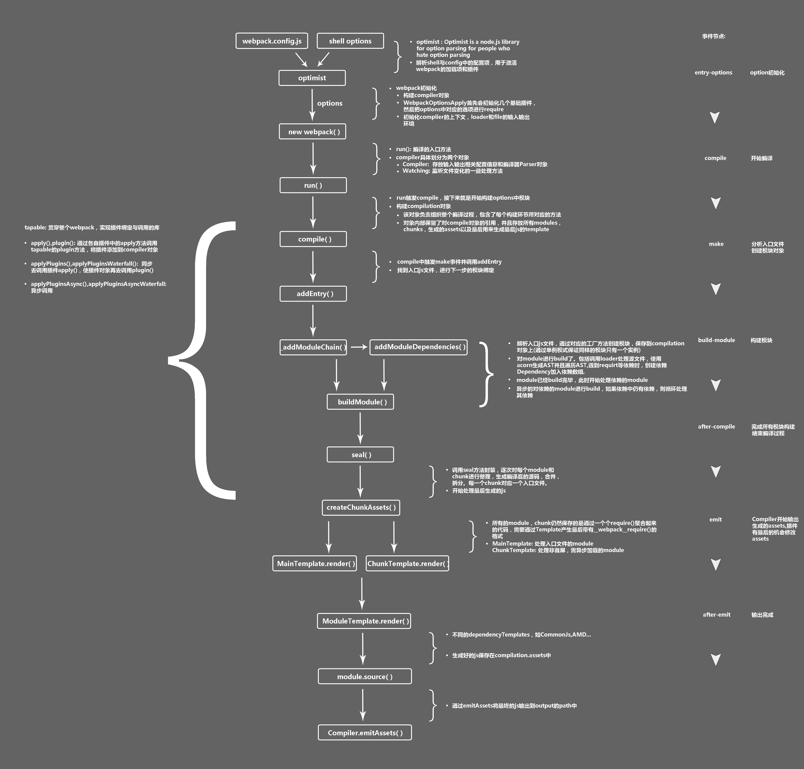

# webpack 核心流程

- 问题：webpack 核心流程是怎样的
    - 解题：
        - 初阶：理解基本工作流程
            - 读 entry 配置，确定入口
            - 从入口开始：
                - 调用 loader 转化文件为 module 对象
                - 内容转 ast
                - 分析文件依赖(import/require 或 img src 等等)
                - 回到第一步，遍历 & 递归处理依赖文件
            - 遍历所有 modules ，source 转成 产物形态
                - import => __webpack_require__
            - 合并 modules 成 chunk ，chunk 再写成 asset
        - 中阶：理解原理
            - 
            1. 初始化阶段：
                1. 初始化参数：从配置文件、 配置对象、Shell 参数中读取，与默认配置结合得出最终的参数
                2. 创建编译器对象：用上一步得到的参数创建 Compiler 对象
                3. 初始化编译环境：包括注入内置插件、注册各种模块工厂、初始化 RuleSet 集合、加载配置的插件等
                4. 开始编译：执行 compiler 对象的 run 方法
                5. 确定入口：根据配置中的 entry 找出所有的入口文件，调用 compilition.addEntry 将入口文件转换为 dependence 对象
            2. 构建阶段：
                1. 编译模块(make)：根据 entry 对应的 dependence 创建 module 对象，调用 loader 将模块转译为标准 JS 内容，调用 JS 解释器将内容转换为 AST 对象，从中找出该模块依赖的模块，再 递归 本步骤直到所有入口依赖的文件都经过了本步骤的处理
                2. 完成模块编译：上一步递归处理所有能触达到的模块后，得到了每个模块被翻译后的内容以及它们之间的 依赖关系图
            3. 生成阶段：
                1. 输出资源(seal)：根据入口和模块之间的依赖关系，组装成一个个包含多个模块的 Chunk，再把每个 Chunk 转换成一个单独的文件加入到输出列表，这步是可以修改输出内容的最后机会
                2. 写入文件系统(emitAssets)：在确定好输出内容后，根据配置确定输出的路径和文件名，把文件内容写入到文件系统
        - 高阶：应用 & 思考
            - 如何优化性能？
                - 配置 resolve 提升文件路径解析速度
                - 配置 module.rules.exclude 跳过不需要处理的模块
                - 使用 cache 缓存模块
                - 使用 HappyPack、thread-loader 等组件，实现并行编译
                - 等等
            - 与 rollup、vite 等工具横向对比，有何优缺点
    - 资料：
        - <https://mp.weixin.qq.com/s/SbJNbSVzSPSKBe2YStn2Zw>
        - <https://developer.aliyun.com/article/61047>
