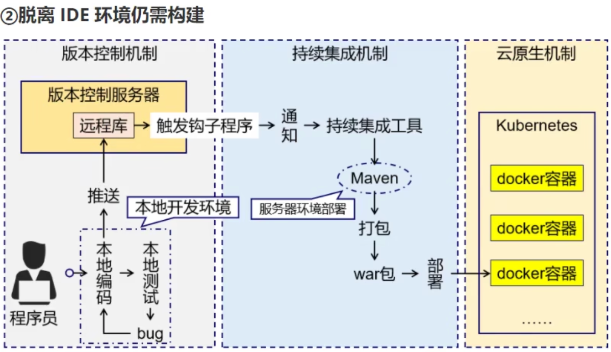
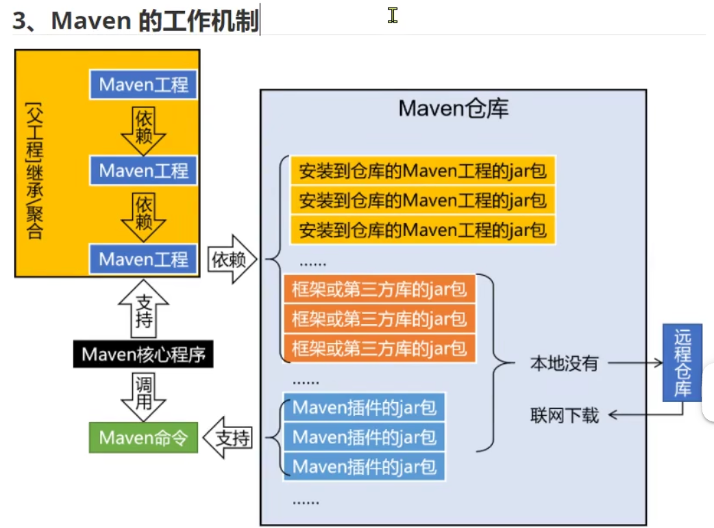
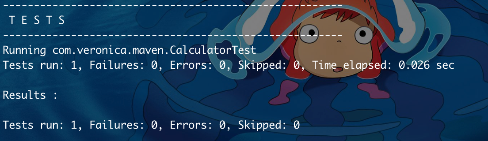
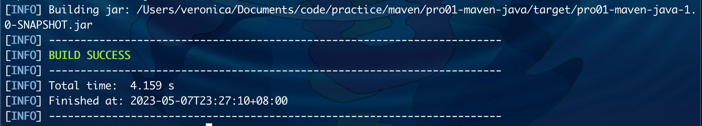
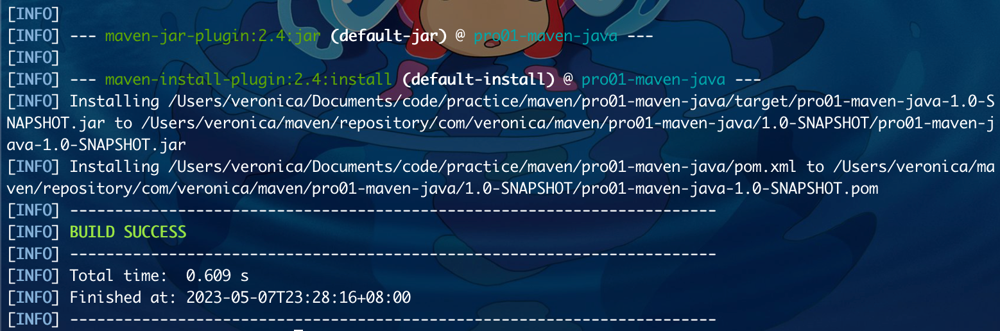

# maven 学习笔记

## 概述

- 应用场景
    - 开发过程
    - 自动部署
    - 私有仓库
- 为什么
    - jar 包管理工具
        - 项目用到的 jar 包很多
        - jar 包的来源很多
        - jar 包之间的依赖关系管理
    - 构建工具
        - 
- 是什么
    - 构建和依赖管理工具
    - 构建
        - 从原材料到产品的过程
            - 原材料
                - 源代码
                - 图片
                - 配置文件
            - 产品
                - 一个可以在服务器上运行的项目
        - 构建过程
            - 清理：删除上一次构建结果
            - 编译：将源代码编译成字节码文件
            - 测试：对编译后的字节码文件进行测试
            - 报告：生成测试报告
            - 打包：
                - java 工程：jar 包
                - web 工程：war 包
            - 安装：将打包的结果复制到本地仓库
            - 部署
                - jar 包：部署到 Nexus 私服
                - war 包：部署到 Tomcat
    - 依赖
        - jar 包的下载：maven 会自动从中央仓库下载 jar 包
        - jar 包之间的依赖：maven 会自动解决 jar 包之间的依赖关系
        - jar 包之间的冲突：通过调整依赖配置，让某些 jar 包不被导入，解决 jar 包之间的冲突
    - maven 工作机制
        - 

## 安装

- 安装
    - 下载
    - 解压
    - 配置本地仓库 conf/setting.xml -> localRepository
    - 配置镜像仓库 conf/setting.xml -> mirrors
    - 配置 JDK 版本 conf/setting.xml -> profiles -> profile -> properties -> maven.compiler.source
- 配置环境变量
    - 检查 java 环境变量 JAVA_HOME
    - MAVEN_HOME
    - PATH
    - 验证： mvn -v

## 命令行环境

- 核心概念
    - 坐标
        - groupId：公司或组织域名反写，通常会加上项目名称
        - artifactId：模块名
            - 一个项目可能包含很多个工程，每个工程都是一个模块
        - version：版本号
            - SNAPSHOT：快照版本
            - RELEASE：正式版本
        - 存储路径：repository/groupId/artifactId/version/artifactId-version.jar
    - POM
        - POM：Project Object Model，项目对象模型，类似 DOM。
        - 模型化思想的具体体现
        - 对应的文件：pom.xml
    - 约定的目录结构
        - 各个目录的作用
            - src/main/java：源代码
            - src/main/resources：资源文件
            - src/test/java：测试代码
            - src/test/resources：测试资源文件
        - 约定的意义
            - 自动化构建
        - 约定大于配置：约定大于配置，配置大于编码
            - 专注于编码：初级开发工程师
            - 专注于配置：中高级开发工程师
            - 专注于约定：架构师
- jar 工程
    - 1. 创建工程
        - mvn archetype:generate
            - 主命令： mvn
            - 子命令： archetype:generate
                - 插件： archetype
                - 目标： generate
            - 创建过程
                - Choose a number or apply filter (format: [groupId:]artifactId, case sensitive contains): 7:【回车，使用默认值】
                - Define value for property 'groupId':com.veronica.maven
                - Define value for property 'artifactId':demo-maven-java
                - Define value for property 'version' 1.0-SNAPSHOT:【回车，使用默认值】
                - Define value for property 'package' com.veronica.maven:【回车，使用默认值】
                - Y: :【回车，表示确认】
        - 调整
            - junit 版本 改为 4.12
            - 删除 app.java 和 test.java
        - pom.xml

            ```xml
            <!-- project：根标签，表示对当前工程进行配置、管理 -->
            <project xmlns="http://maven.apache.org/POM/4.0.0" xmlns:xsi="http://www.w3.org/2001/XMLSchema-instance"
            xsi:schemaLocation="http://maven.apache.org/POM/4.0.0 http://maven.apache.org/xsd/maven-4.0.0.xsd">
            <!-- modelVersion：从 maven2 开始就固定是 4.0.0，代表当前 pom.xml所采用的标签结构 -->
            <modelVersion>4.0.0</modelVersion>
            <!-- 坐标信息 -->
            <groupId>com.veronica.maven</groupId>
            <artifactId>pro01-maven-java</artifactId>
            <version>1.0-SNAPSHOT</version>
            <!-- packaging：当前工程打包的方式，默认 jar，说明是一个 Java 工程，war 是 web 工程，pom 是用来管理其他工程的工程 -->
            <packaging>jar</packaging>

            <name>pro01-maven-java</name>
            <url>http://maven.apache.org</url>

            <!-- 定义属性值 -->
            <properties>
                <!-- 在构建过程中读取源码使用的字符集 -->
                <project.build.sourceEncoding>UTF-8</project.build.sourceEncoding>
            </properties>

            <!-- 配置依赖信息 -->
            <dependencies>
                <dependency>
                    <groupId>junit</groupId>
                    <artifactId>junit</artifactId>
                    <version>4.12</version>
                    <!-- 配置当前依赖的范围 -->
                    <scope>test</scope>
                </dependency>
            </dependencies>
            </project>
            ```
    - 2. 编写代码
        - Calculator.java
            ```java
                package com.veronica.maven;

                public class Calculator {
                    public int sum(int i, int j){
                        return i + j;
                    }
                }
            ```
        - CalculatorTest.java
            ```java
                package com.veronica.maven;

                import orj.junit.Test;
                import com.veronica.maven.Calculator;

                // 静态导入，将 Assert类中的静态资源导入当前类
                // 在当前类中就可以直接使用了
                import static org.junit.Assert.*;

                public class CalculatorTest {

                    // junit 4 才支持注解的写法
                    @Test
                    public void testSum(){
                        // 1. 创建对象
                        Calculator calculator = new Calculator();

                        // 2. 调用对象，获取运行结果
                        int actualResult = calculator.sum(5, 3);

                        // 3. 声明一个变量，表示预期运行结果
                        int expectedResult = 8;

                        // 4. 使用断言来判断实际结果与预期是否一致
                        assertEquals(expectedResult, actualResult);
                    }
                }
            ```
    - 3. 构建工程
        - 要求：必须在 pom.xml 所在的目录下执行命令
        - 清理：删除 target 目录
            - mvn clean
        - 编译
            - 主程序编译：mvn compile
                - 存放路径：target/classes
            - 测试程序编译：mvn test-compile
                - 存放路径：target/test-classes
        - 测试
            - mvn test
            - 测试报告存放路径：target/surefire-reports
            - 
        - 打包
            - mvn package
            - 
        - 安装：存入本地仓库
            - mvn install
            - 
            - /Users/veronica/maven/repository/com/veronica/maven/pro01-maven-java/1.0-SNAPSHOT/pro01-maven-java-1.0-SNAPSHOT.jar
            - /Users/veronica/maven/repository/com/veronica/maven/pro01-maven-java/1.0-SNAPSHOT/pro01-maven-java-1.0-SNAPSHOT.pom
- web 工程
    - 1. 创建工程
        - mvn archetype:generate -DarchetypeGroupId=org.apache.maven.archetypes -DarchetypeArtifactId=maven-archetype-webapp -DarchetypeVersion=1.4
    - 2. 编写代码