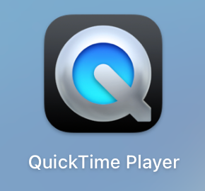
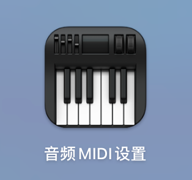
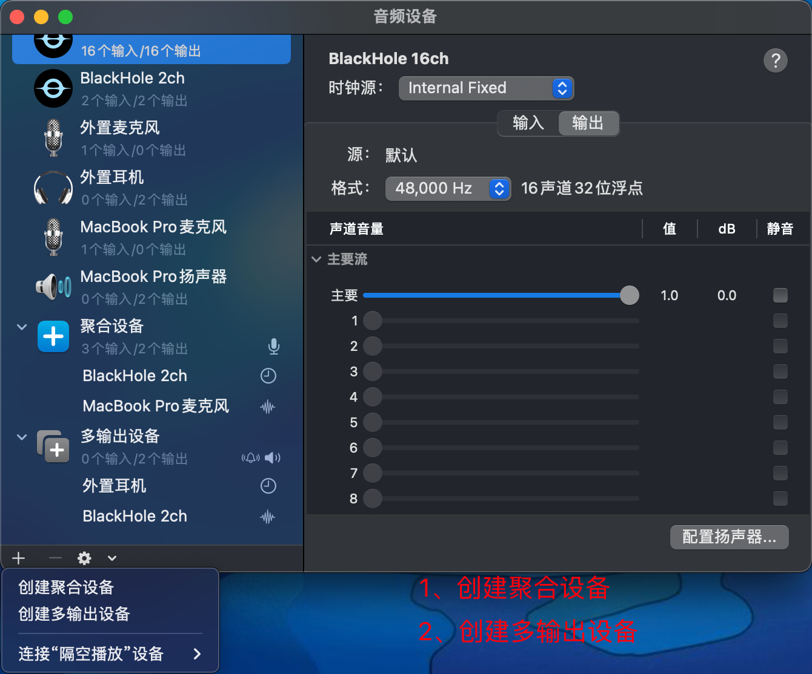
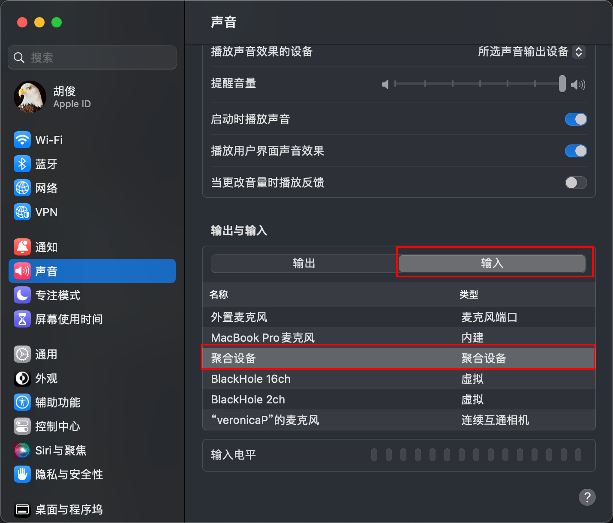
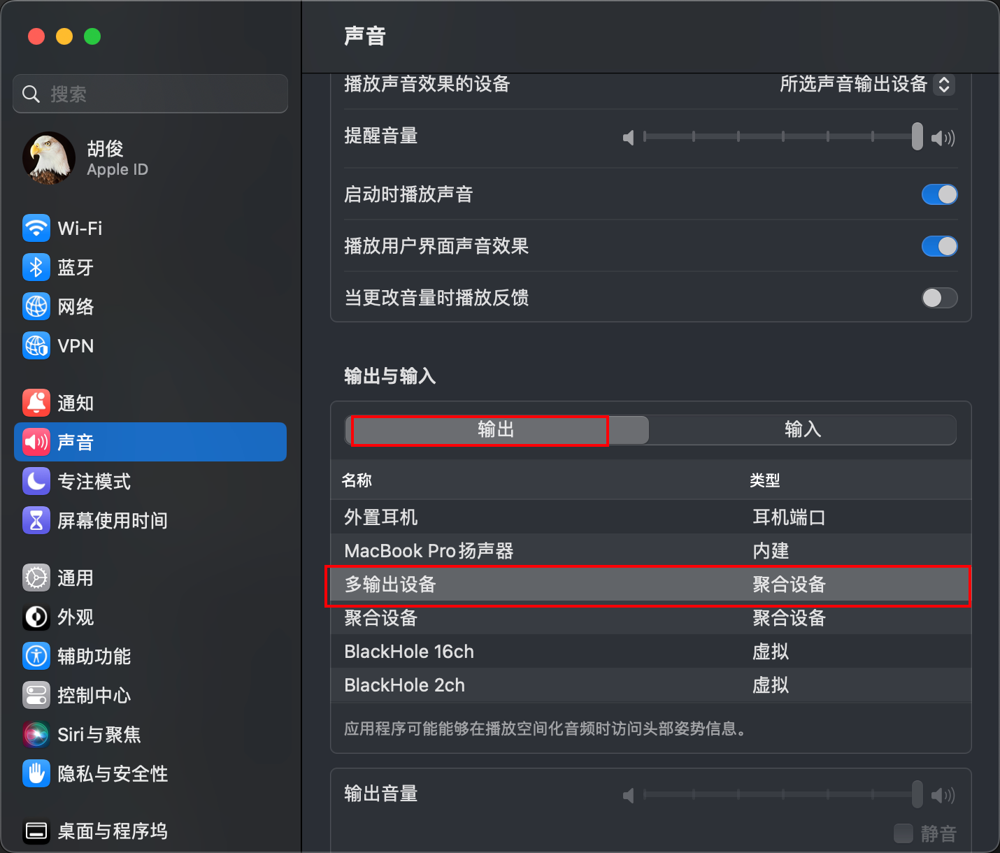
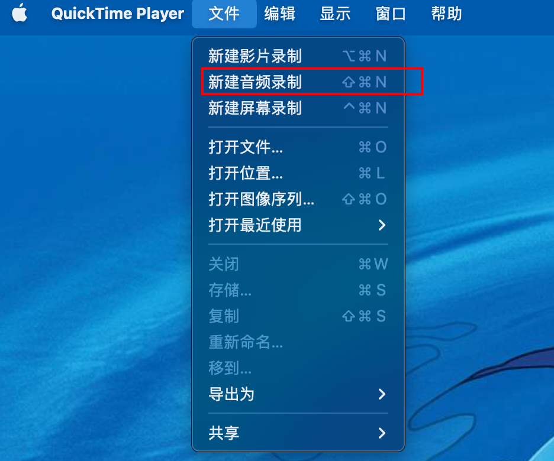
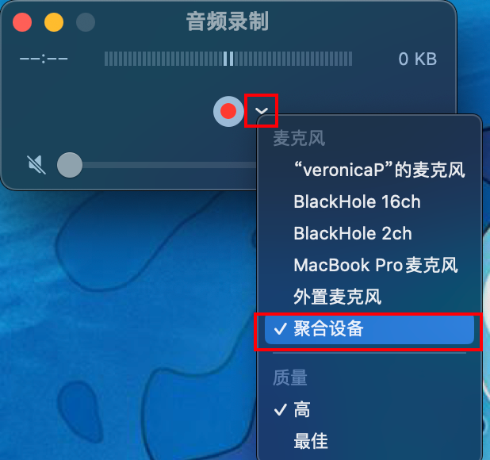

# 多输入声音录制

1. 多输入：同时录制麦克风、耳机发出的声音
2. 软件：
   1. 自带Quicktime Player
      1. 
   2. [blackhole 2h 驱动](https://gitcode.net/mirrors/ExistentialAudio/BlackHole?utm_source=csdn_github_accelerator)
3. 具体配置：
   1. 下载驱动(2选一即可)
      1. brew install blackhole-2ch
      2. brew install blackhole-16ch
   2. 打开audio midi setup
      1. 
      2. 
   3. 系统偏好设置-声音
      1. 
      2. 
   4. 打开Quicktime Player
      1. 
      2. 