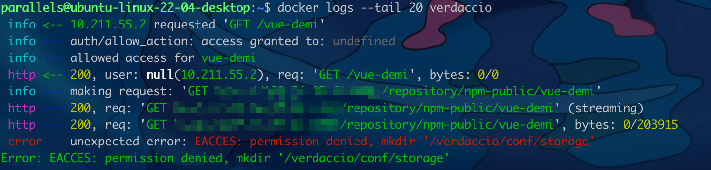
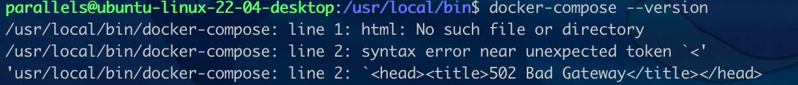

# 搭建npm私服

## 环境

操作系统：ubuntu 22.04 arm64
工具：verdaccio，Docker

## 方式一 docker 安装

- [参考文档](https://blog.csdn.net/bertZuo/article/details/129046009)

1. 安装

    ```sh
    docker pull verdaccio/verdaccio
    ```

2. 启动

    ```sh
    $ docker run -it --rm --name verdaccio -p 4873:4873 verdaccio/verdaccio
    info --- config file  - /verdaccio/conf/config.yaml
    info --- the "crypt" algorithm is deprecated consider switch to "bcrypt" in the configuration file. Read the documentation for additional details
    info --- using htpasswd file: /verdaccio/storage/htpasswd
    info --- plugin successfully loaded: verdaccio-htpasswd
    info --- plugin successfully loaded: verdaccio-audit
    warn --- http address - http://0.0.0.0:4873/ - verdaccio/5.24.1
    ```

3. 将配置复制到本地

    ```sh
    docker cp vverdaccio:/verdaccio ~/verdaccio
    ```

4. 删除 verdaccio 容器

   ```sh
   docker rm -f verdaccio
   ```

5. 修改本地的配置文件

   ```sh
    # 包含所有包的目录的路径
    storage: ./storage/data
    # 包含插件的目录路径
    plugins: ./plugins

    # 完整的webui配置查看 https://verdaccio.org/docs/webui
    web:
    enable: true
    title: npm仓库
    logo: https://lichong.work/logo
    favicon: https://lichong.work/logo
    # 主题色
    primary_color: '#8794AF'
    # gravatar头像支持
    gravatar: true
    # 包默认的排序方式
    sort_packages: asc
    # 默认用户界面转换为暗黑主题
    darkMode: false
    # html缓存
    html_cache: false
    # 默认显示所有功能
    login: true
    # 是否显示右上角verdaccio项目的相关信息
    showInfo: false
    # 是否显示右上角设置
    showSettings: true
    # 结合 darkMode 可以切换主题
    showThemeSwitch: true
    # 是否显示页脚
    showFooter: false
    # 是否可以搜索
    showSearch: true
    # 是否展示包的原始清单
    showRaw: true
    # 是否可以下载压缩包
    showDownloadTarball: true
    #  HTML tags injected after manifest <scripts/>
    # scriptsBodyAfter:
    #    - '<script type="text/javascript" src="https://my.company.com/customJS.min.js"></script>'
    #  HTML tags injected before ends </head>
    #  metaScripts:
    #    - '<script type="text/javascript" src="https://code.jquery.com/jquery-3.5.1.slim.min.js"></script>'
    #    - '<script type="text/javascript" src="https://browser.sentry-cdn.com/5.15.5/bundle.min.js"></script>'
    #    - '<meta name="robots" content="noindex" />'
    #  HTML tags injected first child at <body/>
    #  bodyBefore:
    #    - '<div id="myId">html before webpack scripts</div>'
    #  Public path for template manifest scripts (only manifest)
    #  publicPath: http://somedomain.org/

    # 认证相关完整配置查看 https://verdaccio.org/docs/configuration#authentication
    auth:
    htpasswd:
        file: ./storage/htpasswd
        # Maximum amount of users allowed to register, defaults to "+infinity".
        # You can set this to -1 to disable registration.
        # max_users: 1000
        # Hash algorithm, possible options are: "bcrypt", "md5", "sha1", "crypt".
        # algorithm: bcrypt # by default is crypt, but is recommended use bcrypt for new installations
        # Rounds number for "bcrypt", will be ignored for other algorithms.
        # rounds: 10

    # 上游链路完整配置查看 https://verdaccio.org/docs/configuration#uplinks
    uplinks:
    npmjs:
        url: http://120.24.95.61:8081/repository/npm-public/ #https://registry.npmjs.org/
    npmmirror:
        url: http://120.24.95.61:8081/repository/npm-public/ #https://registry.npmmirror.com/

    # 了解如何保护包查看 https://verdaccio.org/docs/protect-your-dependencies/
    # packages完整配置查看 https://verdaccio.org/docs/configuration#packages
    packages:
    '@*/*':
        access: $all
        publish: $authenticated
        unpublish: $authenticated
        proxy: npmmirror
        
    '**':
        # 可以指定用户名/组名（取决于使用的身份验证插件）和三个关键字：“$all”、“$anonymous”、“$authenticated”

        # 允许所有用户（包括未经身份验证的用户）阅读和发布所有包
        access: $all
        # 允许所有已知用户发布/发布包
        publish: $authenticated
        unpublish: $authenticated
        # 如果包在本地找不到，将请求到“npmmirror”代理去查找
        proxy: npmmirror

    # To improve your security configuration and  avoid dependency confusion
    # consider removing the proxy property for private packages
    # https://verdaccio.org/docs/best#remove-proxy-to-increase-security-at-private-packages

    # https://verdaccio.org/docs/configuration#server
    # You can specify HTTP/1.1 server keep alive timeout in seconds for incoming connections.
    # A value of 0 makes the http server behave similarly to Node.js versions prior to 8.0.0, which did not have a keep-alive timeout.
    # WORKAROUND: Through given configuration you can workaround following issue https://github.com/verdaccio/verdaccio/issues/301. Set to 0 in case 60 is not enough.
    server:
    keepAliveTimeout: 60
    # Allow `req.ip` to resolve properly when Verdaccio is behind a proxy or load-balancer
    # See: https://expressjs.com/en/guide/behind-proxies.html
    # trustProxy: '127.0.0.1'

    # https://verdaccio.org/docs/configuration#offline-publish
    # publish:
    #   allow_offline: false

    # https://verdaccio.org/docs/configuration#url-prefix
    # url_prefix: /verdaccio/
    # VERDACCIO_PUBLIC_URL='https://somedomain.org';
    # url_prefix: '/my_prefix'
    # // url -> https://somedomain.org/my_prefix/
    # VERDACCIO_PUBLIC_URL='https://somedomain.org';
    # url_prefix: '/'
    # // url -> https://somedomain.org/
    # VERDACCIO_PUBLIC_URL='https://somedomain.org/first_prefix';
    # url_prefix: '/second_prefix'
    # // url -> https://somedomain.org/second_prefix/'

    # https://verdaccio.org/docs/configuration#security
    # security:
    #   api:
    #     legacy: true
    #     jwt:
    #       sign:
    #         expiresIn: 29d
    #       verify:
    #         someProp: [value]
    #    web:
    #      sign:
    #        expiresIn: 1h # 1 hour by default
    #      verify:
    #         someProp: [value]

    # https://verdaccio.org/docs/configuration#user-rate-limit
    # userRateLimit:
    #   windowMs: 50000
    #   max: 1000

    # https://verdaccio.org/docs/configuration#max-body-size
    # max_body_size: 10mb

    # https://verdaccio.org/docs/configuration#listen-port
    # listen:
    # - localhost:4873            # default value
    # - http://localhost:4873     # same thing
    # - 0.0.0.0:4873              # listen on all addresses (INADDR_ANY)
    # - https://example.org:4873  # if you want to use https
    # - "[::1]:4873"                # ipv6
    # - unix:/tmp/verdaccio.sock    # unix socket

    # The HTTPS configuration is useful if you do not consider use a HTTP Proxy
    # https://verdaccio.org/docs/configuration#https
    # https:
    #   key: ./path/verdaccio-key.pem
    #   cert: ./path/verdaccio-cert.pem
    #   ca: ./path/verdaccio-csr.pem

    # https://verdaccio.org/docs/configuration#proxy
    # http_proxy: http://something.local/
    # https_proxy: https://something.local/

    # webhook通知完整配置查看 https://verdaccio.org/docs/configuration#notifications
    # notify:
    #   method: POST
    #   headers: [{ "Content-Type": "application/json" }]
    #   endpoint: https://usagge.hipchat.com/v2/room/3729485/notification?auth_token=mySecretToken
    #   content: '{"color":"green","message":"New package published: * {{ name }}*","notify":true,"message_format":"text"}'

    middlewares:
    audit:
        enabled: true

    # https://verdaccio.org/docs/logger
    # log settings
    logs: { type: stdout, format: pretty, level: http }
    #experiments:
    #  # support for npm token command
    #  token: false
    #  # enable tarball URL redirect for hosting tarball with a different server, the tarball_url_redirect can be a template string
    #  tarball_url_redirect: 'https://mycdn.com/verdaccio/${packageName}/${filename}'
    #  # the tarball_url_redirect can be a function, takes packageName and filename and returns the url, when working with a js configuration file
    #  tarball_url_redirect(packageName, filename) {
    #    const signedUrl = // generate a signed url
    #    return signedUrl;
    #  }

    # 国际化配置
    i18n:
    web: zh-CN

   ```

6. 启动

   ```sh
   docker run -it -d --name verdaccio -v ~/verdaccio/conf -p 4873:4873 verdaccio/verdaccio
   ```

7. 访问

   ```sh
    http://localhost:4873
    ```

8. 在项目中访问

    ```sh
    nrm add verdaccio http://localhost:4873
    nrm use verdaccio
    npm install 
    ```

    - 这里可能会卡住不动，可以去看看docker日志

9. 查看报错

   ```sh
   docker logs --tail 200 verdaccio
   ```

    - 会看到没有权限的问题
    - 

10. 设置 verdaccio 权限

    ```sh
    chown -R 10001:65533 ~/verdaccio/conf/storage
    ```

11. 重启

    ```sh
    docker restart verdaccio
    ```

## 方式二 npm 安装

1. 安装 [nvm](https://github.com/nvm-sh/nvm#installing-and-updating)

   ```sh
   $ curl -o- https://raw.githubusercontent.com/nvm-sh/nvm/v0.39.3/install.sh | bash
    % Total    % Received % Xferd  Average Speed   Time    Time     Time  Current
                                    Dload  Upload   Total   Spent    Left  Speed
    100 15916  100 15916    0     0   8031      0  0:00:01  0:00:01 --:--:--  8030
    => Downloading nvm from git to '/home/parallels/.nvm'
    => Cloning into '/home/parallels/.nvm'...
    remote: Enumerating objects: 360, done.
    remote: Counting objects: 100% (360/360), done.
    remote: Compressing objects: 100% (306/306), done.
    remote: Total 360 (delta 40), reused 170 (delta 28), pack-reused 0
    Receiving objects: 100% (360/360), 219.95 KiB | 1.03 MiB/s, done.
    Resolving deltas: 100% (40/40), done.
    * (HEAD detached at FETCH_HEAD)
    master
    => Compressing and cleaning up git repository

    => Appending nvm source string to /home/parallels/.bashrc
    => Appending bash_completion source string to /home/parallels/.bashrc
    => Close and reopen your terminal to start using nvm or run the following to use it now:

    export NVM_DIR="$HOME/.nvm"
    [ -s "$NVM_DIR/nvm.sh" ] && \. "$NVM_DIR/nvm.sh"  # This loads nvm
    [ -s "$NVM_DIR/bash_completion" ] && \. "$NVM_DIR/bash_completion"  # This loads nvm bash_completion
   ```

2. 查看 shell 类型

   ```sh
   echo $0
   ```

3. 在.bashrc中添加nvm的环境变量

    ```sh
    vim .bashrc
    ```

   ```sh
   # NVM
   export NVM_DIR="$HOME/.nvm"
   [ -s "$NVM_DIR/nvm.sh" ] && \. "$NVM_DIR/nvm.sh"  # This loads nvm
   [ -s "$NVM_DIR/bash_completion" ] && \. "$NVM_DIR/bash_completion"  # This loads nvm bash_completion
   ```

    ```sh
    source ~/.bashrc
    ```

    ```sh
    $ nvm -v
    0.39.3
    ```

4. 安装 node

    ```sh
    $ nvm install node
    Downloading and installing node v20.2.0...
    Downloading https://nodejs.org/dist/v20.2.0/node-v20.2.0-linux-arm64.tar.xz...
    ################################################################################################################### 100.0%
    Computing checksum with sha256sum
    Checksums matched!
    Now using node v20.2.0 (npm v9.6.6)
    Creating default alias: default -> node (-> v20.2.0)
    ```

5. 安装 verdaccio

    ```sh
    npm install --location=global verdaccio
    ```

6. 启动 verdaccio

    ```sh
    $ verdaccio
    warn --- config file  - /home/.config/verdaccio/config.yaml
    warn --- http address - http://localhost:4873/ - verdaccio/3.0.0
    ```

## 方式三 docker-compose

[docker-compose](https://github.com/docker/compose#windows-and-macos)

1. 安装 docker-compose

    ```sh
    sudo curl -L https://github.com/docker/compose/releases/download/v2.18.1/docker-compose-`uname -s`-`uname -m` -o /usr/local/bin/docker-compose
    sudo curl -L https://get.daocloud.io/docker/compose/releases/download/2.18.1/docker-compose-`uname -s`-`uname -m` > /usr/local/bin/docker-compose
    ```

    - 大概有 40 多 M，容易下载失败，需要确定下载成功才能执行后面的操作

2. 添加执行权限

    ```sh
    sudo chmod +x /usr/local/bin/docker-compose
    ```

3. 查看版本

    ```sh
    docker-compose --version
    ```

    -
4. 创建项目结构和文件

   ```sh
    -verdaccio
        -docker-compose.yml   #docker-compose 配置文件
        -plugins              
        -conf
            -config.yaml      #verdaccio 配置文件
        -storage
   ```

5. 设置全部文件夹下面文件权限

    ```sh
    sudo chmod -R 777 ~/verdaccio
    sudo chmod -R 777 ~/verdaccio/plugins
    sudo chmod -R 777 ~/verdaccio/conf
    sudo chmod -R 777 ~/verdaccio/conf/config.yaml
    sudo chmod -R 777 ~/verdaccio/storage
    ```

6. 配置 docker-compose.yml

    ```yml
    version: '3.4'

    services:
    verdaccio:
        image: verdaccio/verdaccio
        container_name: "verdaccio"
        networks:
        - node-network
        environment:
        - VERDACCIO_PORT=4873
        ports:
        - "4873:4873"
        volumes:
        - "./storage:/verdaccio/storage"
        - "./config:/verdaccio/conf"
        - "./plugins:/verdaccio/plugins"
    networks:
    node-network:
        driver: bridge
    ```

7. 配置 verdaccio config.yaml
    同 docker 安装方式
8. 在 docker-compose.yml 目录中启动

    ```sh
    docker-compose up -d
    ```

    - 问题：verdaccio  | cannot open config file /verdaccio/conf/config.yaml: false

## 其他收货

1. 虚拟机的 .bash_profile 文件在哪里
    在用户目录下，使用ls -a命令查看隐藏文件
