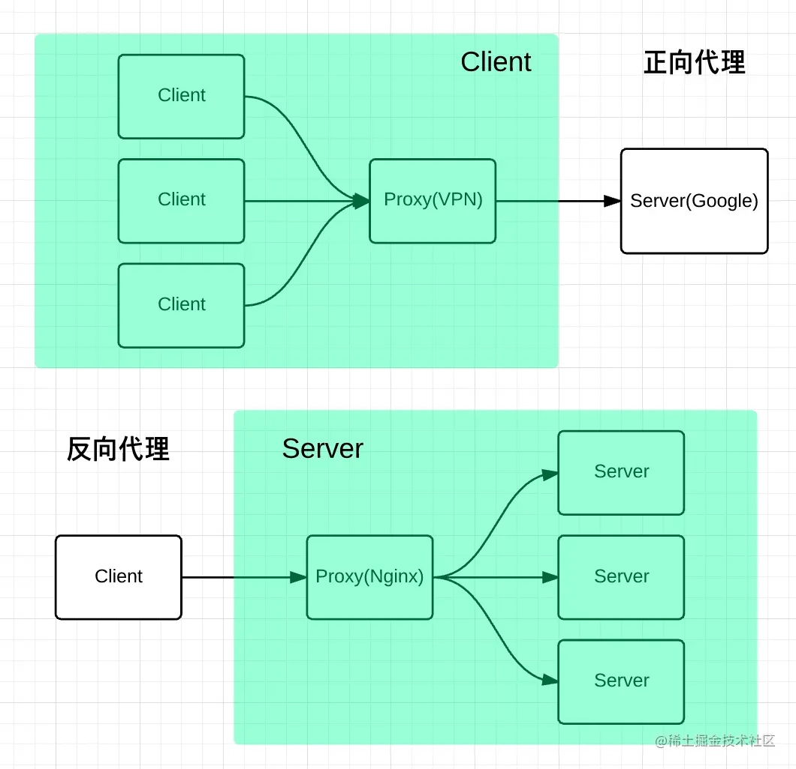

# Nginx 反向代理服务器

Nginx 是一种高性能的反向代理服务器，可以用来轻松解决跨域问题。

**正向代理**帮助客户端访问客户端自己访问不到的服务器，然后将结果返回给客户端。
**反向代理**拿到客户端的请求，将请求转发给其他的服务器，主要的场景是维持服务器集群的负载均衡，换句话说，反向代理帮其它的服务器拿到请求，然后选择一个合适的服务器，将请求转交给它。
正向代理服务器是**帮客户端做事情**，而反向代理服务器是**帮其它的服务器做事情**。

客户端的域名为client.com，服务器的域名为server.com
Nginx配置

```js
server {
  listen  80;
  server_name  client.com;
  location /api {
    proxy_pass server.com;
  }
}
```
