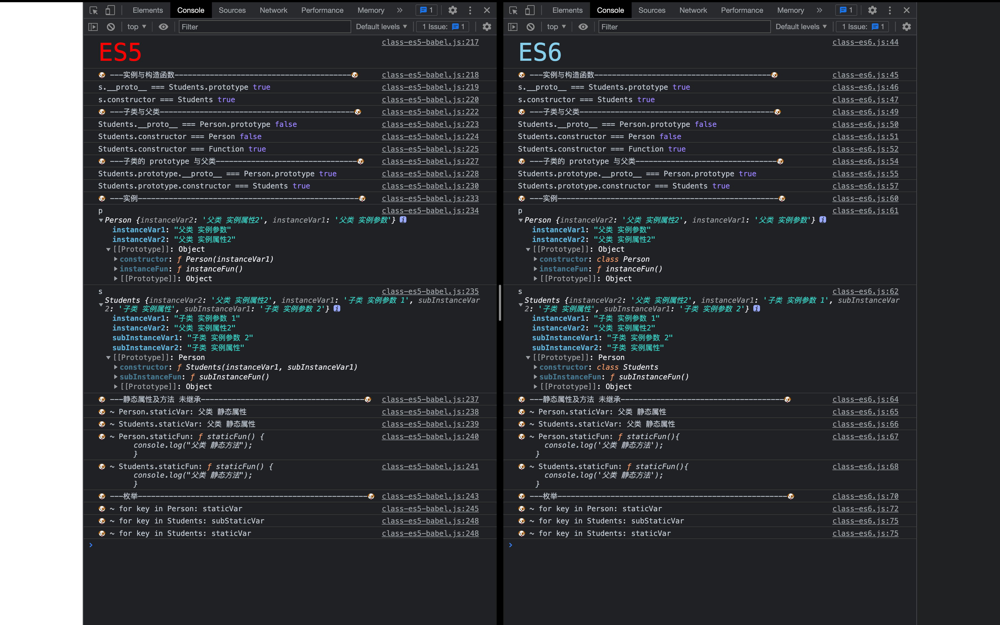

# ES6 中的 class

```js
class Person {
  constructor(name){
    //实例属性和方法 constructor 内定义的方法和属性 实例对象 自己使用
    this.name = name;
  }

  //实例属性和方法 constructor 外定义的方法和属性 所有实例对象 共享的 注意!
  gender = '';
  sayName(){
    console.log(this.name);
  }

  //私有属性和方法：只能在类的内部访问的方法和属性，外部不能访问。
  // 方式 1：在命名前加_
  // 方式 2：使用 symbol 值来命名
  // 方式 3：将私有方法移除 class, 在实例方法中调用该方法的 call


  //静态属性和方法：不会被实例继承，而是直接通过类来调用，这就称为“静态方法”。
  static identity = 0;
  static run(){
    console.log('running');
  }
}


class Students extends Person {
  constructor(name, age){
   super(name);
    this.age = age;
  }
  vocation = '',
  hello(){
    console.log('hello');
  }
  static laugh(){
    console.log('hahaha');
  }
}

console.log(new Students('张三',18));
```

[babel 编译结果解析](class-es6-babel.js)


