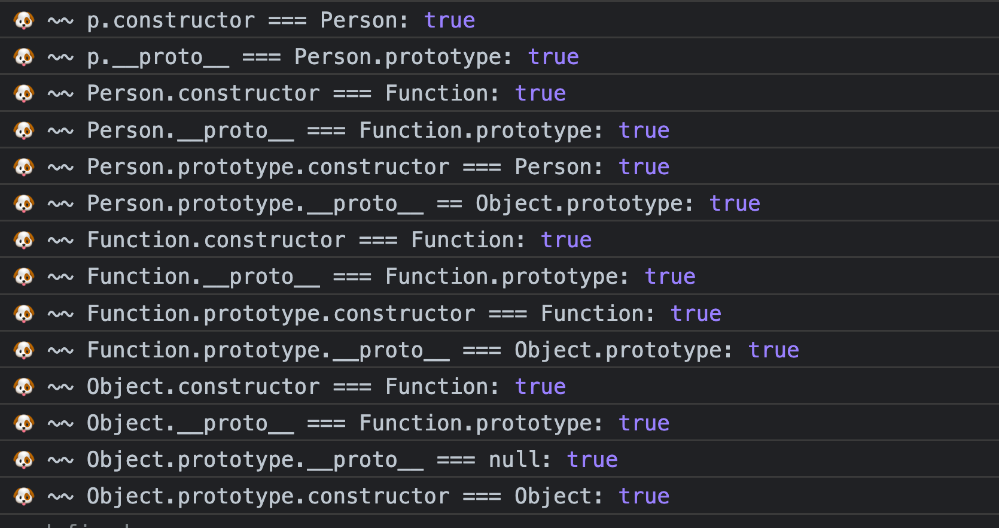
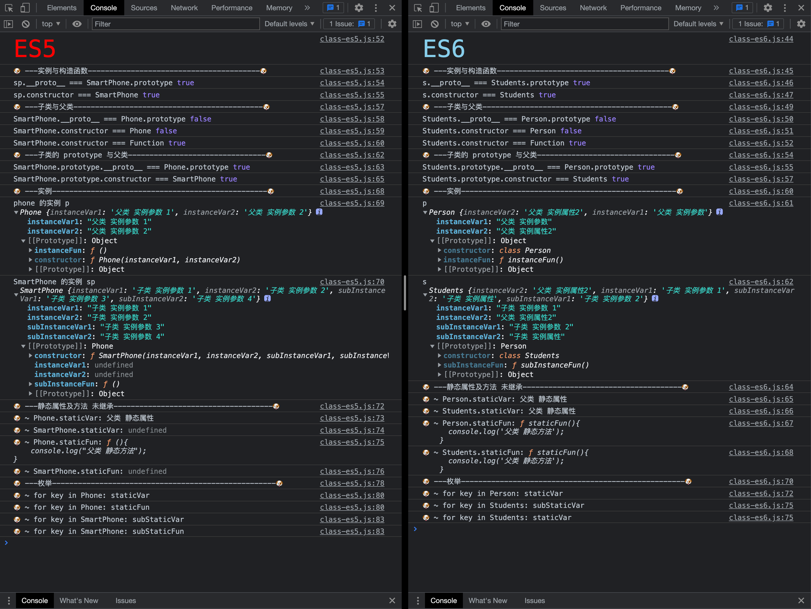

# 原型和原型链

[toc]

## 思考题

1. 为什么 typeof 判断 null 是 Object 类型？
2. Function 和 Object 是什么关系？
3. new 关键字具体做了什么？手写实现。
4. prototype 和 \_\_proto\_\_ 是什么关系？什么情况下相等？
5. ES5 实现继承有几种方式，优缺点是啥
6. ES6 如何实现一个类
7. ES6 extends 关键字实现原理是什么
8. ConstructorB 如何继承 ConstructorA
9. [思考题](prototype-q.html)

## 关键属性

1. constructor：对象属性，是一个对象，指向该对象的构造函数
2. \_\_proto\_\_：对象属性，是一个对象，指向对象的原型，也就是该对象的构造函数的 prototype 属性。
    - 显式的属性，可以访问被定义为隐式属性的 prototype
    - 属性既不能被 for in 遍历出来，也不能被 Object.keys(obj) 查找出来。
    - 访问对象的 obj.\_\_proto\_\_属性，默认走的是 Object.prototype 对象上 \_\_proto\_\_ 属性的 get/set 方法。
3. prototype：函数独有，是一个对象，实例对象的原型
    - 原型：给其它对象提供共享属性的对象
    - 所有 object 对象都有一个的隐式引用(不是由开发者亲自创建/操作)

注：函数也是对象

## 原型链图解


注：
Function.\_\_proto\_\_ === Function.prototype
Object.constructor === Function
Function.prototype.\_\_proto\_\_ === Object.prototype
Object.prototype === null

```js
//原型链的验证
function Person(){}
var p = new Person();

console.log("🐶 ~~ p.constructor === Person:", p.constructor === Person)

console.log("🐶 ~~ p.__proto__ === Person.prototype:", p.__proto__ === Person.prototype)

console.log("🐶 ~~ Person.constructor === Function:", Person.constructor === Function)

console.log("🐶 ~~ Person.__proto__ === Function.prototype:", Person.__proto__ === Function.prototype)

console.log("🐶 ~~ Person.prototype.constructor === Person:", Person.prototype.constructor === Person)

console.log("🐶 ~~ Person.prototype.__proto__ == Object.prototype:", Person.prototype.__proto__ == Object.prototype)

console.log("🐶 ~~ Function.constructor === Function:", Function.constructor === Function)

console.log("🐶 ~~ Function.__proto__ === Function.prototype:", Function.__proto__ === Function.prototype)

console.log("🐶 ~~ Function.prototype.constructor === Function:", Function.prototype.constructor === Function)

console.log("🐶 ~~ Function.prototype.__proto__ === Object.prototype:", Function.prototype.__proto__ === Object.prototype)

console.log("🐶 ~~ Object.constructor === Function:", Object.constructor === Function)

console.log("🐶 ~~ Object.__proto__ === Function.prototype:", Object.__proto__ === Function.prototype)

console.log("🐶 ~~ Object.prototype.__proto__ === null:", Object.prototype.__proto__ === null)

console.log("🐶 ~~ Object.prototype.constructor === Object:", Object.prototype.constructor === Object)

```

验证结果


## [原型的继承](prototype-extends.md)

## 类的实现

### [ES5 中类的实现](class-es5.md)

### [ES6 中类的实现](class-es6.md)

## [类的继承](extends.md)

### [ES5 中类的继承](class-extends-es5.md)

### [ES6 中类的继承](class-extends-es6.md)

### ES5 组合继承 和 ES6 继承 对比



## 思考题解答

1. 为什么 typeof 判断 null 是 Object 类型？
    - [typeof](../typeof.md)
    - 延展：[instanceof 运算符](../instanceof.md)

2. Function 和 Object 是什么关系？
    - 一切对象都最终继承自Object对象，Object对象直接继承自根源对象null
    - 一切函数对象（包括Object对象）都直接继承自Function对象
    - Object对象直接继承自Function对象
    - Function对象直接继承自己，最终继承自Object对象
    - Object.\_\_proto\_\_ == Function.prototype
    - Function.prototype.\_\_proto\_\_ == Object.prototype

3. new 关键字具体做了什么？

    （1）首先创建了一个新的空对象
    （2）设置原型，将对象的原型设置为函数的 prototype 对象。
    （3）让函数的 this 指向这个对象，执行构造函数的代码（为这个新对象添加属性）
    （4）判断函数的返回值类型，如果是值类型，返回创建的对象。如果是引用类型，就返回这个引用类型的对象。
    [手写实现](eg-new.js)

4. prototype 和 \_\_proto\_\_ 是什么关系？什么情况下相等？

    - 对象的 \_\_proto\_\_ 指向它的构造函数的 prototype
    - Function.\_\_proto\_\_ === Function.prototype

5. ES5，ES6 如何实现一个类

    - [ES5 中类的实现](class-es5.md)
    - [ES6 中类的实现](class-es6.md)

6. ES5 实现继承有几种方式，优缺点是啥
    [ES5 中类的继承](class-extends-es5.md)

7. ES6 extends 关键字实现原理是什么

    ```js
    /** 设置子类的 prototype === 父类的 prototype
   * 1. 校验父构造函数。
   * 2. 寄生继承：用父类构造函数的 prototype 创建一个空对象，并将这个对象指向子类构造函数的 prototype
   * 3. 将父构造函数指向子构造函数的 _proto_
   * @param {*} subClass 
   * @param {*} superClass 
   */

    function _inherits(subClass, superClass) {
        if (typeof superClass !== "function" && superClass !== null) {
        throw new TypeError("Super expression must either be null or a function");
        }
        subClass.prototype = Object.create(superClass && superClass.prototype, {
        constructor: { value: subClass, writable: true, configurable: true }
        });
        Object.defineProperty(subClass, "prototype", { writable: false });
        if (superClass)_setPrototypeOf(subClass, superClass);
    }
    /** 设置子类的 \_\_proto\_\_
    *
    \- @param {*} o
    \- @param {*} p
    \- @returns
    */
    function \_setPrototypeOf(o, p) {
        \_setPrototypeOf = Object.setPrototypeOf
        ? Object.setPrototypeOf.bind()
        : function \_setPrototypeOf(o, p) {
            o.\_\_proto\_\_ = p;
            return o;
            };
        return \_setPrototypeOf(o, p);
    }
    ```

8. ConstructorB 如何继承 ConstructorA

    - 方法一 ES5 实现
        - [ES5 中类的继承](class-extends-es5.md)

    - 方法二 ES6 extends
        - 通过 extends

9. [思考题](prototype-q.html)