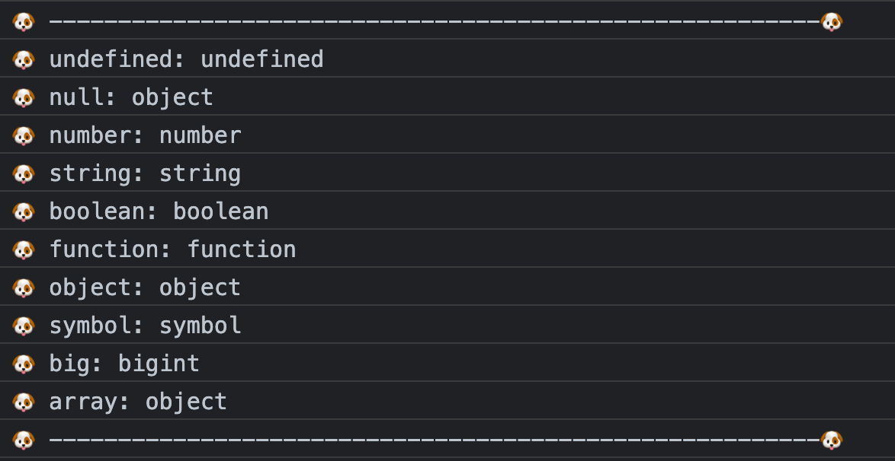

# typeof

输出 变量的类型
    能判断除 null 以外的基本数据类型
    不能判断出 null, array 的类型

```js
var u = undefined, 
    n = 1, 
    str = 'string',
    b = true, 
    f = function(){}, 
    o = {}, 
    s = Symbol('s'), 
    big = BigInt(Number.MAX_SAFE_INTEGER),
    a = [];

console.log("🐶 --------------------------------------------------------🐶")
console.log("🐶 undefined:", typeof u)//undefined
console.log("🐶 null:", typeof null)//object
console.log("🐶 number:", typeof n)//number
console.log("🐶 string:", typeof str)//string
console.log("🐶 boolean:", typeof b)//boolean
console.log("🐶 function:", typeof f)//function
console.log("🐶 object:", typeof o)//object
console.log("🐶 symbol:", typeof s)//symbol
console.log("🐶 big:", typeof big)//bigint
console.log("🐶 array:", typeof a)//object

console.log("🐶 --------------------------------------------------------🐶")
```



- 为什么 typeof 判断 null 是 Object 类型？
  - 是 JavaScript 设计的一个 bug
  - 在 JavaScript 最初的实现中，JavaScript 中的值是由一个表示类型的标签和实际数据值表示的。对象的类型标签是 0。由于 null 代表的是空指针（大多数平台下值为 0x00），因此，null 的类型标签是 0，typeof null 也因此返回 "object"。
