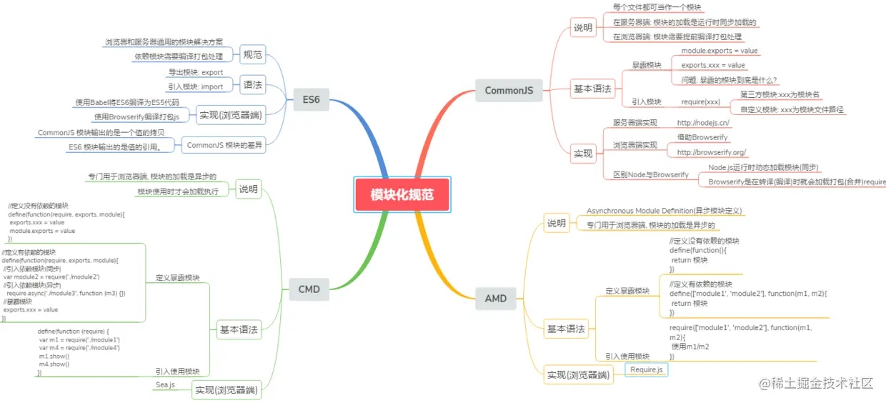

# 前端模块化

[前端模块化详解(完整版)](https://juejin.cn/post/6844903744518389768#heading-47)

模块应该是职责单一、相互独立、低耦合的、高内聚且可替换的离散功能块。
模块化是通过分解复杂系统为独立的模块来实现细粒度的精细控制。

历史：

1. 通过 script 标签引入文件，调用相关的函数。
2. 用对象来模拟命名空间
3. 闭包
4. CommonJS（）
    1. 使用 require 引用和加载模块，exports 定义和导出模块，module 标识模块。
    2. 不适用于前端
        1. 采用同步加载模块的方式，加载完才能执行后面的操作。
        2. 前端需要等代码模块下载完毕，并运行之后才能得到模块。
5. AMD
   1. 通过define方法，将代码定义为模块；通过require方法，实现代码的模块加载。
   2. 异步加载，提前执行。
   3. 缺点：
      1. 开发成本高，代码的阅读和书写比较困难，模块定义方式的语义不顺畅
      2. 不符合通用的模块化思维方式
6. CMD
   1. 专门用于浏览器端，异步加载，模块使用时才会加载执行。
   2. 缺点：
      1. 依赖 SPM 打包，模块的加载逻辑偏重
7. ES6 模块化
   1. export命令用于规定模块的对外接口，import命令用于输入其他模块提供的功能。
   2. 编译时加载：尽量的静态化，编译时就能确定模块的依赖关系，以及输入和输出的变量。
   3. 与 CommonJS 区别
      1. CommonJS 模块输出的是一个值的拷贝，ES6 模块输出的是值的引用。
      2. CommonJS 模块是运行时加载，ES6 模块是编译时输出接口。

ES6模块与CommonJS模块有什么异同？

- 区别
    - CommonJS 是对模块的浅拷⻉，ES6 Module是对模块的引⽤。

- 共同点
    - CommonJS 和 ES6 Module 都可以对引⼊的对象进⾏赋值，即改变对象内部属性。