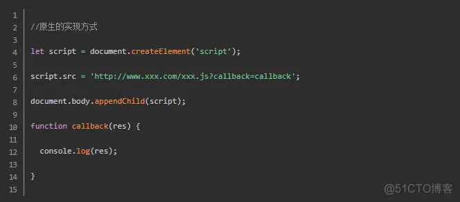
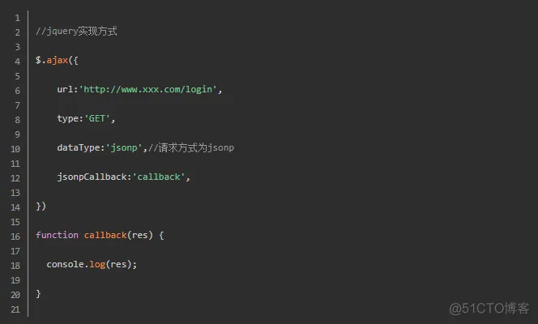
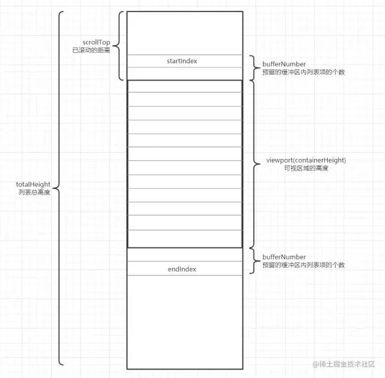
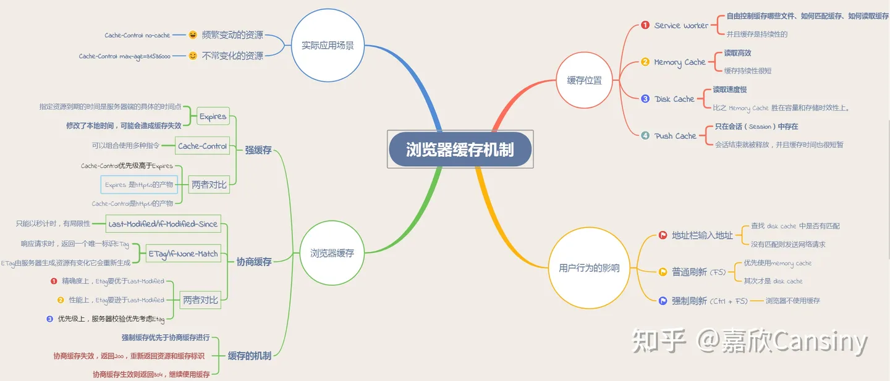
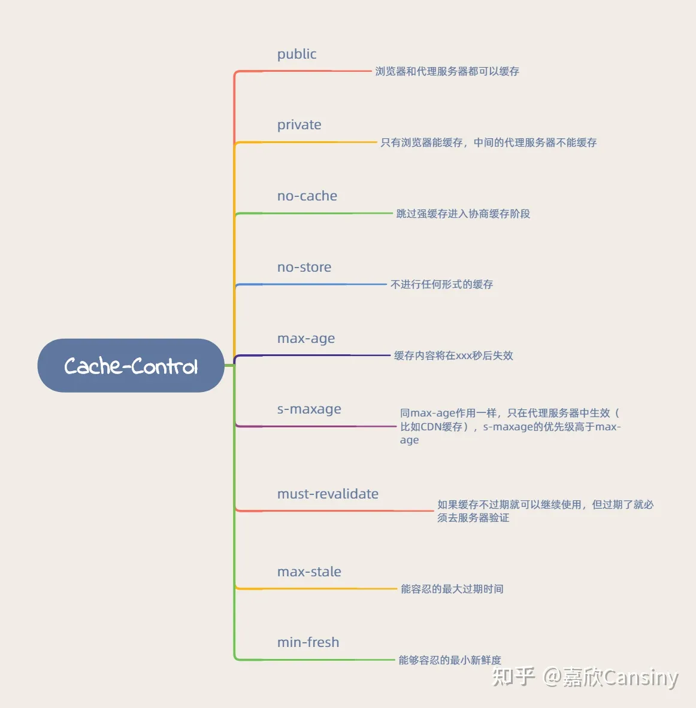

# 前端面试题

[toc]

## 1.一些开放性题目

1)自我介绍:除了基本个人信息以外，面试官更想听的是你与众不同的地方和你的优势。
2)项目介绍
3)如何看待前端开发?
4)平时是如何学习前端开发的?
5)未来三到五年的规划是怎样的?

## 2.position的值， relative和absolute分别是相对于谁进行定位的?

absolute :生成绝对定位的元素， 相对于最近一级的 定位不是
static 的父元素来进行定位。
fixed (老IE不支持)生成绝对定位的元素，通常相对于浏览器窗口或 frame 进行定位。
relative 生成相对定位的元素，相对于其在普通流中的位置进行定位。
static 默认值。没有定位，元素出现在正常的流中
sticky 生成粘性定位的元素，容器的位置根据正常文档流计算得出

## 3.如何解决跨域问题

1. JSONP
    动态的创建script标签，再去请求一个带参网址来实现跨域通信。
    
    
    优点是兼容性好，简单易用，支持浏览器与服务器双向通信。
    缺点是只支持GET请求。

2. CORS: 服务器端对于CORS的支持，主要就是通过设置Access-Control-Allow-Origin来进行的。如果浏览器检测到相应的设置，就可以允许Ajax进行跨域的访问。
3. document.domain
    主域名相同，而子域名不同，将子域和主域的document.domain设为同一个主域.
4. window.name
    在同一个浏览器标签里，不同的页面可以共享window.name的值，而且这个值是不会过期的。
5. window.location.hash
    通过锚点值的改变来实现跨域通信，这种方法的原理是通过改变锚点值来触发onhashchange事件，从而实现跨域通信。
6. window.top
    通过window.top来实现跨域通信，这种方法的原理是通过改变父页面的location来触发onhashchange事件，从而实现跨域通信。
7. window.postMessage
    window.postMessage是HTML5新增的API，它提供了跨窗口通信的能力，可以实现不同源的窗口之间的数据传递。
8. 在服务器上设置代理页面。
9. 个人认为window.name的方法既不复杂，也能兼容到几乎所有浏览器，这真是极好的一种跨域方法。

## 4.XML和JSON的区别?

(1).数据体积方面。 JSON相对于XML来讲，数据的体积小，传递的速度更快些。
(2).数据交互方面。 JSON与JavaScript的交互更加方便，更容易解析处理，更好的数据交互。
(3).数据描述方面。JSON对数据的描述性比XML较差。
(4).传输速度方面。JSON的速度要远远快于XML。

## 5.谈谈你对webpack的看法

WebPack 是一个模块打包工具，可以管理你的模块依赖，并编绎输出所需的静态文件

1. 支持 CommonJS、AMD、ES6 模块化
2. 串联式 的 loader 和 plugin 对不同类型资源的加载、优化、处理
    1. 压缩
    2. 规则检查
    3. 编译（babel）
    4. 转换（图片转 base64）
3. 更好的开发体验
    1. 代理
    2. 自动编译，热更新
    3. 代码映射
4. 更快的打包速度
    1. 异步 IO，多级缓存
    2. 多进程
    3. 指定搜索范围
    4. 路径别名
5. 更好的用户体验
    1. 兼容性
    2. 懒加载，按需加载
    3. 代码分割
    4. 提取公共代码

## 6.说说TCP传输的三次握手四次挥手策略

- 三次握手
    1. 第一次握手, 确认客户端的发送能力
    2. 第二次握手, 确认了服务端的接收能力和发送能力
    3. 第三次握手, 确认客户端的接收能力。

- 四次挥手
  1. 第一次: 客户端告知服务器 请求发送完毕
  2. 第二次: 服务器告知客户端 请求接受完毕
  3. 第三次: 服务器告知客户端 响应发送完毕
  4. 第四次: 客户端告知服务器 响应接受完毕

## 7.TCP和UDP的区别

- TCP 先建立连接，再发送数据
- UDP 不建立连接，直接发送数据! 适用于一次只传送少量数据、对可靠性要求不高的应用环境。

## 8.说说你对作用域链的理解

作用域链的作用是保证执行环境里有权访问的变量和函数是有序的，作用域链的变量只能向上访问，变量访问到window对象即被终止，作用域链向下访问变量是不被允许的。

## 9.创建ajax过程

(1)创建XMLHttpRequest对象,也就是创建一个异步调用对象
(2)创建一个新的HTTP请求,并指定该HTTP请求的方法、URL及验证信息.
(3)设置响应HTTP请求状态变化的函数.
(4)发送HTTP请求.
(5)获取异步调用返回的数据.
(6)使用JavaScript和DOM实现局部刷新.

## 10.渐进增强和优雅降级

渐进增强 :针对低版本浏览器进行构建页面，保证最基本的功能，然后再针对高级浏览器进行效果、交互等改进和追加功能达到更好的用户体验。
优雅降级 :一开始就构建完整的功能，然后再针对低版本浏览器进行兼容。

## 11.常见web安全及防护原理

sql注入原理
就是通过把SQL命令插入到Web表单递交或输入域名或页面请求的查询字符串，最终达到欺骗服务器执行恶意的SQL命令。
总的来说有以下几点:
1)永远不要信任用户的输入，要对用户的输入进行校验，可以通过正则表达式，或限制长度，对单引号和双"-"进行转换等。
2)永远不要使用动态拼装SQL，可以使用参数化的SQL或者直接使用存储过程进行数据查询存取。
3)永远不要使用管理员权限的数据库连接，为每个应用使用单独的权限有限的数据库连接。
4)不要把机密信息明文存放，请加密或者hash掉密码和敏感的信息。

## 12.XSS原理及防范

Xss(cross-site scripting)攻击指的是攻击者往Web页面里插入恶意 html 标签或者 javascript 代码。
比如:
攻击者在论坛中放一个看似安全的链接，骗取用户点击后，窃取cookie中的用户私密信息;
或者攻击者在论坛中加一个恶意表单，当用户提交表单的时候，却把信息传送到攻击者的服务器中，而不是用户原本以为的信任站点。

XSS防范方法

- 首先代码里对用户输入的地方和变量都需要仔细检查长度和对”<”,”>”,”;”,”’”等字符做过滤;
- 其次任何内容写到页面之前都必须加以encode，避免不小心把html tag弄出来。这一个层面做好，至少可以堵住超过一半的XSS 攻击。

首先，避免直接在 cookie 中泄露用户隐私，例如email、密码等等。
其次，通过使 cookie 和系统ip 绑定来降低 cookie 泄露后的危险。这样攻击者得到的cookie 没有实际价值，不可能拿来重放。

如果网站不需要再浏览器端对 cookie 进行操作，可以在Set-Cookie 末尾加上HttpOnly 来防止javascript代码直接获取cookie 。
尽量采用 POST 而非 GET 提交表单

## 13.XSS 与 CSRF 有什么区别吗?

- XSS（利用虚假输入表单骗取用户个人信息盗取账号等）
httpOnly：在cookie中设置HttpOnly属性后，js脚本将无法读取到cookie信息
XSS Filter：针对用户输入验证
转义HTML：拼接 HTML 时，对于引号，尖括号，斜杠进行转义

- CSRF(冒充用户发起请求，完成一些违背用户意愿的事情)
验证 HTTP Referer 字段
在请求地址中添加 token 并验证
在 HTTP 头中自定义属性并验证

## 14.Web Worker 和 webSocket

- 其实这俩根本没法比，一个是多线程，一个是通信协议。

- Web Worker 让JS有了多线程的能力，可以将复杂耗时的操作都交付给 Worker 线程处理。
- worker主线程:
1)通过 worker = new Worker( url ) 加载一个JS文件来创建一个worker，同时返回一个worker实例。
2)通过 worker.postMessage( data ) 方法来向worker发送数据。
3)绑定 worker.onmessage 方法来接收worker发送过来的数据。
4)可以使用 worker.terminate() 来终止一个worker的执行。

- websocket 是一种网络通信协议，它的最大特点就是，服务器可以主动向客户端推送信息，客户端也可以主动向服务器发送信息，是真正的双向平等对话，属于服务器推送技术的一种。
- Service Worker是一种离线缓存技术，属于web worker的一种。

## 15.HTTP 和 HTTPS

HTTP 协议通常承载于 TCP 协议之上，在HTTP和TCP之间添加一个安全协议层(SSL或TSL)，这个时候，就成了我们常说的HTTPS。 默认HTTP的端口号为80，HTTPS的端口号为443。

为什么HTTPS安全
因为网络请求需要中间有很多的服务器路由器的转发。中间的节点都可能篡改信息，而如果使用 HTTPS，密钥在你和终点站才有。https之所以比http安全，是因为他利用ssl/tls协议传输。它包含证书，卸载，流量转发，负载均衡，页面适配，浏览器适配，refer传递等。保障了传输过程的安全性。

## 16.对前端模块化的认识

模块应该是职责单一、相互独立、低耦合的、高内聚且可替换的离散功能块。
模块化是通过分解复杂系统为独立的模块来实现细粒度的精细控制。

历史：

1. 通过 script 标签引入文件，调用相关的函数。
2. 用对象来模拟命名空间
3. 闭包
4. CommonJS（）
    1. 使用 require 引用和加载模块，exports 定义和导出模块，module 标识模块。
    2. 不适用于前端
        1. 采用同步加载模块的方式，加载完才能执行后面的操作。
        2. 前端需要等代码模块下载完毕，并运行之后才能得到模块。
5. AMD
   1. 通过define方法，将代码定义为模块；通过require方法，实现代码的模块加载。
   2. 异步加载，提前执行。
   3. 缺点：
      1. 开发成本高，代码的阅读和书写比较困难，模块定义方式的语义不顺畅
      2. 不符合通用的模块化思维方式
6. CMD
   1. 专门用于浏览器端，异步加载，模块使用时才会加载执行。
   2. 缺点：
      1. 依赖 SPM 打包，模块的加载逻辑偏重
7. ES6 模块化
   1. export命令用于规定模块的对外接口，import命令用于输入其他模块提供的功能。
   2. 编译时加载：尽量的静态化，编译时就能确定模块的依赖关系，以及输入和输出的变量。
   3. 与 CommonJS 区别
      1. CommonJS 模块输出的是一个值的拷贝，ES6 模块输出的是值的引用。
      2. CommonJS 模块是运行时加载，ES6 模块是编译时输出接口。

## 17.Javascript垃圾回收方法

引用计数

- 跟踪值被使用的次数，当值的引用次数为0时，就会被垃圾回收器回收。
- 缺点：
    - 无法回收循环引用的值。
    - 无法回收被遗忘的值。（BOM 和 DOM）

标记清除

- 遍历所有的对象，找到活动对象，进行标记
- 遍历所有的对象，清除没有标记的。
- 回收空间
- 解决对象循环引用的不能回收问题
- 缺点：
    - 不能立即回收垃圾对象
    - 容易产生碎片化空间

标记整理

- 标记、清除与标记清除一样
- 清除后，移动对象位置，使得他们在地址上是一个连续的空间
- 缺点：
    - 不能立即回收垃圾对象

## 18.你觉得前端工程的价值体现在哪

为简化用户使用提供技术支持(交互部分)
为多个浏览器兼容性提供支持
为提高用户浏览速度(浏览器性能)提供支持
为跨平台或者其他基于webkit或其他渲染引擎的应用提供支持
为展示数据提供支持(数据接口)

## 19.谈谈性能优化问题

- 代码层面
  1. 防抖和节流（resize，scroll）。
  2. 减少 DOM 操作。
  3. 减少回流（重排）和重绘。
  4. Web Worker 优化长任务（长任务：执行时间超过 50ms 的任务）
  5. 长列表虚拟滚动（只渲染可见区域，滚动时动态更新可视区域）
     1. 
     2. 计算出 totalHeight 列表总高度，并在触发时滚动事件时根据 scrollTop 值不断更新 startIndex 以及 endIndex ，以此从列表数据 listData 中截取对应元素
     3. 插件 vue-virtual-scroller、vue-virtual-scroll-list、react-tiny-virtual-list、react-virtualized
  6. requestAnimationFrame 代替 setTimeout
  7. 按需加载，路由懒加载，组件懒加载
  8. 避免使用 CSS 表达式，关系选择器，统配选择器
  9. 图片优化
      1. 图片的动态裁剪
            1. 阿里云、七牛云只需在图片的 url 地址上动态添加参数，就可以得到你所需要的尺寸大小
      2. 图片的懒加载
            1. 插件 vue-lazyload
            2. 可以通过 html5 自定义属性 data-xxx 先暂存 src 的值，然后在图片出现在屏幕可视区域的时候，再将 data-xxx 的值重新赋值到 img 的 src 属性即可
      3. 使用字体图标
      4. 小图片转 base64 格式

- 构建方面
  1. 压缩代码文件:
      1. 使用 terser-webpack-plugin 压缩 Javascript 代码；
      2. 使用 css-minimizer-webpack-plugin 压缩 CSS 代码；
      3. 使用 html-webpack-plugin 压缩 html 代码。
  2. 开启 gzip 压缩:
      1. webpack 中使用 compression-webpack-plugin
      2. node 作为服务器也要开启，使用 compression。
  3. 代码分割 和 tree shaking（只对使用 export 导出的变量生效）
  4. 骨架屏（打包时将骨架屏的内容放在 html 文件的跟节点中）
     1. 插件 vue-skeleton-webpack-plugin
  5. js 预加载
     1. 正常模式
        1. 阻塞 dom 渲染，必须等待 js 加载和执行完成后才能去做其它事情
     2. async
        1. 无序，异步加载，加载完立即执行。
        2. 使用场景：加载第三方库，不依赖其它 js 文件
     3. defer
        1. 有序，异步加载，html 解析完后执行
        2. 使用场景：一般情况下都可以使用 defer，特别是需要控制资源加载顺序时
     4. module 模式
        1. 浏览器会对其内部的 import 引用发起 HTTP 请求，获取模块内容。这时 script 的行为会像是  defer 一样，在后台下载，并且等待 DOM 解析
        2. Vite 就是利用浏览器支持原生的 es module 模块，开发时跳过打包的过程，提升编译效率
     5. preload（link）
        1. 用于提前加载一些需要的依赖，这些资源会优先加载
        2. 在浏览器渲染机制之前进行处理的，并且不会阻塞 onload 事件
        3. 其加载和执行的过程是分离的，即 preload 会预加载相应的脚本代码，待到需要时自行调用；
     6. prefetch（link）
        1. 利用浏览器的空闲时间，加载页面将来可能用到的资源的一种机制
        2. 用于加载其他页面（非首页）所需要的资源，以便加快后续页面的打开速度
        3. 可以获取非当前页面所需要的资源，并且将其放入缓存至少 5 分钟
        4. 当页面跳转时，未完成的 prefetch 请求不会被中断

- 网络
  1. 使用服务端渲染。
  2. 使用 http2。因为解析速度快，头部压缩，多路复用，服务器推送静态资源。
  3. 使用 http 缓存，比如服务端的响应中添加 Cache-Control / Expires 。
  4. 常用的第三方库使用 CDN 服务，在 webpack 中我们要配置 externals，将比如 React， Vue 这种包不打到最终生成的文件中。而是采用 CDN 服务。

## 20.21.22.23 浏览器缓存

- 强制缓存
    1. Cache-Control(http1.1)
       1. 
       2. 可以组合使用多种指令
    2. Expires(http1.0)
       1. 指定资源到期的服务端时间，如果在这个时间之前，浏览器直接从缓存中读取资源，不会再次发送请求。
       2. 问题：服务器的时间和浏览器的时间可能并不一致，那服务器返回的这个过期时间可能就是不准确的。
    3. Cache-Control优先级更高
- 协商缓存
  1. Etag(http1.1)
     1. 资源的唯一标识，服务器会根据文件内容生成一个唯一的标识，浏览器再次请求时，会将这个标识发送给服务器，服务器根据这个标识判断资源是否有更新，如果没有更新，返回304，浏览器直接从缓存中读取资源。
     2. 解决 Last-Modified 的问题
  2. Last-Modified(http1.0)
     1. 指定资源最后修改的服务端时间，如果在这个时间之后，浏览器才会发送请求，否则直接从缓存中读取资源。
     2. 问题：
        1. Last-Modified 只能精确到秒级。
        2. 如果资源被重复生成，而内容不变，那么 Last-Modified 的时间也会被更新，这样就会导致缓存失效。
  3. Etag 优先级更高
- 强制缓存优先级高于协商缓存

## 24.栈和队列的区别?

队列先进先出，栈先进后出。

## 25.栈和堆的区别?

栈区(stack): 由编译器自动分配释放 ，存放函数的参数值，局部变量的值等。
堆区(heap) : 一般由程序员分配释放，若程序员不释放，程序结束时可能由OS回收。
堆(数据结构): 堆可以被看成是一棵树，如:堆排序;
栈(数据结构): 一种先进后出的数据结构。

## 26.快速 排序的思想并实现一个快排? “快速排序”的思想很简单，整个排序过程只需要三步

(1)在数据集之中，找一个基准点 (2)建立两个数组，分别存储左边和右边的数组 (3)利用递归进行下次比较
 <scripttype="text/javascript">
    functionquickSort(arr){
if(arr.length<=1){
return arr;//如果数组只有一个数，就直接返回;
}
var num = Math.floor(arr.length/2);//找到中间数的索引值，如果是浮点数，则向下取整 var numValue =arr.splice(num,1);//找到中间数的值
var left = [];
var right = [];
      for(var i=0;i<arr.length;i++){
        if(arr[i]<numValue){
left.push(arr[i]);//基准点的左边的数传到左边数组 }
else{ right.push(arr[i]);//基准点的右边的数传到右边数组
} }
returnquickSort(left).concat([numValue],quickSort(right));//递归不断重复比较 }
alert(quickSort([32,45,37,16,2,87]));//弹出“2,16,32,37,45,87”

## 27.你觉得jQuery或zepto源码有哪些写的好的地方 (答案仅供参考)

Query源码封装在一个匿名函数的自执行环境中，有助于防止变量的全局污染，然后通过传入window对 象参数，可以使window对象作为局部变量使用，好处是当jquery中访问window对象的时候，就不用将 作用域链退回到顶层作用域了，从而可以更快的访问window对象。同样，传入undefined参数，可以缩 短查找undefined时的作用域链。
  (function( window, undefined ) { //用一个函数域包起来，就是所谓的沙箱 //在这里边var定义的变量，属于这个函数域内的局部变量，避免污染全局 //把当前沙箱需要的外部变量通过函数参数引入进来 //只要保证参数对内提供的接口的一致性，你还可以随意替换传进来的这个参数
  window.jQuery = window.$ = jQuery;
})( window );
jquery将一些原型属性和方法封装在了jquery.prototype中，为了缩短名称，又赋值给了jquery.fn，这 是很形象的写法。
有一些数组或对象的方法经常能使用到，jQuery将其保存为局部变量以提高访问速度。 jquery实现的链式调用可以节约代码，所返回的都是同一个对象，可以提高代码效率。

## 28.ES6的了解

新增模板字符串(为JavaScript提供了简单的字符串插值功能)、箭头函数(操作符左边为输入的参数， 而右边则是进行的操作以及返回的值Inputs=>outputs。)、for-of(用来遍历数据—例如数组中的 值。)arguments对象可被不定参数和默认参数完美代替。ES6将promise对象纳入规范，提供了原生的 Promise对象。增加了let和const命令，用来声明变量。增加了块级作用域。let命令实际上就增加了块 级作用域。ES6规定，var命令和function命令声明的全局变量，属于全局对象的属性;let命令、const 命令、class命令声明的全局变量，不属于全局对象的属性。。还有就是引入module模块的概念

## 29.js继承方式及其优缺点 原型链继承的缺点

一是字面量重写原型会中断关系，使用引用类型的原型，并且子类型还无法给超类型传递参数。
借用构造函数(类式继承)
借用构造函数虽然解决了刚才两种问题，但没有原型，则复用无从谈起。所以我们需要原型链+借用构造 函数的模式，这种模式称为组合继承
组合式继承
组合式继承是比较常用的一种继承方法，其背后的思路是 使用原型链实现对原型属性和方法的继承，而 通过借用构造函数来实现对实例属性的继承。这样，既通过在原型上定义方法实现了函数复用，又保证 每个实例都有它自己的属性。
 </script>
  
## 30.关于Http 2.0你知道多少?

HTTP/2引入了“服务端推(server push)”的概念，它允许服务端在客户端需要数据之前就主动地将数据
发送到客户端缓存中，从而提高性能。
HTTP/2提供更多的加密支持
HTTP/2使用多路技术，允许多个消息在一个连接上同时交差。
它增加了头压缩(header compression)，因此即使非常小的请求，其请求和响应的header都只会占 用很小比例的带宽。

## 31.defer和async defer并行加载js文件，会按照页面上script标签的顺序执行

async并行加载js文件，下载完成立即执行，不会按照页面上script标签的顺序执行

## 32. 谈谈浮动和清除浮动

浮动的框可以向左或向右移动，直到他的外边缘碰到包含框或另一个浮动框的边框为止。由于浮动框不
在文档的普通流中，所以文档的普通流的块框表现得就像浮动框不存在一样。浮动的块框会漂浮在文档
普通流的块框上。

## 33.如何评价AngularJS和BackboneJS backbone具有依赖性，依赖underscore.js。Backbone + Underscore + jQuery(or Zepto) 就比一个

AngularJS多出了2 次HTTP请求.
Backbone的Model没有与UI视图数据绑定，而是需要在View中自行操作DOM来更新或读取UI数据。 AngularJS与此相反，Model直接与UI视图绑定，Model与UI视图的关系，通过directive封装， AngularJS内置的通用directive，就能实现大部分操作了，也就是说，基本不必关心Model与UI视图的关 系，直接操作Model就行了，UI视图自动更新。
AngularJS的directive，你输入特定数据，他就能输出相应UI视图。是一个比较完善的前端MVW框架， 包含模板，数据双向绑定，路由，模块化，服务，依赖注入等所有功能，模板功能强大丰富，并且是声 明式的，自带了丰富的 Angular 指令。

## 34.用过哪些设计模式? 工厂模式

主要好处就是可以消除对象间的耦合，通过使用工程方法而不是new关键字。将所有实例化的代码集中 在一个位置防止代码重复。
工厂模式解决了重复实例化的问题 ，但还有一个问题,那就是识别问题，因为根本无法搞清楚他们到底 是哪个对象的实例。

 构造函数模式
使用构造函数的方法 ，即解决了重复实例化的问题 ，又解决了对象识别的问题，该模式与工厂模式的不 同之处在于:
1)构造函数方法没有显示的创建对象 (new Object()); 2)直接将属性和方法赋值给 this 对象;
3)没有 renturn 语句。

## 35.说说你对闭包的理解

使用闭包主要是为了设计私有的方法和变量。闭包的优点是可以避免全局变量的污染，缺点是闭包会常 驻内存，会增大内存使用量，使用不当很容易造成内存泄露。在js中，函数即闭包，只有函数才会产生 作用域的概念
闭包有三个特性:
1)函数嵌套函数 2)函数内部可以引用外部的参数和变量 3)参数和变量不会被垃圾回收机制回收

## 36.请你谈谈Cookie的弊端 cookie虽然在持久保存客户端数据提供了方便，分担了服务器存储的负担，但还是有很多局限性的

第一:每个特定的域名下最多生成20个cookie 1)IE6或更低版本最多20个cookie 2)IE7和之后的版本最后可以有50个cookie。 3)Firefox最多50个cookie
4)chrome和Safari没有做硬性限制
IE和Opera 会清理近期最少使用的cookie，Firefox会随机清理cookie。 cookie的最大大约为4096字节，为了兼容性，一般不能超过4095字节。
IE 提供了一种存储可以持久化用户数据，叫做userdata，从IE5.0就开始支持。每个数据最多128K，每 个域名下最多1M。这个持久化数据放在缓存中，如果缓存没有清理，那么会一直存在。
function createObject(name,age,profession){//集中实例化的函数var obj = newObject(); obj.name =name;
obj.age = age;
obj.profession= profession;
  obj.move =function () {
    returnthis.name + ' at ' + this.age + ' engaged in ' + this.profession;
};
return obj; }
var test1 = createObject('trigkit4',22,'programmer');//第一个实例var test2 =createObject('mike',25,'engineer');//第二个实例

 优点:极高的扩展性和可用性
1)通过良好的编程，控制保存在cookie中的session对象的大小。
2)通过加密和安全传输技术(SSL)，减少cookie被破解的可能性。
3)只在cookie中存放不敏感数据，即使被盗也不会有重大损失。
4)控制cookie的生命期，使之不会永远有效。偷盗者很可能拿到一个过期的cookie。
缺点:

1) Cookie 数量和长度的限制。每个domain最多只能有20条cookie，每个cookie长度不能超过4KB， 否则会被截掉.
2)安全性问题。如果cookie被人拦截了，那人就可以取得所有的session信息。即使加密也与事无补， 因为拦截者并不需要知道cookie的意义，他只要原样转发cookie就可以达到目的了。
3)有些状态不可能保存在客户端。例如，为了防止重复提交表单，我们需要在服务器端保存一个计数 器。如果我们把这个计数器保存在客户端，那么它起不到任何作用。

## 37.浏览器本地存储 在较高版本的浏览器中，js提供了sessionStorage和globalStorage。在HTML5中提供了localStorage来

取代globalStorage。
html5中的Web Storage包括了两种存储方式:sessionStorage和localStorage。
sessionStorage用于本地存储一个会话(session)中的数据，这些数据只有在同一个会话中的页面才能 访问并且当会话结束后数据也随之销毁。因此sessionStorage不是一种持久化的本地存储，仅仅是会话 级别的存储。
而localStorage用于持久化的本地存储，除非主动删除数据，否则数据是永远不会过期的

## 38.web storage和cookie的区别

Web Storage的概念和cookie相似，区别是它是为了更大容量存储设计的。Cookie的大小是受限的，并 且每次你请求一个新的页面的时候Cookie都会被发送过去，这样无形中浪费了带宽，另外cookie还需要 指定作用域，不可以跨域调用。
除此之外，Web Storage拥有setItem,getItem,removeItem,clear等方法，不像cookie需要前端开发者 自己封装setCookie，getCookie。
但是cookie也是不可以或缺的:cookie的作用是与服务器进行交互，作为HTTP规范的一部分而存在 ， 而Web Storage仅仅是为了在本地“存储”数据而生
浏览器的支持除了IE7及以下不支持外，其他标准浏览器都完全支持(ie及FF需在web服务器里运行)，值 得一提的是IE总是办好事，例如IE7、IE6中的userData其实就是javascript本地存储的解决方案。通过简 单的代码封装可以统一到所有的浏览器都支持web storage。
localStorage和sessionStorage都具有相同的操作方法，例如setItem、getItem和removeItem等

## 39.cookie和session的区别

1)cookie数据存放在客户的浏览器上，session数据放在服务器上。 2)cookie不是很安全，别人可以分析存放在本地的COOKIE并进行COOKIE欺骗
考虑到安全应当使用session。 3)session会在一定时间内保存在服务器上。当访问增多，会比较占用你服务器的性能
考虑到减轻服务器性能方面，应当使用COOKIE。 4)单个cookie保存的数据不能超过4K，很多浏览器都限制一个站点最多保存20个cookie。 5)所以个人建议:
将登陆信息等重要信息存放为SESSION 其他信息如果需要保留，可以放在COOKIE中

## 40.display:none和visibility:hidden的区别?

display:none 隐藏对应的元素，在文档布局中不再给它分配空间，它各边的元素会合拢，就当他从来不
存在。
visibility:hidden 隐藏对应的元素，但是在文档布局中仍保留原来的空间。

## 41.CSS中link和@import的区别是?

(1) link属于HTML标签，而@import是CSS提供的;
(2) 页面被加载的时，link会同时被加载，而@import被引用的CSS会等到引用它的CSS文件被加载完再加
载;
(3) import只在IE5以上才能识别，而link是HTML标签，无兼容问题;
(4) link方式的样式的权重 高于@import的权重.

## 42.position:absolute和float属性的异同 共同点:对内联元素设置float和absolute属性，可以让元素脱离文档流，并且可以设置其宽高

不同点:float仍会占据位置，absolute会覆盖文档流中的其他元素

## 43.介绍一下box-sizing属性?

box-sizing属性主要用来控制元素的盒模型的解析模式。默认值是content-box。 content-box:让元素维持W3C的标准盒模型。元素的宽度/高度由border + padding + content的 宽度/高度决定，设置width/height属性指的是content部分的宽/高 border-box:让元素维持IE传统盒模型(IE6以下版本和IE6~7的怪异模式)。设置width/height属 性指的是border + padding + content
标准浏览器下，按照W3C规范对盒模型解析，一旦修改了元素的边框或内距，就会影响元素的盒子尺 寸，就不得不重新计算元素的盒子尺寸，从而影响整个页面的布局。

## 44.选择符有哪些?哪些属性可以继承?

1)id选择器( # myid) 2)类选择器(.myclassname) 3)标签选择器(div, h1, p) 4)相邻选择器(h1 + p) 5)子选择器(ul > li) 6)后代选择器(lia) 7)通配符选择器( * ) 8)属性选择器(a[rel = "external"]) 9)伪类选择器(a: hover, li:nth-child)

## 45.优先级算法如何计算?

优先级为:
!important > id > class > tag
important 比 内联优先级高,但内联比 id 要高

## 46.CSS3新增伪类有那些?

CSS3新增伪类举例:
p:first-of-type选择属于其父元素的首个 
 元素的每个 
 元素。 p:last-of-type 选择属于其父元素的最后 
 元素的每个 
 元素。 p:only-of-type 选择属于其父元素唯一的 
 元素的每个 
 元素。 p:only-child 选择属于其父元素的唯一子元素的每个 
 元素。 p:nth-child(2) 选择属于其父元素的第二个子元素的每个 
 元素。 :enabled :disabled控制表单控件的禁用状态。
:checked 单选框或复选框被选中。

## 47.CSS3有哪些新特性?

CSS3实现圆角(border-radius)，阴影(box-shadow)， 对文字加特效(text-shadow、)，线性渐变(gradient)，旋转(transform) transform:rotate(9deg) scale(0.85,0.90)translate(0px,-30px) skew(-9deg,0deg);//旋转,缩放,定位,倾斜 增加了更多的CSS选择器 多背景 rgba
在CSS3中唯一引入的伪元素是::selection.
媒体查询，多栏布局

 border-image
CSS3中新增了一种盒模型计算方式:box-sizing。盒模型默认的值是content-box, 新增的值是padding- box和border-box，几种盒模型计算元素宽高的区别如下:
content-box(默认)
布局所占宽度Width:
Width = width + padding-left + padding-right + border-left + border-right 布局所占高度Height:
Height = height + padding-top + padding-bottom + border-top + border-bottom padding-box
布局所占宽度Width:
Width = width(包含padding-left + padding-right) + border-top + border-bottom 布局所占高度Height:
Height = height(包含padding-top + padding-bottom) + border-top + border-bottom border-box
布局所占宽度Width:
Width = width(包含padding-left + padding-right + border-left + border-right) 布局所占高度Height:
Height = height(包含padding-top + padding-bottom + border-top + border-bottom)

## 48.对BFC规范的理解?

BFC，块级格式化上下文，一个创建了新的BFC的盒子是独立布局的，盒子里面的子元素的样式不会影 响到外面的元素。在同一个BFC中的两个毗邻的块级盒在垂直方向(和布局方向有关系)的margin会发 生折叠。
(W3C CSS 2.1 规范中的一个概念，它决定了元素如何对其内容进行布局，以及与其他元素的关系和相 互作用。

## 49.说说你对语义化的理解? 1)去掉或者丢失样式的时候能够让页面呈现出清晰的结构

2)有利于SEO:和搜索引擎建立良好沟通，有助于爬虫抓取更多的有效信息:爬虫依赖于标签来确定上 下文和各个关键字的权重;
3)方便其他设备解析(如屏幕阅读器、盲人阅读器、移动设备)以意义的方式来渲染网页;
4)便于团队开发和维护，语义化更具可读性，是下一步吧网页的重要动向，遵循W3C标准的团队都遵 循这个标准，可以减少差异化。

## 50.Doctype作用? 严格模式与混杂模式如何区分?它们有何意义?

1)<!DOCTYPE> 声明位于文档中的最前面，处于<html>标签之前。告知浏览器以何种模式来渲染文
档。
2)严格模式的排版和 JS 运作模式是 以该浏览器支持的最高标准运行。 3)在混杂模式中，页面以宽松的向后兼容的方式显示。模拟老式浏览器的行为以防止站点无法工作。 4)DOCTYPE不存在或格式不正确会导致文档以混杂模式呈现。

## 51.你知道多少种Doctype文档类型?

该标签可声明三种 DTD 类型，分别表示严格版本、过渡版本以及基于框架的 HTML 文档。 HTML 4.01 规定了三种文档类型:Strict、Transitional 以及 Frameset。
XHTML 1.0 规定了三种 XML 文档类型:Strict、Transitional 以及 Frameset。
Standards (标准)模式(也就是严格呈现模式)用于呈现遵循最新标准的网页，而 Quirks (包容)模式(也就是松散呈现模式或者兼容模式)用于呈现为传统浏览器而设计的网页。

## 52.HTML与XHTML——二者有什么区别

区别: 1)所有的标记都必须要有一个相应的结束标记 2)所有标签的元素和属性的名字都必须使用小写 3)所有的XML标记都必须合理嵌套 4)所有的属性必须用引号""括起来 5)把所有<和&特殊符号用编码表示 6)给所有属性赋一个值 7)不要在注释内容中使“--” 8)图片必须有说明文字

## 53.常见兼容性问题?

png24位的图片在iE6浏览器上出现背景，解决方案是做成PNG8.也可以引用一段脚本处理.
浏览器默认的margin和padding不同。解决方案是加一个全局的*{margin:0;padding:0;}来统一。
IE6双边距bug:块属性标签float后，又有横行的margin情况下，在ie6显示margin比设置的大。
浮动ie产生的双倍距离(IE6双边距问题:在IE6下，如果对元素设置了浮动，同时又设置了margin-left 或margin-right，margin值会加倍。)
     #box{ float:left; width:10px; margin:0 0 0 100px;}
这种情况之下IE会产生20px的距离，解决方案是在float的标签样式控制中加入

 将其转化为行内属性。(_这个符号只有ie6会识别) 渐进识别的方式，从总体中逐渐排除局部。
首先，巧妙的使用“\9”这一标记，将IE游览器从所有情况中分离出来。 接着，再次使用“+”将IE8和IE7、IE6分离开来，这样IE8已经独立识别。
   css .bb{
background-color:#f1ee18;/*所有识别*/ .background-color:#00deff\9; /*IE6、7、8识别*/ +background-color:#a200ff;/*IE6、7识别*/_background-color:#1e0bd1;/*IE6识别*/
}
怪异模式问题:漏写DTD声明，Firefox仍然会按照标准模式来解析网页，但在IE中会触发
怪异模式。为避免怪异模式给我们带来不必要的麻烦，最好养成书写DTD声明的好习惯。现在
可以使用html5推荐的写法: <doctype html>
上下margin重合问题
ie和ff都存在，相邻的两个div的margin-left和margin-right不会重合，但是margin-top和margin- bottom却会发生重合。
解决方法，养成良好的代码编写习惯，同时采用margin-top或者同时采用margin-bottom

## 54.解释下浮动和它的工作原理?清除浮动的技巧

浮动元素脱离文档流，不占据空间。浮动元素碰到包含它的边框或者浮动元素的边框停留。 1)使用空标签清除浮动。
这种方法是在所有浮动标签后面添加一个空标签 定义cssclear:both. 弊端就是增加了无意义标签。 2)使用overflow。
给包含浮动元素的父标签添加css属性 overflow:auto; zoom:1; zoom:1用于兼容IE6。 3)使用after伪对象清除浮动。
该方法只适用于非IE浏览器。具体写法可参照以下示例。使用中需注意以下几点。一、该方法中必须为 需要清除浮动元素的伪对象中设置 height:0，否则该元素会比实际高出若干像素;

## 55.浮动元素引起的问题和解决办法?

浮动元素引起的问题:
(1)父元素的高度无法被撑开，影响与父元素同级的元素 (2)与浮动元素同级的非浮动元素(内联元素)会跟随其后 (3)若非第一个元素浮动，则该元素之前的元素也需要浮动，否则会影响页面显示的结构 解决方法:
 _display:inline;

 使用CSS中的clear:both;属性来清除元素的浮动可解决2、3问题，对于问题1，添加如下样式，给父元素 添加clearfix样式:
.clearfix:after{content:".";display: block;height:0;clear: both;visibility: hidden;} .clearfix{display: inline-block;} /*for IE/Mac*/

## 56.清除浮动的几种方法

1)额外标签法， <divstyle="clear:both;">
 (缺点:不过这个办法会增加额外的标签使
HTML结构看起来不够简洁。) 2)使用after伪类
   #parent:after{
    content:".";
    height:0;
    visibility:hidden;
    display:block;
    clear:both;
}
3)浮动外部元素 4)设置overflow为hidden或者auto

## 57.DOM操作——怎样添加、移除、移动、复制、创建和查找节点。 1)创建新节点

createDocumentFragment() //创建一个DOM片段 createElement() //创建一个具体的元素 createTextNode() //创建一个文本节点
2)添加、移除、替换、插入 appendChild()
removeChild()
replaceChild()
insertBefore() //并没有insertAfter()
3)查找
getElementsByTagName() //通过标签名称
getElementsByName() //通过元素的Name属性的值(IE容错能力较强， 会得到一个数组，其中包括id等于name值的)
getElementById() //通过元素Id，唯一性

## 58.html5有哪些新特性、移除了那些元素?如何处理HTML5新标签的浏览器兼 容问题?如何区分 HTML 和 HTML5?

HTML5 现在已经不是 SGML 的子集，主要是关于图像，位置，存储，多任务等功能的增加。 拖拽释放(Drag and drop) API 语义化更好的内容标签(header,nav,footer,aside,article,section) 音频、视频API(audio,video)
画布(Canvas) API
地理(Geolocation) API
本地离线存储 localStorage 长期存储数据，浏览器关闭后数据不丢失; sessionStorage 的数据在浏览器关闭后自动删除 表单控件，calendar、date、time、email、url、search 新的技术webworker, websocket,Geolocation
移除的元素
纯表现的元素:basefont，big，center，font, s，strike，tt，u; 对可用性产生负面影响的元素:frame，frameset，noframes;
支持HTML5新标签: IE8/IE7/IE6支持通过document.createElement方法产生的标签， 可以利用这一特性让这些浏览器支持HTML5新标签， 当然最好的方式是直接使用成熟的框架、使用最多的是html5shim框架
如何区分: DOCTYPE声明\新增的结构元素\功能元素

## 59.如何实现浏览器内多个标签页之间的通信?

调用localstorge、cookies等本地存储方式

## 60.什么是 FOUC(无样式内容闪烁)?你如何来避免 FOUC?

FOUC - FlashOf Unstyled Content 文档样式闪烁
<styletype="text/css"media="all">@import"../fouc.css";</style>
而引用CSS文件的@import就是造成这个问题的罪魁祸首。IE会先加载整个HTML文档的DOM，然后再 去导入外部的CSS文件，因此，在页面DOM加载完成到CSS导入完成中间会有一段时间页面上的内容是 没有样式的，这段时间的长短跟网速，电脑速度都有关系。
   <!--[if lt IE 9]>
    
<![endif]-->

 解决方法简单的出奇，只要在 之间加入一个 或者 元素就可以了。
   <head>

## 61.null和undefined的区别 null是一个表示”无”的对象，转为数值时为0;undefined是一个表示”无”的原始值，转为数值时为NaN

当声明的变量还未被初始化时，变量的默认值为undefined。 null用来表示尚未存在的对象，常用来表示函数企图返回一个不存在的对象。 undefined表示”缺少值”，就是此处应该有一个值，但是还没有定义。典型用法是: (1)变量被声明了，但没有赋值时，就等于undefined。
(2) 调用函数时，应该提供的参数没有提供，该参数等于undefined。 (3)对象没有赋值的属性，该属性的值为undefined。 (4)函数没有返回值时，默认返回undefined。
null表示”没有对象”，即该处不应该有值。典型用法是: (1) 作为函数的参数，表示该函数的参数不是对象。 (2) 作为对象原型链的终点。

## 62.new操作符具体干了什么呢?

1)创建一个空对象，并且 this 变量引用该对象，同时还继承了该函数的原型。 2)属性和方法被加入到 this 引用的对象中。
3)新创建的对象由 this 所引用，并且最后隐式的返回 this 。

## 63.js延迟加载的方式有哪些? defer和async、动态创建DOM方式(创建script，插入到DOM中，加载完毕后callBack)、按需异步载

入js

## 64.call()和 apply() 的区别和作用? 作用:动态改变某个类的某个方法的运行环境(执行上下文)

<link>
<script>
  var obj = {};
obj.__proto__ = Base.prototype;
Base.call(obj);

## 65.哪些操作会造成内存泄漏? 内存泄漏指任何对象在您不再拥有或需要它之后仍然存在

垃圾回收器定期扫描对象，并计算引用了每个对象的其他对象的数量。如果一个对象的引用数量为 0(没有其他对象引用过该对象)，或对该对象的惟一引用是循环的，那么该对象的内存即可回收。
setTimeout 的第一个参数使用字符串而非函数的话，会引发内存泄漏。 闭包、控制台日志、循环(在两个对象彼此引用且彼此保留时，就会产生一个循环)

## 66.列举IE与其他浏览器不一样的特性?

IE支持currentStyle，FIrefox使用getComputStyle
IE 使用innerText，Firefox使用textContent
滤镜方面:IE:filter:alpha(opacity= num);Firefox:-moz-opacity:num 事件方面:IE:attachEvent:火狐是addEventListener 鼠标位置:IE是event.clientX;火狐是event.pageX IE使用event.srcElement;Firefox使用event.target IE中消除list的原点仅需margin:0即可达到最终效果;FIrefox需要设置margin:0;padding:0以及list- style:none
CSS圆角:ie7以下不支持圆角

## 67.WEB应用从服务器主动推送Data到客户端有那些方式? Javascript数据推送

Commet:基于HTTP长连接的服务器推送技术 基于WebSocket的推送方案
SSE(Server-Send Event):服务器推送数据新方式

## 68.对前端界面工程师这个职位是怎么样理解的?它的前景会怎么样?

前端是最贴近用户的程序员，比后端、数据库、产品经理、运营、安全都近。 1)实现界面交互
2)提升用户体验
3)有了Node.js，前端可以实现服务端的一些事情
前端是最贴近用户的程序员，前端的能力就是能让产品从 90分进化到 100 分，甚至更好， 参与项目，快速高质量完成实现效果图，精确到1px; 与团队成员，UI设计，产品经理的沟通;
做好的页面结构，页面重构和用户体验;
处理hack，兼容、写出优美的代码格式; 针对服务器的优化、拥抱最新前端技术。

## 69.一个页面从输入 URL到页面加载显示完成，这个过程中都发生了什么? 分为4个步骤

(1)，当发送一个URL请求时，不管这个URL是Web页面的URL还是Web页面上每个资源的URL，浏 览器都会开启一个线程来处理这个请求，同时在远程DNS服务器上启动一个DNS查询。这能使浏览器获 得请求对应的IP地址。
(2)， 浏览器与远程 Web 服务器通过 TCP 三次握手协商来建立一个 TCP/IP 连接。该握手包括一个同 步报文，一个同步-应答报文和一个应答报文，这三个报文在浏览器和服务器之间传递。该握手首先由客 户端尝试建立起通信，而后服务器应答并接受客户端的请求，最后由客户端发出该请求已经被接受的报 文。
(3)，一旦 TCP/IP 连接建立，浏览器会通过该连接向远程服务器发送 HTTP 的 GET 请求。远程服务器 找到资源并使用HTTP响应返回该资源，值为200的HTTP响应状态表示一个正确的响应。
(4)，此时， Web 服务器提供资源服务，客户端开始下载资源。 请求返回后，便进入了我们关注的前端模块
简单来说，浏览器会解析 HTML 生成 DOM Tree ，其次会根据CSS生成CSS Rule Tree，而 javascript 又 可以根据 DOM API 操作 DOM

## 70.javascript对象的几种创建方式

1)工厂模式 2)构造函数模式 3)原型模式 4)混合构造函数和原型模式 5)动态原型模式 6)寄生构造函数模式 7)稳妥构造函数模式

## 71.javascript继承的6种方法 1)原型链继承

2)借用构造函数继承 3)组合继承(原型+借用构造) 4)原型式继承 5)寄生式继承 6)寄生组合式继承

## 72.创建ajax的过程

(1)创建 XMLHttpRequest 对象,也就是创建一个异步调用对象. (2)创建一个新的 HTTP 请求,并指定该 HTTP 请求的方法、 URL 及验证信息. (3)设置响应 HTTP 请求状态变化的函数.
(4)发送 HTTP 请求.
(5)获取异步调用返回的数据.
(6)使用JavaScript和DOM实现局部刷新.
    var xmlHttp = new XMLHttpRequest();
 xmlHttp.open('GET','demo.php','true');
 xmlHttp.send()
 xmlHttp.onreadystatechange = function(){
   if(xmlHttp.readyState === 4 & xmlHttp.status=== 200){
} }

## 73.异步加载和延迟加载

1)异步加载的方案: 动态插入script标签
2)通过ajax去获取js代码，然后通过eval执行
3)script标签上添加defer或者async属性
4)创建并插入iframe，让它异步执行js
5)延迟加载:有些 js 代码并不是页面初始化的时候就立刻需要的，而稍后的某些情况才需要的。

## 74.ie各版本和chrome可以并行下载多少个资源 IE6 两个并发，iE7升级之后的6个并发，之后版本也是6个

Firefox，chrome也是6个

## 75.Flash、Ajax各自的优缺点，在使用中如何取舍?

Flash适合处理多媒体、矢量图形、访问机器;对CSS、处理文本上不足，不容易被搜索。 Ajax对CSS、文本支持很好，支持搜索;多媒体、矢量图形、机器访问不足。 共同点:与服务器的无刷新传递消息、用户离线和在线状态、操作DOM

## 76.请解释一下 JavaScript的同源策略。 概念:同源策略是客户端脚本(尤其是Javascript)的重要的安全度量标准。它最早出自Netscape

Navigator2.0，其目的是防止某个文档或脚本从多个不同源装载。 这里的同源策略指的是:协议，域名，端口相同，同源策略是一种安全协议。

 指一段脚本只能读取来自同一来源的窗口和文档的属性。

## 77.为什么要有同源限制?

我们举例说明:比如一个黑客程序，他利用Iframe把真正的银行登录页面嵌到他的页面上，当你使用真 实的用户名，密码登录时，他的页面就可以通过Javascript读取到你的表单中input中的内容，这样用户 名，密码就轻松到手了。
缺点:
现在网站的JS 都会进行压缩，一些文件用了严格模式，而另一些没有。这时这些本来是严格模式的文
件，被 merge 后，这个串就到了文件的中间，不仅没有指示严格模式，反而在压缩后浪费了字节

## 78.GET和POST的区别，何时使用POST?

GET:一般用于信息获取，使用URL传递参数，对所发送信息的数量也有限制，一般在2000个字符
POST:一般用于修改服务器上的资源，对所发送的信息没有限制。
GET方式需要使用Request.QueryString来取得变量的值，而POST方式通过Request.Form来获取变量 的值，
也就是说Get是通过地址栏来传值，而Post是通过提交表单来传值。 然而，在以下情况中，请使用 POST 请求: 无法使用缓存文件(更新服务器上的文件或数据库) 向服务器发送大量数据(POST 没有数据量限制) 发送包含未知字符的用户输入时，POST 比 GET 更稳定也更可靠

## 79.事件、IE**与火狐的事件机制有什么区别? 如何阻止冒泡? 1)我们在网页中的某个操作(有的操作对应多个事件)。例如:当我们点击一个按钮就会产生一个事

件。是可以被 JavaScript 侦测到的行为。 2)事件处理机制:IE是事件冒泡、firefox同时支持两种事件模型，也就是:捕获型事件和冒泡型事
件。;
3) ev.stopPropagation() ;注意旧ie的方法 ev.cancelBubble = true ;

## 80.ajax的缺点和在IE下的问题?

ajax的缺点
1)ajax不支持浏览器back按钮。
2)安全问题 AJAX暴露了与服务器交互的细节。 3)对搜索引擎的支持比较弱。 4)破坏了程序的异常机制。
5)不容易调试。
  
 IE缓存问题
在IE浏览器下，如果请求的方法是GET，并且请求的URL不变，那么这个请求的结果就会被缓存。解决这 个问题的办法可以通过实时改变请求的URL，只要URL改变，就不会被缓存，可以通过在URL末尾添加上 随机的时间戳参数('t'= + newDate().getTime())
或者:
Ajax请求的页面历史记录状态问题 可以通过锚点来记录状态，location.hash。让浏览器记录Ajax请求时页面状态的变化。 还可以通过HTML5的history.pushState，来实现浏览器地址栏的无刷新改变

## 81.谈谈你对重构的理解

网站重构:在不改变外部行为的前提下，简化结构、添加可读性，而在网站前端保持一致的行为。也就 是说是在不改变UI的情况下，对网站进行优化，
在扩展的同时保持一致的UI。
对于传统的网站来说重构通常是:
表格(table)布局改为DIV+CSS 使网站前端兼容于现代浏览器(针对于不合规范的CSS、如对IE6有效的) 对于移动平台的优化
针对于SEO进行优化
深层次的网站重构应该考虑的方面
减少代码间的耦合
让代码保持弹性
严格按规范编写代码
设计可扩展的API
代替旧有的框架、语言(如VB)
增强用户体验
通常来说对于速度的优化也包含在重构中 压缩JS、CSS、image等前端资源(通常是由服务器来解决) 程序的性能优化(如数据读写)
采用CDN来加速资源加载
对于JS DOM的优化
HTTP服务器的文件缓存
  open('GET','demo.php?rand=+Math.random()',true);//

## 82.HTTP状态码

100 Continue 继续，一般在发送post请求时，已发送了http header之后服务端将返回此信息，表示确
认，之后发送具体参数信息
200 OK 正常返回信息
201 Created 请求成功并且服务器创建了新的资源
202 Accepted 服务器已接受请求，但尚未处理
301 Moved Permanently 请求的网页已永久移动到新位置。
302 Found 临时性重定向。
303 SeeOther 临时性重定向，且总是使用 GET 请求新的 URI。
304 Not Modified 自从上次请求后，请求的网页未修改过。
400 BadRequest 服务器无法理解请求的格式，客户端不应当尝试再次使用相同的内容发起请求。 401 Unauthorized 请求未授权。
403Forbidden 禁止访问。
404 NotFound 找不到如何与 URI 相匹配的资源。
500 InternalServer Error 最常见的服务器端错误。
503 ServiceUnavailable 服务器端暂时无法处理请求(可能是过载或维护)。

## 83.说说你对Promise的理解

依照 Promise/A+ 的定义，Promise 有四种状态:
pending: 初始状态, 非fulfilled 或 rejected.
fulfilled: 成功的操作.
rejected: 失败的操作.
settled: Promise已被fulfilled或rejected，且不是pending 另外， fulfilled 与 rejected 一起合称 settled。
Promise 对象用来进行延迟(deferred) 和异步(asynchronous ) 计算。 Promise 的构造函数
构造一个 Promise，最基本的用法如下:
  var promise = new Promise(function(resolve, reject) {
  if (...) { // succeed
    resolve(result);
  } else {  // fails
    reject(Error(errMessage));
} });

 Promise 实例拥有 then 方法(具有 then 方法的对象，通常被称为 thenable)。它的使用方法如下: promise.then(onFulfilled, onRejected)
接收两个函数作为参数，一个在 fulfilled 的时候被调用，一个在 rejected 的时候被调用，接收参数就是 future，onFulfilled对应 resolve, onRejected 对应 reject。

## 84.说说你对前端架构师的理解

负责前端团队的管理及与其他团队的协调工作，提升团队成员能力和整体效率;
带领团队完成研发工具及平台前端部分的设计、研发和维护;
带领团队进行前端领域前沿技术研究及新技术调研，保证团队的技术领先
负责前端开发规范制定、功能模块化设计、公共组件搭建等工作，并组织培训。
实现一个函数clone，可以对JavaScript中的5种主要的数据类型(包括Number、String、Object、 Array、Boolean)进行值复制
  Object.prototype.clone = function(){
    var o = this.constructor === Array ? [] : {};
    for(var e inthis){
        o[e] = typeofthis[e] === "object" ? this[e].clone() : this[e];
    }
return o; }

## 85.说说严格模式的限制

严格模式主要有以下限制:
变量必须声明后再使用
函数的参数不能有同名属性，否则报错
不能使用with语句
不能对只读属性赋值，否则报错 不能使用前缀0表示八进制数，否则报错 不能删除不可删除的属性，否则报错
不能删除变量delete prop，会报错，只能删除属性delete global[prop] eval不会在它的外层作用域引入变量
eval和arguments不能被重新赋值 arguments不会自动反映函数参数的变化 不能使用arguments.callee 不能使用arguments.caller
禁止this指向全局对象 不能使用fn.caller和fn.arguments获取函数调用的堆栈

 增加了保留字(比如protected、static和interface) 设立”严格模式”的目的，主要有以下几个:
消除Javascript语法的一些不合理、不严谨之处，减少一些怪异行为; 消除代码运行的一些不安全之处，保证代码运行的安全; 提高编译器效率，增加运行速度; 为未来新版本的Javascript做好铺垫。
注:经过测试均不支持严格模式。

## 86.如何删除一个cookie

1)将时间设为当前时间往前一点。
var date = newDate(); date.setDate(date.getDate() - 1);//真正的删除 setDate()方法用于设置一个月的某一天。 2)expires的设置
document.cookie= 'user='+ encodeURIComponent('name') + ';expires = ' + newDate(0)
<strong> ， <em> 和 <b> ， <i> 标签
<strong> 标签和 <em> 标签一样，用于强调文本，但它强调的程度更强一些。
em 是 斜体强调标签，更强烈强调，表示内容的强调点。相当于html元素中的 <i>...</i> ;
< i > 是视觉要素，分别表示无意义的加粗，无意义的斜体。 em 和 strong 是表达要素(phraseelements)。

## 87.说说你对AMD和Commonjs的理解 CommonJS是服务器端模块的规范，Node.js采用了这个规范。CommonJS规范加载模块是同步的，也

就是说，只有加载完成，才能执行后面的操作。AMD规范则是非同步加载模块，允许指定回调函数。 AMD推荐的风格通过返回一个对象做为模块对象，CommonJS的风格通过对module.exports或exports
的属性赋值来达到暴露模块对象的目的。

## 88.document.write()的用法 document.write()方法可以用在两个方面:页面载入过程中用实时脚本创建页面内容，以及用延时脚本

创建本窗口或新窗口的内容。 document.write只能重绘整个页面。innerHTML可以重绘页面的一部分 编写一个方法求一个字符串的字节长度 假设:一个英文字符占用一个字节，一个中文字符占用两个字节
     <b>

## 89.git fetch和git pull的区别

git pull:相当于是从远程获取最新版本并merge到本地
git fetch:相当于是从远程获取最新版本到本地，不会自动merge

## 90.说说你对MVC和MVVM的理解

MVC
View 传送指令到 Controller
Controller 完成业务逻辑后，要求 Model 改变状态
Model 将新的数据发送到 View，用户得到反馈
所有通信都是单向的。
Angular它采用双向绑定(data-binding):View的变动，自动反映在 ViewModel，反之亦然。 组成部分Model、View、ViewModel
View:UI界面 ViewModel:它是View的抽象，负责View与Model之间信息转换，将View的Command传送到Model; Model:数据访问层

## 91.请解释什么是事件代理

事件代理(Event Delegation)，又称之为事件委托。是 JavaScript 中常用绑定事件的常用技巧。顾名 思义，“事件代理”即是把原本需要绑定的事件委托给父元素，让父元素担当事件监听的职务。事件代理 的原理是DOM元素的事件冒泡。使用事件代理的好处是可以提高性能。

## 92.attribute和property的区别是什么?

attribute是dom元素在文档中作为html标签拥有的属性; property就是dom元素在js中作为对象拥有的属性。 所以:
functionGetBytes(str){
    var len = str.length;
    var bytes = len;
    for(var i=0; i<len; i++){
      if (str.charCodeAt(i) >255) bytes++;
    }
    return bytes;
  }
alert(GetBytes("你好,as"));

 对于html的标准属性来说，attribute和property是同步的，是会自动更新的， 但是对于自定义的属性来说，他们是不同步的，

## 93.说说网络分层里七层模型是哪七层

应用层:应用层、表示层、会话层(从上往下)(HTTP、FTP、SMTP、DNS) 传输层(TCP和UDP)
网络层(IP)
物理和数据链路层(以太网)
每一层的作用如下: 物理层:通过媒介传输比特,确定机械及电气规范(比特Bit) 数据链路层:将比特组装成帧和点到点的传递(帧Frame) 网络层:负责数据包从源到宿的传递和网际互连(包PackeT) 传输层:提供端到端的可靠报文传递和错误恢复(段Segment) 会话层:建立、管理和终止会话(会话协议数据单元SPDU) 表示层:对数据进行翻译、加密和压缩(表示协议数据单元PPDU) 应用层:允许访问OSI环境的手段(应用协议数据单元APDU)
各种协议
ICMP协议: 因特网控制报文协议。它是TCP/IP协议族的一个子协议，用于在IP主机、路由器之间传递控 制消息。
TFTP协议: 是TCP/IP协议族中的一个用来在客户机与服务器之间进行简单文件传输的协议，提供不复 杂、开销不大的文件传输服务。
HTTP协议: 超文本传输协议，是一个属于应用层的面向对象的协议，由于其简捷、快速的方式，适用 于分布式超媒体信息系统。
DHCP协议: 动态主机配置协议，是一种让系统得以连接到网络上，并获取所需要的配置参数手段。

## 94.说说mongoDB和MySQL的区别

MySQL是传统的关系型数据库，MongoDB则是非关系型数据库 mongodb以BSON结构(二进制)进行存储，对海量数据存储有着很明显的优势。
对比传统关系型数据库,NoSQL有着非常显著的性能和扩展性优势，与关系型数据库相比，MongoDB的 优点有:
1弱一致性(最终一致)，更能保证用户的访问速度: 2文档结构的存储方式，能够更便捷的获取数据。

## 95.讲讲304缓存的原理 服务器首先产生ETag，服务器可在稍后使用它来判断页面是否已经被修改。本质上，客户端通过将该记

号传回服务器要求服务器验证其(客户端)缓存。
304是HTTP状态码，服务器用来标识这个文件没修改，不返回内容，浏览器在接收到个状态码后，会使 用浏览器已缓存的文件
客户端请求一个页面(A)。 服务器返回页面A，并在给A加上一个ETag。 客户端展现该页面，并将页 面连同ETag一起缓存。 客户再次请求页面A，并将上次请求时服务器返回的ETag一起传递给服务器。 服 务器检查该ETag，并判断出该页面自上次客户端请求之后还未被修改，直接返回响应304(未修改—— Not Modified)和一个空的响应体。

## 96.什么样的前端代码是好的 高复用低耦合，这样文件小，好维护，而且好扩展
