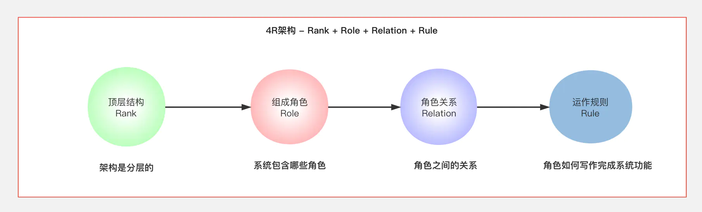
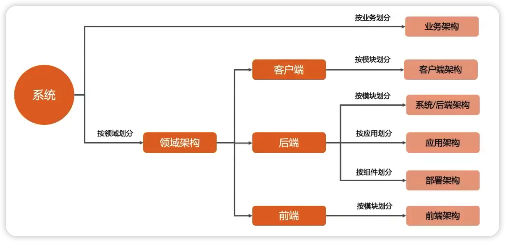
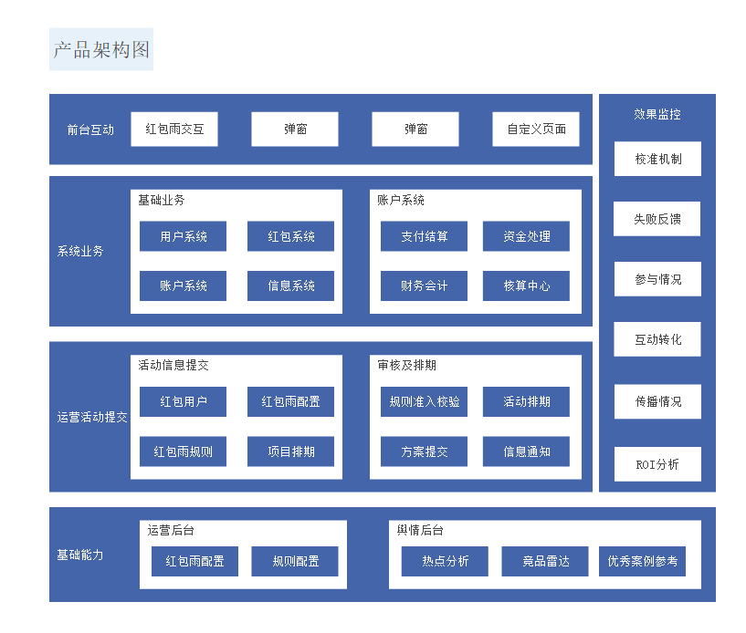
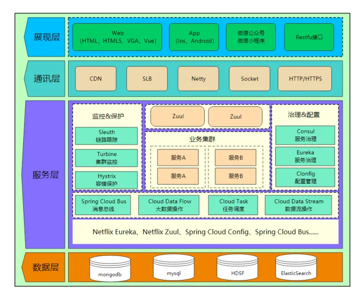
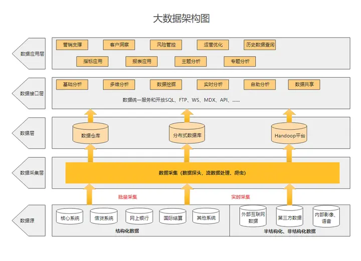
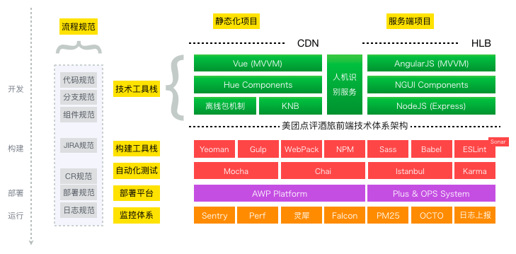
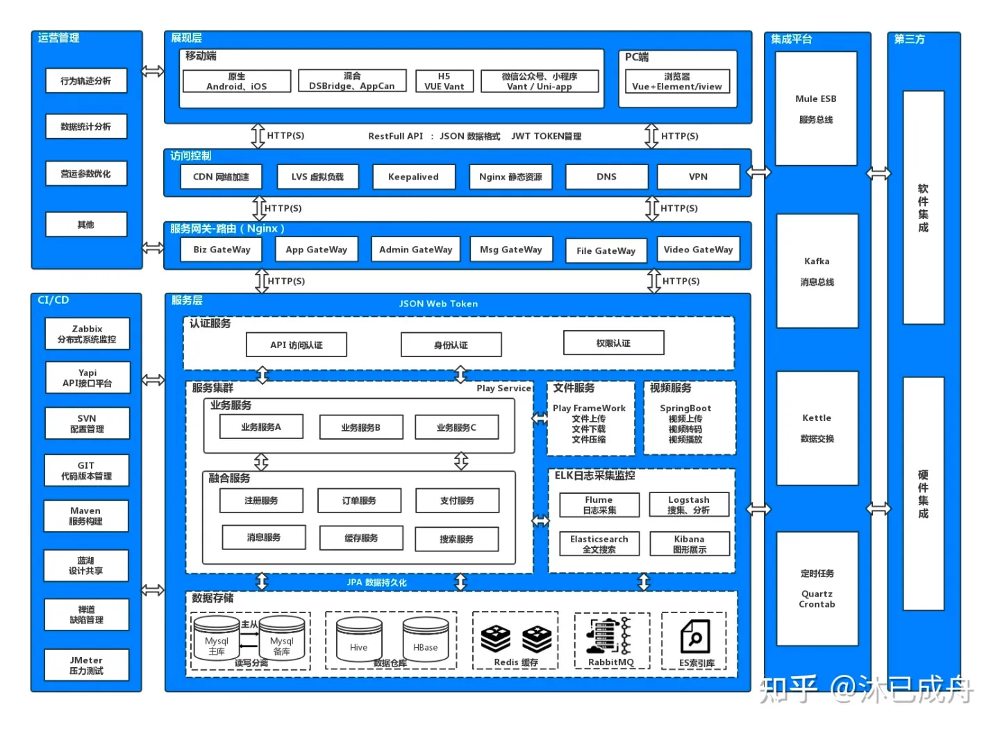
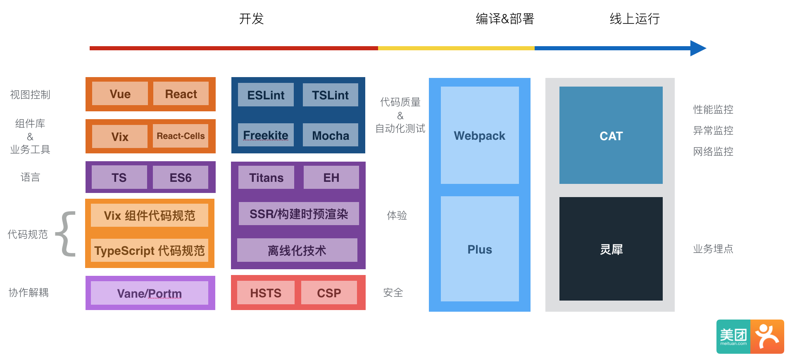
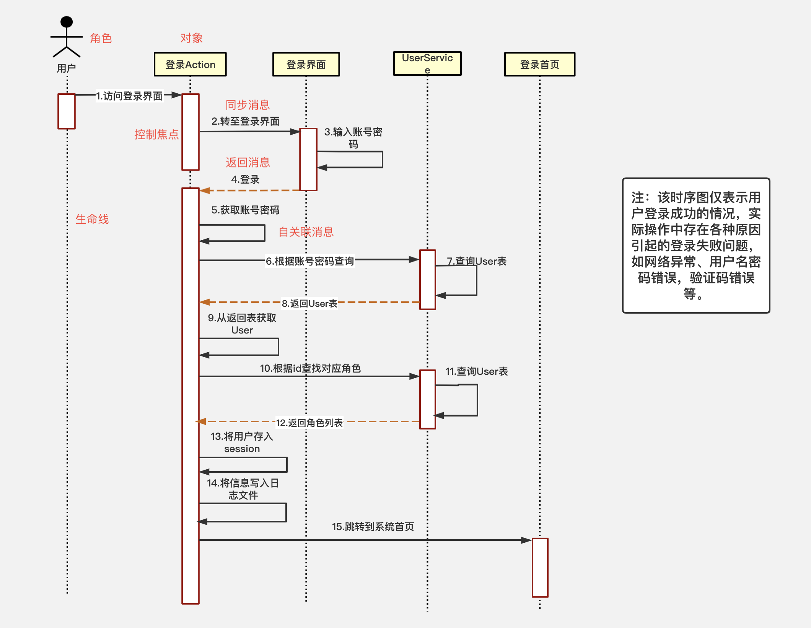
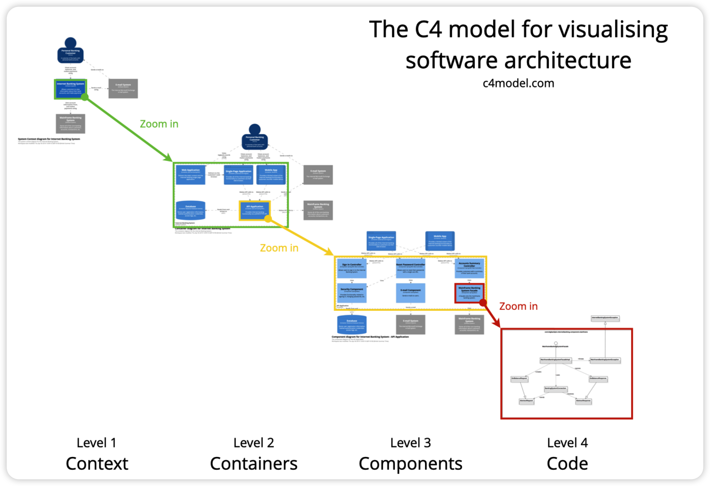

# 架构图

- 架构图是一种用于描述系统架构的图形化表示方法，它可以用来描述系统的组成部分、组成部分之间的关系、组成部分之间的交互方式等。
    - 
- 分类
    - 
- 如何画
    - 搞清楚要画的架构图的类型
    - 抽离架构图中的关键要素
    - 梳理各个要素之间的关系：包含关系 、引用关系、同级关系等等
    - 根据以上信息串联起来，并标识清楚。
- 架构大致可以分为4类：
    - 业务架构
        - 使用一套方法论/逻辑对产品（项目）所涉及到的业务进行边界划分。
        - 
    - 应用架构
        - 它是对整个系统实现的总体上的架构，需要指出系统的层次、系统开发的原则、系统各个层次的应用服务。
        - 
    - 数据架构
        - 是一套对存储数据的架构逻辑，它会根据各个系统应用场景、不同时间段的应用场景 ，对数据进行诸如数据异构、读写分离、缓存使用、分布式数据策略等划分。
        - 数据架构主要解决三个问题：
            - 第一，系统需要什么样的数据；
            - 第二，如何存储这些数据；
            - 第三，如何进行数据架构设计。
        - 
    - 技术架构
        - 应用架构本身只关心需要哪些应用系统，哪些平台来满足业务目标的需求，而不会关心在整个构建过程中你需要使用哪些技术。
        - 技术架构则是应接应用架构的技术需求，并根据识别的技术需求，进行技术选型，把各个关键技术和技术之间的关系描述清楚。
        - 技术架构解决的问题包括：
            - 纯技术层面的分层、
            - 开发框架的选择、
            - 开发语言的选择、
            - 涉及非功能性需求的技术选择。
        - 
        - 
        - 
- 序列图
    - 序列图，又称时序图，是一种UML交互图。它通过描述具体场景中，对象之间发送消息的时间顺序显示多个对象之间的动态协作。
    - 
- C4 模型
    - 由一系列分层的软件架构图组成，这些架构图用于描述上下文、容器、组件和代码。
    - 

- 参考文档
    - [如何画好架构图](https://blog.csdn.net/qq_43328236/article/details/123919260)
    - 
