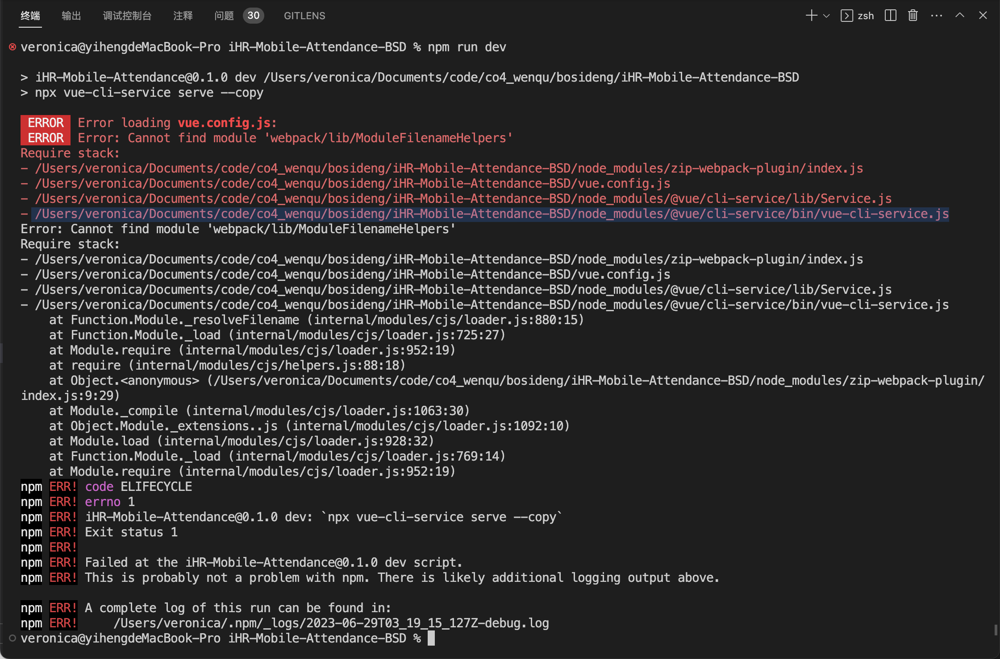
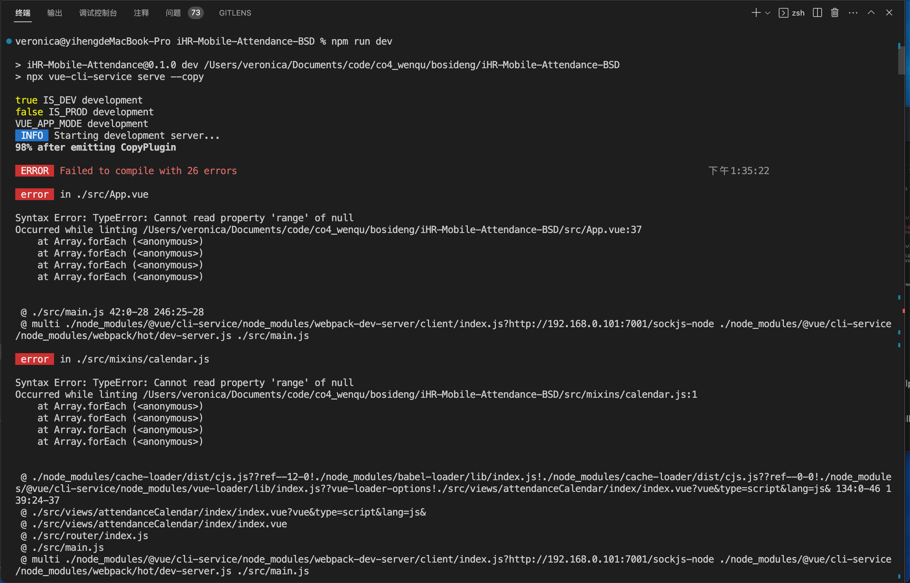

# Vue2 老项目遇到的问题

## 问题：Cannot find module 'webpack/lib/ModuleFilenameHelpers'


原因：未安装 webpack
方案1：npm link webpack （解决）
方案 2： npm install -D webpack@2.7.0

## 问题：Syntax Error: TypeError: Cannot read property 'range' of null


原因：babel-eslint版本过高
解决：npm install -D  babel-eslint@8.0.1  

## npm 找不到模块

解决： npm rebuild

## node-sass 安装失败

原因：
    1. node 版本不匹配，项目 node 版本为 14.15.0
    2. M2 系统，需要单独下载 node-sass 的二进制文件，下载过程中可能会出现网络问题，导致下载失败，需要提前下载好文件 <https://github.com/sass/node-sass/releases/download/v4.14.1/darwin-x64-83_binding.node>，放在 npm cache 中，再执行 npm install node-sass@4.14.1 -D
    3. github 连接问题，需要设置代理，或者使用淘宝镜像

## http-proxy-middleware 代理配置问题

    原因：
       1. 代理配置错误，导致请求无法代理到目标服务器
       2. 代理配置正确，但是代理的目标服务器没有启动
       3. 代理配置正确，端口被占用

## nrm 报错

    ```sh
    require() of ES modules is not supported.
    ```

解决办法:

    ```sh
    npm install -g nrm open@8.4.2 --save
    ```

## 换源

npm config set registry <https://registry.npmmirror.com/>
