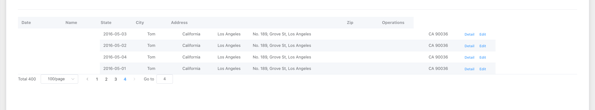
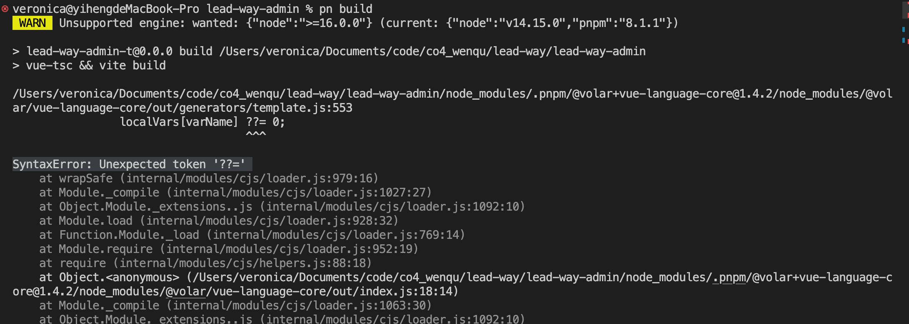
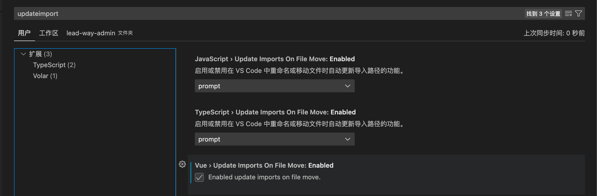

# 遇到的问题

1. [vite] Internal server error: Failed to resolve import "element-plus/es" from "src/App.vue". Does the file exist?
   解决：vite.config.js - resolve - alias - "element-plus/es": "element-plus/lib"
2. element-plus table
    1. header-row-class-name 设置无效
       解决：
        1. 样式不要写到 scoped 的 style 中，如果要写，就要加 /deep/ 或者 ::v-deep，或者写在 全局样式 src/style.css 中
        2. 使用 header-cell-style 属性
    2. 表头 和 列 未对齐 
       解决：table-layout="auto"
3. [vite] ws proxy error:
   Error: connect EHOSTUNREACH 0.0.34.177:80 - Local (192.168.0.101:62451)
   at internalConnect (net.js:921:16)
   at defaultTriggerAsyncIdScope (internal/async_hooks.js:429:12)
   at GetAddrInfoReqWrap.emitLookup [as callback] (net.js:1064:9)
   at GetAddrInfoReqWrap.onlookup [as oncomplete] (dns.js:69:8)
   解决：
4. vite proxy 代理不生效 //
   解决：
5. 路由切换时，页面加载缓慢 //
   解决：
6. 找不到模块“@/pages/login/login.vue”或其相应的类型声明。// <https://blog.csdn.net/sebeefe/article/details/123321625>
   解决：
    1. 在项目根目录或 src 文件夹下创建一个后缀为 .d.ts 的文件
    2. vue 文件导入需要.vue 后缀名
7. 找不到模块“@/api/index.js”或其相应的类型声明。// <https://www.cnblogs.com/zyfenblog/p/17223237.html>
    1. 在 tsconfig.json 加上 baseUrl 和 paths 的 即可。
8. SyntaxError: Unexpected token '??=' 
   解决：使用 node > 16
9. 文件改名，引用自动更新
    解决：vscode -> 右键 rename 时生效 
10. 写出文件名，自动引入
    解决：
11. element-puls 主题

## 神奇

1. vscode 自动整理所有引用import，保存代码时（ctrl+s）自动整理页面所有import引用，包括删除未使用到的import、多import归类整理、排序等。
   1. settings.json中加入配置项： "editor.codeActionsOnSave": { "source.organizeImports": true },
2.
